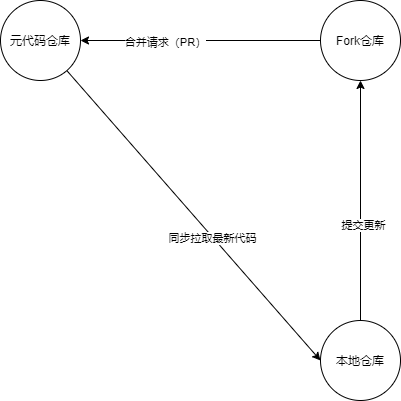

# Git 之 Fork 流的使用
***
## 简介
本篇介绍Git中Fork流的使用方法

## 概览
本篇文章将分为三个部分，Fork流的主要流程、步骤详解、相关工具推荐

## 流程图
主要流程图如下：



- 元代码仓库：开发和发布版本的代码仓库，及原始代码仓库
- Fork仓库：自己Fork的远程仓库
- 本地仓库：进行代码编写的本地仓库（从自己的Fork仓库Clone的）

一般来说，他们的之间的数据流向大致如上：

每次开发编写代码之前，需要同步自己的代码，保持版本不是太落后，需要去元代码仓库拉取同步目前最新的代码，并新建一个本地分支进行开发

在提交代码前，因为编写期间可能会有新的PR合并，所以需要再次拉取最新代码，如果有冲突，解决冲突后再提交代码

提交代码是提交到自己的Fork仓库中，这个时候就可以从Fork仓库发起PR，将自己的代码合并到元代码仓库中（GitHub会自己弹出PR链接和页面，GitLab需要自己去网页上操作）

PR成功合并后，切换到开发分支，再次拉取更新同步代码，发现自己的提交记录在元代码仓库中了

## 步骤详解
具体步骤如下：

- 1.Fork代码仓库
- 2.Clone自己Fork的仓库到本地
- 3.设置源代码仓库
- 4.编写开发
  - 4.1 切换到主开发分支
  - 4.2 同步更新源代码仓库代码
  - 4.3 新建本地开发新分支
  - 4.4 代码编写
  - 4.5 提交前的准备
    - 同步更新源代码仓库代码
    - 解决冲突
    - 本地CI、规范检查
  - 4.6 提交分支到自己Fork仓库
  - 4.7 发起PR合并请求

大致的示例命令如下：

```shell script
# Fork 在网页上自行操作
# 2. Clone Fork 仓库到本地
git clone http://xxxxxxxxxx.git

# 3. 设置源代码仓库地址，这里起名为 upstream，当然你也可以用其他的
git remote add upstream xxxxxxxxxxx

# 4.1 切换到当前开发分支，推荐使用IDEA/GitHubDesktop或者其他的工具即可，这里使用命令仅仅用于展示
git checkout dev
# 4.2 同步更新源代码参考代码，一般这次同步是干净的，基本不会有冲突
git pull --rebase upstream dev
# 4.3 新建本地开发新分支
git checkout -b xxx(本地编写的目的或者功能起名)
# 4.5 提交前再次同步代码，有冲突需要解决冲突(CI有的话就本地自己先看看能不能过，不过的话需要解决后提交)
git pull --rebase upstream dev
# 4.7 提交代码到自己的Fork仓库，GitHub会在提交后出现提交PR的链接，点击后进入PR界面；Gitlab需要自己去操作
git push
```

在上面的步骤中，前三部基本一次搞定，第四步每次开发新功能或者修复bug都会走一遍，上面的提到的命令和步骤基本能应对开发工作了

## 工具推荐
一般来说，只有开发的步子够小，基本上有冲突不是什么大问题，但如果代码较多时，合并冲突那是一件令人头大的事，在以前刚接触时，合并冲突真是要命

下面推荐目前感觉比较好用的两个工具，用其查看本次更新记录、提交代码、提示和合并冲突方面比较好用，值得拥有，如下：

- [GitHub Desktop](https://desktop.github.com/):GitHub桌面端，简单上手，冲突提示比较好
- [Visual Studio Code](https://code.visualstudio.com/):江湖地位不用说，这里用于配合上面的工具来解决冲突

在合并代码发生冲突的时候，GitHub Desktop会提示你哪些文件产生了冲突，根据提示，点击后跳转到VS中，冲突的代码都有明显的提示（保留版本选择等快捷操作）

解决完一个文件的冲突后，冲突提示后面就会打勾，让人心里有点安全感

但如果版本落后较多，合并冲突需要谨慎

## 进阶
这里就推荐一个命令：rebase，作用是合并commit请求。合并请求一个是提交记录更优雅，二个是便于提交前查看本次改动了那些东西，多个本地commit的情况下不是很直观

如果是新手尽量不要使用，这个命令也是很容易出问题，这里就简单提一手，感兴趣的自行网上搜索