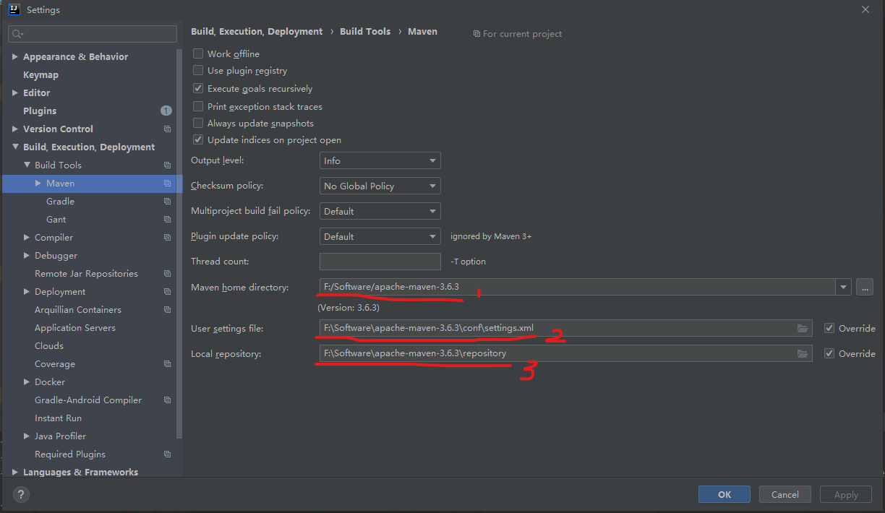
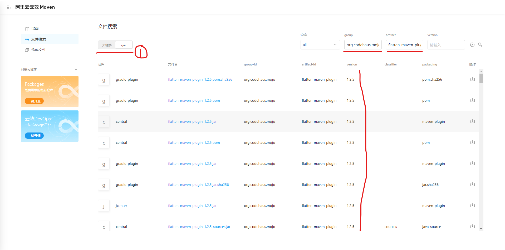

# Maven 阿里云仓库使用小技巧
***

这是我参与2022首次更文挑战的第26天，活动详情查看：[2022首次更文挑战](https://juejin.cn/post/7052884569032392740)

## 简介
&ensp;&ensp;&ensp;&ensp;平时工作或者学习中经常需要看下别人的工程示例代码，但maven的依赖导入经常有些问题，maven镜像使用默认是国外的，众所周知慢的离谱，有时候出门散个步回来，还没有导入完成，导致摸鱼时间过多。

&ensp;&ensp;&ensp;&ensp;使用国内的镜像那就会快非常非常多，快则两三分钟、慢则十多分钟，可以接受。但在使用的过程中也会遇到许多问题，比如设置和依赖找不到的问题，下面介绍下自己使用阿里云的一些技巧，希望对大家有所启发

### 阿里云仓库配置
&ensp;&ensp;&ensp;&ensp;第一步是配置镜像仓库为阿里云，有两种配置方法，一个是全局配置，另一个是单个工程配置

&ensp;&ensp;&ensp;&ensp;推荐使用全局配置，新建两个全局配置文件，配合idea进行切换就比较方便好用

#### 全局配置
&ensp;&ensp;&ensp;&ensp;使用进入maven安装位置的conf目录下，复制一份 setting.xml,命名为 setting.aliyun.xml，打开文件，在<mirrors></mirrors>标签中添加 mirror 子节点，在里面添加如下内容,大致如下：

```xml
<mirrors>
    <!-- mirror
     | Specifies a repository mirror site to use instead of a given repository. The repository that
     | this mirror serves has an ID that matches the mirrorOf element of this mirror. IDs are used
     | for inheritance and direct lookup purposes, and must be unique across the set of mirrors.
     |
    <mirror>
      <id>mirrorId</id>
      <mirrorOf>repositoryId</mirrorOf>
      <name>Human Readable Name for this Mirror.</name>
      <url>http://my.repository.com/repo/path</url>
    </mirror>
     -->
    <mirror>
        <id>aliyunmaven-pulic</id>
        <mirrorOf>*</mirrorOf>
        <name>aliyun-public</name>
        <url>https://maven.aliyun.com/repository/public</url>
     </mirror>

  </mirrors>
```

#### 单个 pom.xml 配置
&ensp;&ensp;&ensp;&ensp;这个相对而言影响范围比较小，就针对单个 pom.xml 的配置，使用起来也算可以，但个人感觉没有上面那个全，有些时候需要使用多个代理仓库，配置起来稍微麻烦一些，在后面的参考链接中有阿里云的官方配置说明，各位也可自行探索，这块研究的比较少

```xml
<repository>
  <id>spring</id>
  <url>https://maven.aliyun.com/repository/spring</url>
  <releases>
    <enabled>true</enabled>
  </releases>
  <snapshots>
    <enabled>true</enabled>
  </snapshots>
</repository>
```

### IDEA 的切换配合使用
&ensp;&ensp;&ensp;&ensp;配置完成后，在 IDEA 中进行配置，即可实现国内源和国外源的切换使用，大致的配置如下：



&ensp;&ensp;&ensp;&ensp;按照上图进入 IDEA 的 Maven 配置界面，图中的 1 配置 Maven 的根路径；2 是配置文件配置，这里就可以随意切换不同的配置文件；3是依赖下载存放的路径

&ensp;&ensp;&ensp;&ensp;配置完成后基本就可以使用了，使用阿里云的话依赖很快就导入完成了

### 依赖缺失的一些解决小技巧
&ensp;&ensp;&ensp;&ensp;在依赖导入的时候，经常会遇到 xxxx:xxxx:pom 之类找不到，下载不了的情况，而且有些情况切换到国外源又是可以正常下载的，但又很慢，则就很烦，经过探索，大部分的依赖无法下载问题可以通过直接指定特定版本进行解决，下面是一个示例：

&ensp;&ensp;&ensp;&ensp;如下，我们在依赖导入的时候遇到下面这种类似的问题，依赖找不到，这个时候解决的办法就是指定特定的依赖版本，具体的细节在后面

```
Could not find artifact org.codehaus.mojo:flatten-maven-plugin:pom: in aliyunmaven-pulic (https://maven.aliyun.com/repository/public)
```

&ensp;&ensp;&ensp;&ensp;解决这类问题主要是在阿里云仓库中查找到依赖的版本，然后在配置文件中指定或者修改依赖版本即可

&ensp;&ensp;&ensp;&ensp;首先打开阿里云仓库搜索地址：[https://maven.aliyun.com/mvn/search](https://maven.aliyun.com/mvn/search) , 如下图：



&ensp;&ensp;&ensp;&ensp;在上面的搜索中在右侧可以填入报错的依赖的 group 和 artifact，然后就搜索，看到下面有很多版本，选择一个看起来顺眼的填入即可（大部分版本其实都一样）。在左侧也可以切换搜索方式，可以直接输入一些关键字，如 latten-maven-plugin 之类的，辨识度比较高的话，使用关键字搜索即可；如果没有找到，则可以使用 gav 这种比较全的搜索方法

&ensp;&ensp;&ensp;&ensp;这样基本上能解决大部分问题了，希望对大家有所帮助