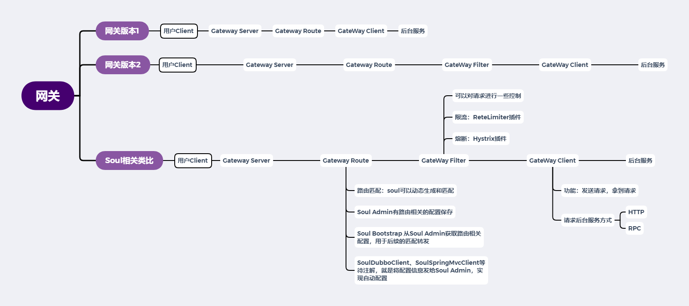

# Soul 源码解析（一） 概览
***
## 简介
&ensp;&ensp;&ensp;&ensp;阅读soul的官方文档，大致了解soul的功能和相关概念

### 心得
&ensp;&ensp;&ensp;&ensp;需要对网关的功能有个大致的了解，把[soul官方文档](https://dromara.org/zh-cn/docs/soul/user-sofa.html)读两遍（第一遍通读，能看懂多少是多少，第二遍参照网关基本概念，整理一下自己所理解的soul相关概念），整理的大致如下：

&ensp;&ensp;&ensp;&ensp;大致写过网关Demo应该了解网关的大致组件，如上图的网关版本1和2：

- server ：一个服务端，用于监听请求
- router ：路由匹配，判断请求是否能匹配上后端服务，能匹配上就继续
- filter ：可以进行一些定时，比如简单的增删改查请求和响应的header内容，高阶的如限流、熔断等
- client ：发送请求给后台服务，并得到响应

&ensp;&ensp;&ensp;&ensp;读下来，发现Soul的路由匹配规则是动态生成的，一个很关键，很基础的插件就是divide。这些路由的配置保存的地方计时 Soul Admin 这个模块，网关的核心模块还是 Soul Bootstrap，转发合处理还是这个来

&ensp;&ensp;&ensp;&ensp;发现Soul Admin 好像还配置了相关 Filter，那可以理解 Soul Admin 为配置中心，可以配置 Router 和 Filter

&ensp;&ensp;&ensp;&ensp;大致读下[数据同步](https://dromara.org/zh-cn/docs/soul/user-dataSync.html)这部分，知道了Soul这些配置都是可以动态的

&ensp;&ensp;&ensp;&ensp;利用类比，将我们之前熟悉的东西套一套，对Soul有个大致的认识即可

&ensp;&ensp;&ensp;&ensp;当然，也有可能有些描述和认知是错的，但这些都是正确认识的前提，我们可以在不断的阅读研究中不断更新自己的模型（我目前也没完全搞懂Soul）

&ensp;&ensp;&ensp;&ensp;就想现在我们有一张地图，可以有些地方拆迁重建了，但我们还是可以这个地图探索，前往目的地，在探索的过程中，不断地完善我们的地图