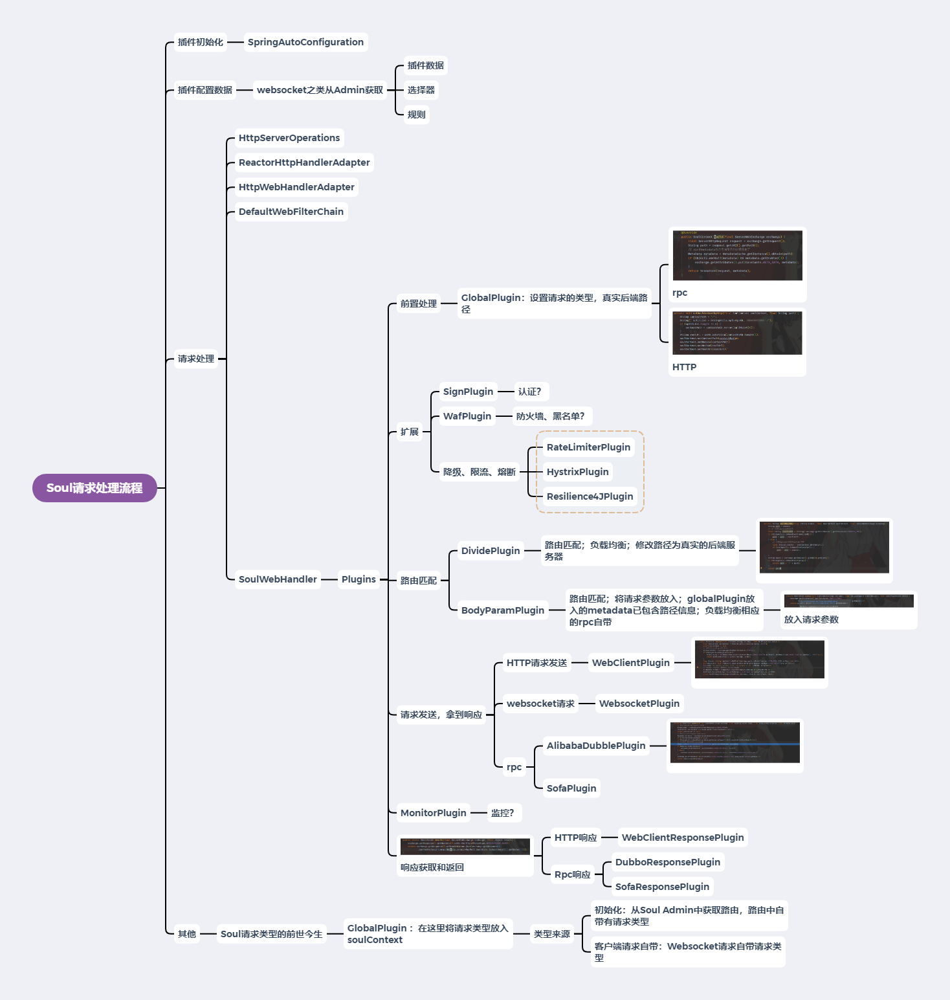

# Soul网关源码解析（十一）请求处理小结
***
## 简介
&ensp;&ensp;&ensp;&ensp;经过前面文章的探索，处理流程大部分了解了，此篇文件就来做一个Soul网关处理流程小结

## 总结
&ensp;&ensp;&ensp;&ensp;Soul网关的处理流程图大致如下：

&ensp;&ensp;&ensp;&ensp;处理流程如上图，大致可以分为两部分：

- 1.插件初始化和配置初始化：插件链的初始化和相关路由配置的初始化
- 2.请求处理流程：一个请求大致如何处理的

### 插件初始化和配置初始化
&ensp;&ensp;&ensp;&ensp;在第九篇文章：[Soul网关源码阅读（九）插件配置加载初探](https://juejin.cn/post/6920074307590684685/)，我们分析了相关的细节

&ensp;&ensp;&ensp;&ensp;插件的初始化是使用Spring的自动配置加载机制进行实现了，结合使用插件都需要引入哪些start的依赖

&ensp;&ensp;&ensp;&ensp;插件数据、选择器数据、规则数据的初始化，都是从Websocket（或者同步通信模块）那边过来的，接收到数据以后，进行配置加载到本地

### 请求处理流程
&ensp;&ensp;&ensp;&ensp;在上图中，可以看到我们将plugin进行大致的分类：

- 前置处理：
  - GlobalPlugin:设置请求的类型；HTTP真实后端路径；Rpc的metadata;它的作用还是不能忽视的，在插件链中比较重要

- 扩展：进行黑名单、认证、限流、降级、熔断等等的扩展操作；扩展中分有全局和特定规则的；特定规则的需要进行规则匹配

- 路由匹配：
  - DividePlugin：HTTP路由匹配；负载均衡；修改路径为真实的后端服务器
  - BodyParamPlugin：Rpc路由匹配；将请求参数放入；globalPlugin放入的metadata已包含路径信息；负载均衡相应的rpc自带

- 请求发送，拿到响应放入exchange：分有HTTP的、websocket的、rpc的

- 响应返回：分为HTTP响应返回和RPC响应返回；这里返回调用的其实都是通过获取exchange的response后调用函数发送给客户端

&ensp;&ensp;&ensp;&ensp;还进行其他的探索，比如请求类型的来源之类的

&ensp;&ensp;&ensp;&ensp;当然，这部分其他细节还是挺多了，后面可能有疑问就会继续探索下，后面的工作想把另外一块核心：路由数据配置和同步给探索了
		
## Soul网关源码分析文章列表
### Github
- [Soul源码阅读（一） 概览](https://github.com/lw1243925457/SE-Notes/blob/master/profession/program/%E5%BC%80%E6%BA%90/soul/soul%E6%BA%90%E7%A0%81%E9%98%85%E8%AF%BB1-%E6%A6%82%E8%A7%88.md)
- [Soul源码阅读（二）代码初步运行](https://github.com/lw1243925457/SE-Notes/blob/master/profession/program/%E5%BC%80%E6%BA%90/soul/soul%E6%BA%90%E7%A0%81%E9%98%85%E8%AF%BB2-%E5%88%9D%E6%AD%A5%E8%BF%90%E8%A1%8C.md)
- [Soul源码阅读（三）HTTP请求处理概览](https://github.com/lw1243925457/SE-Notes/blob/master/profession/program/%E5%BC%80%E6%BA%90/soul/soul%E6%BA%90%E7%A0%81%E9%98%85%E8%AF%BB3-%E8%AF%B7%E6%B1%82%E5%A4%84%E7%90%86%E6%A6%82%E8%A7%88.md)
- [Soul网关源码阅读（四）Dubbo请求概览](https://github.com/lw1243925457/SE-Notes/blob/master/profession/program/%E5%BC%80%E6%BA%90/soul/soul%E6%BA%90%E7%A0%81%E9%98%85%E8%AF%BB4-dubbo%E8%AF%B7%E6%B1%82%E6%A6%82%E8%A7%88.md)
- [Soul网关源码阅读（五）请求类型探索](https://github.com/lw1243925457/SE-Notes/blob/master/profession/program/%E5%BC%80%E6%BA%90/soul/soul%E6%BA%90%E7%A0%81%E9%98%85%E8%AF%BB5-%E8%AF%B7%E6%B1%82%E7%B1%BB%E5%9E%8B%E6%8E%A2%E7%B4%A2.md)
- [Soul网关源码阅读（六）Sofa请求处理概览](https://github.com/lw1243925457/SE-Notes/blob/master/profession/program/%E5%BC%80%E6%BA%90/soul/soul%E6%BA%90%E7%A0%81%E9%98%85%E8%AF%BB6-sofa%E8%AF%B7%E6%B1%82%E5%A4%84%E7%90%86%E6%A6%82%E8%A7%88.md)
- [Soul网关源码阅读（七）限流插件初探](https://github.com/lw1243925457/SE-Notes/blob/master/profession/program/%E5%BC%80%E6%BA%90/soul/soul%E6%BA%90%E7%A0%81%E9%98%85%E8%AF%BB7-%E9%99%90%E6%B5%81%E6%8F%92%E4%BB%B6%E5%88%9D%E6%8E%A2.md)
- [Soul网关源码阅读（八）路由匹配初探](https://github.com/lw1243925457/SE-Notes/blob/0e6931519a84d5c603504b2c6a633698ac793b70/profession/program/%E5%BC%80%E6%BA%90/soul/soul%E6%BA%90%E7%A0%81%E9%98%85%E8%AF%BB8-%E8%B7%AF%E7%94%B1%E5%8C%B9%E9%85%8D%E5%88%9D%E6%8E%A2.md)
- [Soul网关源码阅读（九）插件配置加载初探](https://github.com/lw1243925457/SE-Notes/blob/master/profession/program/%E5%BC%80%E6%BA%90/soul/soul%E6%BA%90%E7%A0%81%E9%98%85%E8%AF%BB9-%E6%8F%92%E4%BB%B6%E9%85%8D%E7%BD%AE%E5%8A%A0%E8%BD%BD%E5%88%9D%E6%8E%A2.md)
- [Soul网关源码阅读（十）自定义简单插件编写](https://github.com/lw1243925457/SE-Notes/blob/master/profession/program/%E5%BC%80%E6%BA%90/soul/soul%E6%BA%90%E7%A0%81%E9%98%85%E8%AF%BB10-%E8%87%AA%E5%AE%9A%E4%B9%89%E7%AE%80%E5%8D%95%E6%8F%92%E4%BB%B6%E7%BC%96%E5%86%99.md)
- [Soul网关源码阅读（十一）请求处理小结](https://github.com/lw1243925457/SE-Notes/blob/master/profession/program/%E5%BC%80%E6%BA%90/soul/soul%E6%BA%90%E7%A0%81%E9%98%85%E8%AF%BB11-%E8%AF%B7%E6%B1%82%E5%A4%84%E7%90%86%E5%B0%8F%E7%BB%93.md)
- [Soul网关源码阅读（十二）数据同步初探-Bootstrap端](https://github.com/lw1243925457/SE-Notes/blob/master/profession/program/%E5%BC%80%E6%BA%90/soul/soul%E6%BA%90%E7%A0%81%E9%98%85%E8%AF%BB12-%E6%95%B0%E6%8D%AE%E5%90%8C%E6%AD%A5%E5%88%9D%E6%8E%A2.md)
- [Soul网关源码阅读（十三）Websocket同步数据-Bootstrap端](https://github.com/lw1243925457/SE-Notes/blob/master/profession/program/%E5%BC%80%E6%BA%90/soul/soul%E6%BA%90%E7%A0%81%E9%98%85%E8%AF%BB13-websocket%E5%90%8C%E6%AD%A5%E6%95%B0%E6%8D%AE-Bootstrap%E7%AB%AF.md)
- [Soul网关源码阅读（十四）HTTP数据同步-Bootstrap端](https://github.com/lw1243925457/SE-Notes/blob/master/profession/program/%E5%BC%80%E6%BA%90/soul/soul%E6%BA%90%E7%A0%81%E9%98%85%E8%AF%BB14-HTTP%E6%95%B0%E6%8D%AE%E5%90%8C%E6%AD%A5-Bootstrap%E7%AB%AF.md)

- [Soul网关源码阅读番外篇（一） HTTP参数请求错误](https://github.com/lw1243925457/SE-Notes/blob/master/profession/program/%E5%BC%80%E6%BA%90/soul/soul%E6%BA%90%E7%A0%81%E9%98%85%E8%AF%BB%E7%95%AA%E5%A4%96%E7%AF%871-HTTP%E7%A4%BA%E4%BE%8B%E5%8F%82%E6%95%B0%E8%AF%B7%E6%B1%82%E9%94%99%E8%AF%AF.md)

### 掘金
- [Soul网关源码阅读（一） 概览](https://juejin.cn/post/6917864624423436296)
- [Soul网关源码阅读（二）代码初步运行](https://juejin.cn/post/6917865804121767944)
- [Soul网关源码阅读（三）请求处理概览](https://juejin.cn/post/6917866538712334343)
- [Soul网关源码阅读（四）Dubbo请求概览](https://juejin.cn/post/6917867369909977102)
- [Soul网关源码阅读（五）请求类型探索](https://juejin.cn/post/6918575905962983438)
- [Soul网关源码阅读（六）Sofa请求处理概览](https://juejin.cn/post/6918736260467015693)
- [Soul网关源码阅读（七）限流插件初探](https://juejin.cn/post/6919348164944232455/)
- [Soul网关源码阅读（八）路由匹配初探](https://juejin.cn/post/6919774553241550855/)
- [Soul网关源码阅读（九）插件配置加载初探](https://juejin.cn/post/6920074307590684685/)
- [Soul网关源码阅读（十）自定义简单插件编写](https://juejin.cn/post/6920142348617777166)

- [Soul网关源码阅读番外篇（一） HTTP参数请求错误](https://juejin.cn/post/6918947689564471309)