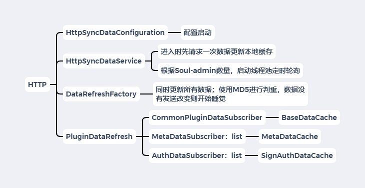

# Soul网关源码解析（十四）HTTP数据同步-Bootstrap端
***
## 简介
&ensp;&ensp;&ensp;&ensp;本篇文章来研究下Soul网关Bootstrap端的HTTP数据同步，看看和上篇的Websocket数据同步区别大不大

## 示例启动
&ensp;&ensp;&ensp;&ensp;启动时候，我们先把Soul-admin和Soul-Bootstrap的Websocket同步给关了，开启HTTP同步，配置大致如下：

&ensp;&ensp;&ensp;&ensp;Soul-Admin的HTTP同步方式配置

```xml
  sync:
      http:
        enabled: true
```

&ensp;&ensp;&ensp;&ensp;Soul-Bootstrap的Http同步方式配置

```xml
soul :
    file:
      enabled: true
    corss:
      enabled: true
    dubbo :
      parameter: multi
    sync:
        http:
             url : http://localhost:9095
```

&ensp;&ensp;&ensp;&ensp;启动Soul-admin、Soul-Bootstrap、Soul-Example-HTTP，开始进入源码debug

## 源码Debug
&ensp;&ensp;&ensp;&ensp;首先进入属性的 CommonPluginDataSubscriber ,在插件数据更新的函数上打上断点，代码如下：

```java
public class CommonPluginDataSubscriber implements PluginDataSubscriber {
    
    @Override
    public void onSubscribe(final PluginData pluginData) {
        subscribeDataHandler(pluginData, DataEventTypeEnum.UPDATE);
    }
}
```

&ensp;&ensp;&ensp;&ensp;跟踪调用栈来到数据同步初探文章中的HTTP同步模块的入口处，调用了subscribe

```java
public class PluginDataRefresh extends AbstractDataRefresh<PluginData> {

    @Override
    protected void refresh(final List<PluginData> data) {
        if (CollectionUtils.isEmpty(data)) {
            log.info("clear all plugin data cache");
            pluginDataSubscriber.refreshPluginDataAll();
        } else {
            pluginDataSubscriber.refreshPluginDataAll();
            data.forEach(pluginDataSubscriber::onSubscribe);
        }
    }
}
```

&ensp;&ensp;&ensp;&ensp;继续跟，来到下面的代码，这里得到data数据，但是调用栈在这里断了。我们在refresh函数上打上断点，然后重启

```java
public abstract class AbstractDataRefresh<T> implements DataRefresh {

    @Override
    public Boolean refresh(final JsonObject data) {
        boolean updated = false;
        JsonObject jsonObject = convert(data);
        if (null != jsonObject) {
            ConfigData<T> result = fromJson(jsonObject);
            if (this.updateCacheIfNeed(result)) {
                updated = true;
                refresh(result.getData());
            }
        }
        return updated;
    }
}
```

&ensp;&ensp;&ensp;&ensp;成功出现新的调用栈，我们跟踪调用栈，来到下面一个函数，这个函数看大意是所有的数据类型都调用更新一遍，考虑到HTTP是全量数据，确实有这个可能

```java
public final class DataRefreshFactory {

    public boolean executor(final JsonObject data) {
        final boolean[] success = {false};
        // 代码的调用明显和websocket不一样，看着代码大意是五个类型都有进行更新，结合HTTP请求是全量数据，感觉确实需要五个都进行缓存更新
        ENUM_MAP.values().parallelStream().forEach(dataRefresh -> success[0] = dataRefresh.refresh(data));
        return success[0];
    }
}
```

&ensp;&ensp;&ensp;&ensp;继续跟踪调用栈，来到了一个比较大的类，里面有很多的操作，其中比较重要的是：

- 第一次进入时，到Admin获取所有的数据进行缓存更新
- 开启线程池，定时轮询，其中还有一些判断数据是否是旧的就多睡几秒的细节操作，看完有所启发

&ensp;&ensp;&ensp;&ensp;相关代码和说明如下：

```java
public class HttpSyncDataService implements SyncDataService, AutoCloseable {

    private void start() {
        // It could be initialized multiple times, so you need to control that.
        if (RUNNING.compareAndSet(false, true)) {
            // 第一次初始化会调用一次，去获取所有的数据，初始化缓存
            // fetch all group configs.
            this.fetchGroupConfig(ConfigGroupEnum.values());
            int threadSize = serverList.size();
            this.executor = new ThreadPoolExecutor(threadSize, threadSize, 60L, TimeUnit.SECONDS,
                    new LinkedBlockingQueue<>(),
                    SoulThreadFactory.create("http-long-polling", true));
            // 我们看到这里用了线程池，其了一个任务，后面我们再跟进去看看
            // start long polling, each server creates a thread to listen for changes.
            this.serverList.forEach(server -> this.executor.execute(new HttpLongPollingTask(server)));
        } else {
            log.info("soul http long polling was started, executor=[{}]", executor);
        }
    }

    // server list 感觉是多个soul-admin，应该是集群模式的高可用吧
    // server list 看着都要去请求一次，重复更新和操作是不是有点频繁，压力有些大？
    private void fetchGroupConfig(final ConfigGroupEnum... groups) throws SoulException {
        for (int index = 0; index < this.serverList.size(); index++) {
            String server = serverList.get(index);
            try {
                this.doFetchGroupConfig(server, groups);
                break;
            } catch (SoulException e) {
                // no available server, throw exception.
                if (index >= serverList.size() - 1) {
                    throw e;
                }
                log.warn("fetch config fail, try another one: {}", serverList.get(index + 1));
            }
        }
    }

    // 这个函数负责去获取请求，然后进行更新
    // 如果updated为false，会多睡上30秒，这个更新与否感觉挺重要的，但先放放，回头过来看
    private void doFetchGroupConfig(final String server, final ConfigGroupEnum... groups) {
        StringBuilder params = new StringBuilder();
        for (ConfigGroupEnum groupKey : groups) {
            params.append("groupKeys").append("=").append(groupKey.name()).append("&");
        }
        // 在这请求了所有的数据
        String url = server + "/configs/fetch?" + StringUtils.removeEnd(params.toString(), "&");
        log.info("request configs: [{}]", url);
        String json = null;
        try {
            json = this.httpClient.getForObject(url, String.class);
        } catch (RestClientException e) {
            String message = String.format("fetch config fail from server[%s], %s", url, e.getMessage());
            log.warn(message);
            throw new SoulException(message, e);
        }
        // 这个判断有点意思，如果请求数据没有发生变化，那下一次请求将延长30秒
        // 这个updated如果判断得到的，我们一会回过头再去跟一跟
        boolean updated = this.updateCacheWithJson(json);
        if (updated) {
            log.info("get latest configs: [{}]", json);
            return;
        }
        // not updated. it is likely that the current config server has not been updated yet. wait a moment.
        log.info("The config of the server[{}] has not been updated or is out of date. Wait for 30s to listen for changes again.", server);
        ThreadUtils.sleep(TimeUnit.SECONDS, 30);
    }
    
    private boolean updateCacheWithJson(final String json) {
        JsonObject jsonObject = GSON.fromJson(json, JsonObject.class);
        JsonObject data = jsonObject.getAsJsonObject("data");
        // if the config cache will be updated?
        return factory.executor(data);
    }
}
```

&ensp;&ensp;&ensp;&ensp;通过上面的代码，我们了解了开始启动的时候，会请求一次全量的数据进行本地缓存的更新

&ensp;&ensp;&ensp;&ensp;下面我们来看看那个线程池相关的任务代码：

&ensp;&ensp;&ensp;&ensp;从下面的代码大致可以看出是一个轮询的代码，其中出错就会在多睡一会

```java
public class HttpSyncDataService implements SyncDataService, AutoCloseable {
    class HttpLongPollingTask implements Runnable {

        @Override
        public void run() {
            // 从代码可以大致的看出是一个轮询的函数，出错了就会多睡一会
            while (RUNNING.get()) {
                for (int time = 1; time <= retryTimes; time++) {
                    try {
                        // 我们跟一根这个函数
                        doLongPolling(server);
                    } catch (Exception e) {
                        // print warnning log.
                        if (time < retryTimes) {
                            log.warn("Long polling failed, tried {} times, {} times left, will be suspended for a while! {}",
                                    time, retryTimes - time, e.getMessage());
                            ThreadUtils.sleep(TimeUnit.SECONDS, 5);
                            continue;
                        }
                        // print error, then suspended for a while.
                        log.error("Long polling failed, try again after 5 minutes!", e);
                        ThreadUtils.sleep(TimeUnit.MINUTES, 5);
                    }
                }
            }
            log.warn("Stop http long polling.");
        }
    }
}
```

&ensp;&ensp;&ensp;&ensp;我们接着看看 doLongPolling 的细节：

&ensp;&ensp;&ensp;&ensp;从下面的代码中看到，这里请求了一个新的接口：listener，而且后面有判空操作后执行上面我们分析到请求全量数据的函数

&ensp;&ensp;&ensp;&ensp;所以我们猜测这个HTTP轮询并不是每次都是拿全量的数据，而是有一个接口会返回数据是否更新的结果，如果发现数据有更新了，那就调用数据更新接口

&ensp;&ensp;&ensp;&ensp;而且看代码它没有睡的操作，是实时轮询的

&ensp;&ensp;&ensp;&ensp;睡的操作只有在 doFetchGroupConfig 中，当update为false的是才睡一个30秒，所以这个update的细节还是挺重要的，后面得跟一跟

```java
public class HttpSyncDataService implements SyncDataService, AutoCloseable {

    private void doLongPolling(final String server) {
        MultiValueMap<String, String> params = new LinkedMultiValueMap<>(8);
        for (ConfigGroupEnum group : ConfigGroupEnum.values()) {
            ConfigData<?> cacheConfig = factory.cacheConfigData(group);
            String value = String.join(",", cacheConfig.getMd5(), String.valueOf(cacheConfig.getLastModifyTime()));
            params.put(group.name(), Lists.newArrayList(value));
        }
        HttpHeaders headers = new HttpHeaders();
        headers.setContentType(MediaType.APPLICATION_FORM_URLENCODED);
        HttpEntity httpEntity = new HttpEntity(params, headers);
        // 它又请求了另外一个接口
        String listenerUrl = server + "/configs/listener";
        log.debug("request listener configs: [{}]", listenerUrl);
        JsonArray groupJson = null;
        try {
            String json = this.httpClient.postForEntity(listenerUrl, httpEntity, String.class).getBody();
            log.debug("listener result: [{}]", json);
            groupJson = GSON.fromJson(json, JsonObject.class).getAsJsonArray("data");
        } catch (RestClientException e) {
            String message = String.format("listener configs fail, server:[%s], %s", server, e.getMessage());
            throw new SoulException(message, e);
        }
        if (groupJson != null) {
            // fetch group configuration async.
            ConfigGroupEnum[] changedGroups = GSON.fromJson(groupJson, ConfigGroupEnum[].class);
            if (ArrayUtils.isNotEmpty(changedGroups)) {
                log.info("Group config changed: {}", Arrays.toString(changedGroups));
                // 这里又调用强求全部数据的函数，猜测前面的那个listener的接口大致使用判断是否有数据更新
                // 有数据更新了，那就请求全量的数据进行更新
                this.doFetchGroupConfig(server, changedGroups);
            }
        }
    }
}
```

&ensp;&ensp;&ensp;&ensp;跟一下start函数的调用栈，发现来到下面两个代码。可以看到是非常熟悉的Spring配置相关的了，那HTTP基本上是通过配置启动的了

```java
public class HttpSyncDataService implements SyncDataService, AutoCloseable {
    public HttpSyncDataService(final HttpConfig httpConfig, final PluginDataSubscriber pluginDataSubscriber,
                               final List<MetaDataSubscriber> metaDataSubscribers, final List<AuthDataSubscriber> authDataSubscribers) {
        this.factory = new DataRefreshFactory(pluginDataSubscriber, metaDataSubscribers, authDataSubscribers);
        this.httpConfig = httpConfig;
        this.serverList = Lists.newArrayList(Splitter.on(",").split(httpConfig.getUrl()));
        this.httpClient = createRestTemplate();
        this.start();
    }
}
```

```java
public class HttpSyncDataConfiguration {

    @Bean
    public SyncDataService httpSyncDataService(final ObjectProvider<HttpConfig> httpConfig, final ObjectProvider<PluginDataSubscriber> pluginSubscriber,
                                           final ObjectProvider<List<MetaDataSubscriber>> metaSubscribers, final ObjectProvider<List<AuthDataSubscriber>> authSubscribers) {
        log.info("you use http long pull sync soul data");
        return new HttpSyncDataService(Objects.requireNonNull(httpConfig.getIfAvailable()), Objects.requireNonNull(pluginSubscriber.getIfAvailable()),
                metaSubscribers.getIfAvailable(Collections::emptyList), authSubscribers.getIfAvailable(Collections::emptyList));
    }
}
```

&ensp;&ensp;&ensp;&ensp;通过上面的分析，大致了解了HTTP同步的启动了，还有请求相关的代码，下面我们来分析一波非常重要的update相关的操作

&ensp;&ensp;&ensp;&ensp;从上面代码跟踪下来，update的值是从这里来的，是HTTP同步的一个类，前面也遇到过，我们跟踪一下 dataRefresh.refresh 的操作

```java
public final class DataRefreshFactory {

    public boolean executor(final JsonObject data) {
        final boolean[] success = {false};
        // 代码的调用明显和websocket不一样，看着代码大意是五个类型都有进行更新，结合HTTP请求是全量数据，感觉确实需要五个都进行缓存更新
        ENUM_MAP.values().parallelStream().forEach(dataRefresh -> success[0] = dataRefresh.refresh(data));
        return success[0];
    }
}
```

&ensp;&ensp;&ensp;&ensp;继续跟踪，来到下面的代码，在下面的代码中看到了关键的一步：updateCacheIfNeed

&ensp;&ensp;&ensp;&ensp;在前面的代码中我们看到更新其实是全部更新的，五类型都更新的，这里就说明了，如果其中一个类型发送了更新，那update就为true

```java
public abstract class AbstractDataRefresh<T> implements DataRefresh {

    @Override
    public Boolean refresh(final JsonObject data) {
        boolean updated = false;
        JsonObject jsonObject = convert(data);
        if (null != jsonObject) {
            ConfigData<T> result = fromJson(jsonObject);
            // 这段很关键，如果updateCacheIfNeed为true，那update就为true
            if (this.updateCacheIfNeed(result)) {
                updated = true;
                // 如果需要更新，进行更新操作
                refresh(result.getData());
            }
        }
        return updated;
    }
}
```

&ensp;&ensp;&ensp;&ensp;继续跟下去，看到了非常关键的一些代码，可以大致看出是使用MD5值来判断是否重复的，感觉又学到了一手！

```java
public class PluginDataRefresh extends AbstractDataRefresh<PluginData> {
    protected boolean updateCacheIfNeed(final ConfigData<PluginData> result) {
        return updateCacheIfNeed(result, ConfigGroupEnum.PLUGIN);
    }

    protected boolean updateCacheIfNeed(final ConfigData<T> newVal, final ConfigGroupEnum groupEnum) {
        // first init cache
        if (GROUP_CACHE.putIfAbsent(groupEnum, newVal) == null) {
            return true;
        }
        ResultHolder holder = new ResultHolder(false);
        // 这段是判断的，看到是判断的Md5的值，来看是否一样，感觉Soul-admin端的HTTP同步也做了很多的工作
        GROUP_CACHE.merge(groupEnum, newVal, (oldVal, value) -> {
            // must compare the last update time
            if (!StringUtils.equals(oldVal.getMd5(), newVal.getMd5()) && oldVal.getLastModifyTime() < newVal.getLastModifyTime()) {
                log.info("update {} config: {}", groupEnum, newVal);
                holder.result = true;
                return newVal;
            }
            log.info("Get the same config, the [{}] config cache will not be updated, md5:{}", groupEnum, oldVal.getMd5());
            return oldVal;
        });
        return holder.result;
    }
}
```

&ensp;&ensp;&ensp;&ensp;为了测试我们猜想的轮询是否正常，我们在HttpSyncDataService 的 doLongPolling ，等一段时间后，它自己就进入了断点，验证了我们的猜想基本是对的

&ensp;&ensp;&ensp;&ensp;等待时间可能有点长，因为update为false时，睡的时间长一点

&ensp;&ensp;&ensp;&ensp;我们又测试了在后台改变插件状态下的请求，发现能准确的探测到改变的是那一部分，感觉Soul-Admin那边也是做了很多的工作的

```java
public class HttpSyncDataService implements SyncDataService, AutoCloseable {
    private void doLongPolling(final String server) {
        MultiValueMap<String, String> params = new LinkedMultiValueMap<>(8);
        // 这里把PLUGIN/RULE/SELECTOR/META_DATA/APP_AUTH都放进去了
        for (ConfigGroupEnum group : ConfigGroupEnum.values()) {
            ConfigData<?> cacheConfig = factory.cacheConfigData(group);
            String value = String.join(",", cacheConfig.getMd5(), String.valueOf(cacheConfig.getLastModifyTime()));
            params.put(group.name(), Lists.newArrayList(value));
        }
        HttpHeaders headers = new HttpHeaders();
        headers.setContentType(MediaType.APPLICATION_FORM_URLENCODED);
        HttpEntity httpEntity = new HttpEntity(params, headers);
        String listenerUrl = server + "/configs/listener";
        log.debug("request listener configs: [{}]", listenerUrl);
        JsonArray groupJson = null;
        try {
            String json = this.httpClient.postForEntity(listenerUrl, httpEntity, String.class).getBody();
            log.debug("listener result: [{}]", json);
            // 没有更新时：{"code":200,"message":"success","data":[]} groupJson == []
            // 当我们admin后台改变限流插件的状态是，groupJson = ["PLUGIN"]
            groupJson = GSON.fromJson(json, JsonObject.class).getAsJsonArray("data");
        } catch (RestClientException e) {
            String message = String.format("listener configs fail, server:[%s], %s", server, e.getMessage());
            throw new SoulException(message, e);
        }
        if (groupJson != null) {
            // fetch group configuration async.
            ConfigGroupEnum[] changedGroups = GSON.fromJson(groupJson, ConfigGroupEnum[].class);
            if (ArrayUtils.isNotEmpty(changedGroups)) {
                log.info("Group config changed: {}", Arrays.toString(changedGroups));
                this.doFetchGroupConfig(server, changedGroups);
            }
        }
    }
}
```

&ensp;&ensp;&ensp;&ensp;到这里分析基本结束，进行一波总结

## 总结
&ensp;&ensp;&ensp;&ensp;HTTP的数据同步流程大致如下：



&ensp;&ensp;&ensp;&ensp;从上图可得

- HttpSyncDataConfiguration : 配置启动
- HttpSyncDataService
	- 进入时先请求一次数据更新本地缓存
	- 根据Soul-admin数量，启动线程池定时轮询
- DataRefreshFactory ： 同时更新所有数据；使用MD5进行判重，数据没有发送改变则开始睡觉
- PluginDataRefresh ： 具体subscribe调用相应的类型的DataCache进行数据更新和删除，和websocket基本一致

&ensp;&ensp;&ensp;&ensp;开完HTTP还是学到了很多东西的，数据变更接口和全量数据接口分离；数据没有更新时，多睡一会之类的

&ensp;&ensp;&ensp;&ensp;还有些疑问：如果是多个Soul-admin，那多个Soul-admin之间的数据是如何同步的呢？这个留待后面研究

## Soul网关源码分析文章列表
### Github
- [Soul源码阅读（一） 概览](https://github.com/lw1243925457/SE-Notes/blob/master/profession/program/%E5%BC%80%E6%BA%90/soul/soul%E6%BA%90%E7%A0%81%E9%98%85%E8%AF%BB1-%E6%A6%82%E8%A7%88.md)
- [Soul源码阅读（二）代码初步运行](https://github.com/lw1243925457/SE-Notes/blob/master/profession/program/%E5%BC%80%E6%BA%90/soul/soul%E6%BA%90%E7%A0%81%E9%98%85%E8%AF%BB2-%E5%88%9D%E6%AD%A5%E8%BF%90%E8%A1%8C.md)
- [Soul源码阅读（三）HTTP请求处理概览](https://github.com/lw1243925457/SE-Notes/blob/master/profession/program/%E5%BC%80%E6%BA%90/soul/soul%E6%BA%90%E7%A0%81%E9%98%85%E8%AF%BB3-%E8%AF%B7%E6%B1%82%E5%A4%84%E7%90%86%E6%A6%82%E8%A7%88.md)
- [Soul网关源码阅读（四）Dubbo请求概览](https://github.com/lw1243925457/SE-Notes/blob/master/profession/program/%E5%BC%80%E6%BA%90/soul/soul%E6%BA%90%E7%A0%81%E9%98%85%E8%AF%BB4-dubbo%E8%AF%B7%E6%B1%82%E6%A6%82%E8%A7%88.md)
- [Soul网关源码阅读（五）请求类型探索](https://github.com/lw1243925457/SE-Notes/blob/master/profession/program/%E5%BC%80%E6%BA%90/soul/soul%E6%BA%90%E7%A0%81%E9%98%85%E8%AF%BB5-%E8%AF%B7%E6%B1%82%E7%B1%BB%E5%9E%8B%E6%8E%A2%E7%B4%A2.md)
- [Soul网关源码阅读（六）Sofa请求处理概览](https://github.com/lw1243925457/SE-Notes/blob/master/profession/program/%E5%BC%80%E6%BA%90/soul/soul%E6%BA%90%E7%A0%81%E9%98%85%E8%AF%BB6-sofa%E8%AF%B7%E6%B1%82%E5%A4%84%E7%90%86%E6%A6%82%E8%A7%88.md)
- [Soul网关源码阅读（七）限流插件初探](https://github.com/lw1243925457/SE-Notes/blob/master/profession/program/%E5%BC%80%E6%BA%90/soul/soul%E6%BA%90%E7%A0%81%E9%98%85%E8%AF%BB7-%E9%99%90%E6%B5%81%E6%8F%92%E4%BB%B6%E5%88%9D%E6%8E%A2.md)
- [Soul网关源码阅读（八）路由匹配初探](https://github.com/lw1243925457/SE-Notes/blob/0e6931519a84d5c603504b2c6a633698ac793b70/profession/program/%E5%BC%80%E6%BA%90/soul/soul%E6%BA%90%E7%A0%81%E9%98%85%E8%AF%BB8-%E8%B7%AF%E7%94%B1%E5%8C%B9%E9%85%8D%E5%88%9D%E6%8E%A2.md)
- [Soul网关源码阅读（九）插件配置加载初探](https://github.com/lw1243925457/SE-Notes/blob/master/profession/program/%E5%BC%80%E6%BA%90/soul/soul%E6%BA%90%E7%A0%81%E9%98%85%E8%AF%BB9-%E6%8F%92%E4%BB%B6%E9%85%8D%E7%BD%AE%E5%8A%A0%E8%BD%BD%E5%88%9D%E6%8E%A2.md)
- [Soul网关源码阅读（十）自定义简单插件编写](https://github.com/lw1243925457/SE-Notes/blob/master/profession/program/%E5%BC%80%E6%BA%90/soul/soul%E6%BA%90%E7%A0%81%E9%98%85%E8%AF%BB10-%E8%87%AA%E5%AE%9A%E4%B9%89%E7%AE%80%E5%8D%95%E6%8F%92%E4%BB%B6%E7%BC%96%E5%86%99.md)
- [Soul网关源码阅读（十一）请求处理小结](https://github.com/lw1243925457/SE-Notes/blob/master/profession/program/%E5%BC%80%E6%BA%90/soul/soul%E6%BA%90%E7%A0%81%E9%98%85%E8%AF%BB11-%E8%AF%B7%E6%B1%82%E5%A4%84%E7%90%86%E5%B0%8F%E7%BB%93.md)
- [Soul网关源码阅读（十二）数据同步初探-Bootstrap端](https://github.com/lw1243925457/SE-Notes/blob/master/profession/program/%E5%BC%80%E6%BA%90/soul/soul%E6%BA%90%E7%A0%81%E9%98%85%E8%AF%BB12-%E6%95%B0%E6%8D%AE%E5%90%8C%E6%AD%A5%E5%88%9D%E6%8E%A2.md)
- [Soul网关源码阅读（十三）Websocket同步数据-Bootstrap端](https://github.com/lw1243925457/SE-Notes/blob/master/profession/program/%E5%BC%80%E6%BA%90/soul/soul%E6%BA%90%E7%A0%81%E9%98%85%E8%AF%BB13-websocket%E5%90%8C%E6%AD%A5%E6%95%B0%E6%8D%AE-Bootstrap%E7%AB%AF.md)
- [Soul网关源码阅读（十四）HTTP数据同步-Bootstrap端](https://github.com/lw1243925457/SE-Notes/blob/master/profession/program/%E5%BC%80%E6%BA%90/soul/soul%E6%BA%90%E7%A0%81%E9%98%85%E8%AF%BB14-HTTP%E6%95%B0%E6%8D%AE%E5%90%8C%E6%AD%A5-Bootstrap%E7%AB%AF.md)

- [Soul网关源码阅读番外篇（一） HTTP参数请求错误](https://github.com/lw1243925457/SE-Notes/blob/master/profession/program/%E5%BC%80%E6%BA%90/soul/soul%E6%BA%90%E7%A0%81%E9%98%85%E8%AF%BB%E7%95%AA%E5%A4%96%E7%AF%871-HTTP%E7%A4%BA%E4%BE%8B%E5%8F%82%E6%95%B0%E8%AF%B7%E6%B1%82%E9%94%99%E8%AF%AF.md)

### 掘金
- [Soul网关源码阅读（一） 概览](https://juejin.cn/post/6917864624423436296)
- [Soul网关源码阅读（二）代码初步运行](https://juejin.cn/post/6917865804121767944)
- [Soul网关源码阅读（三）请求处理概览](https://juejin.cn/post/6917866538712334343)
- [Soul网关源码阅读（四）Dubbo请求概览](https://juejin.cn/post/6917867369909977102)
- [Soul网关源码阅读（五）请求类型探索](https://juejin.cn/post/6918575905962983438)
- [Soul网关源码阅读（六）Sofa请求处理概览](https://juejin.cn/post/6918736260467015693)
- [Soul网关源码阅读（七）限流插件初探](https://juejin.cn/post/6919348164944232455/)
- [Soul网关源码阅读（八）路由匹配初探](https://juejin.cn/post/6919774553241550855/)
- [Soul网关源码阅读（九）插件配置加载初探](https://juejin.cn/post/6920074307590684685/)
- [Soul网关源码阅读（十）自定义简单插件编写](https://juejin.cn/post/6920142348617777166)
- [Soul网关源码阅读（十一）请求处理小结](https://juejin.cn/post/6920596034171174925)
- [Soul网关源码阅读（十二）数据同步初探](https://juejin.cn/post/6920596173925384206)
- [Soul网关源码阅读（十三）Websocket同步数据-Bootstrap端](https://juejin.cn/post/6920596028505178125)
- [Soul网关源码阅读（十四）HTTP数据同步-Bootstrap端](https://juejin.cn/post/6920597298674302983))

- [Soul网关源码阅读番外篇（一） HTTP参数请求错误](https://juejin.cn/post/6918947689564471309)