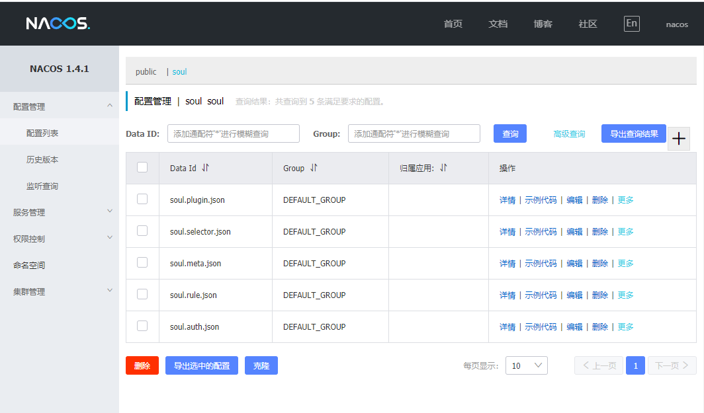

# Soul网关源码解析（十六）Nacos数据同步示例运行
***
## 简介
&ensp;&ensp;&ensp;&ensp;本篇文章来探索下Soul网关的Nacos数据同步的示例运行，由于目前感觉这个nacos对新手不是太友好，而且感觉可能是有bug，所以单独写一篇详解如何配置，为下一步进行源码解析，排查其中的问题打下基础

## 示例运行
**本篇文章问题基于2021.1.23日的soul最新代码版本**

### nacos、mysql docker 启动
&ensp;&ensp;&ensp;&ensp;我们使用docker启动一个nacos 和 mysql

```shell script
docker run --name mysql -p 3306:3306 -e MYSQL_ROOT_PASSWORD=123456 -d mysql:latest

# 管理界面用户名和密码：nacos nacos
git clone https://github.com/nacos-group/nacos-docker.git 
cd .\nacos-docker\
docker-compose -f example/standalone-derby.yaml up
```

&ensp;&ensp;&ensp;&ensp;访问nacos界面：127.0.0.1:8848 ，如果是正常的，就能看到下面五个数据配置，那恭喜你，你的是正常运行的。如果是空的，那说明你和我遇到了一样的问题：




### 问题场景描述
&ensp;&ensp;&ensp;&ensp;我们把admin、example-HTTP、Bootstrap启动起来，可能会遇到下面的问题之一：

- 1.都能正常启动，但nacos界面是空的，Bootstrap访问失败，没找到相应的数据
- 2.bootstrap启动失败，说读取数据为空

### 正确配置Nacos
#### Bootstrap配置
&ensp;&ensp;&ensp;&ensp;首先确保你的maven依赖开启了nacos-starter，如下，如果没有的请添加进去

```xml
        <!-- soul data sync start use nacos-->
        <dependency>
            <groupId>org.dromara</groupId>
            <artifactId>soul-spring-boot-starter-sync-data-nacos</artifactId>
            <version>${project.version}</version>
        </dependency>
```

&ensp;&ensp;&ensp;&ensp;再来配置配置文件，强调：把其他的同步方式都给关了，只留下Nacos，并且修改Nacos同步配置，去掉acm相关的东西，都给注释掉！我们使用新的命名空间soul，方便查看数据

```xml
soul:
    file:
      enabled: true
    corss:
      enabled: true
    dubbo :
      parameter: multi
    sync:
#        websocket :
#             urls: ws://localhost:9095/websocket
#        zookeeper:
#             url: localhost:2181
#             sessionTimeout: 5000
#             connectionTimeout: 2000
#        http:
#             url : http://localhost:9095
        nacos:
              url: localhost:8848
              namespace: soul
#              acm:
#                enabled: false
#                endpoint: acm.aliyun.com
#                namespace:
#                accessKey:
#                secretKey:
```

&ensp;&ensp;&ensp;&ensp;如果运行起来，报错是读取数据是Null，那说明配置成功，下面接着配置其他的

#### Admin配置
&ensp;&ensp;&ensp;&ensp;首先确保引入了Nacos-client依赖，如果没有，请进行添加：

```xml
        <dependency>
            <groupId>com.alibaba.nacos</groupId>
            <artifactId>nacos-client</artifactId>
            <version>${nacos-client.version}</version>
        </dependency>
```

&ensp;&ensp;&ensp;&ensp;配置文件也是，其他的同步方式都关闭，只留下Nacos，并修改命名空间为soul，注释掉acm相关（PS：进行debug的时候发现websocket好像也是开启的，感觉有点奇怪，但没有细看）

```xml
soul:
  database:
    dialect: mysql
    init_script: "META-INF/schema.sql"
    init_enable: true
  sync:
#    websocket:
#      enabled: false
#      zookeeper:
#          url: localhost:2181
#          sessionTimeout: 5000
#          connectionTimeout: 2000
#      http:
#        enabled: true
      nacos:
        url: localhost:8848
        namespace: soul
#        acm:
#          enabled: false
#          endpoint: acm.aliyun.com
#          namespace:
#          accessKey:
#          secretKey:
```

&ensp;&ensp;&ensp;&ensp;可以试着启动下Admin和example-HTTP，看看有没有错，没有的话，继续下面的

#### Nacos配置
&ensp;&ensp;&ensp;&ensp;进入Nacos管理界面，用户名和密码：nacos nacos

&ensp;&ensp;&ensp;&ensp;在左边菜单栏中进行命名空间，选择新建命名空间，全部填写soul，建立soul的命名空间

&ensp;&ensp;&ensp;&ensp;这个时候再重启Admin和HTTP示例，在配置管理--配置列表中，在上方有一个命名空间的名称，public和soul。点击切换到soul，不出意外的话，也是啥也没有

#### 手动同步数据
&ensp;&ensp;&ensp;&ensp;经过前面文章，我们知道有五种数据：插件数据、选择器数据、规则数据、元数据、认证管理数据

&ensp;&ensp;&ensp;&ensp;下面我们进入Admin后台管理界面，分别进入元数据、认证管理界面、插件管理，点击同步数据，然后点击nacos配置列表页面的查询，发现出现了auth、meta、plugin相关的数据

&ensp;&ensp;&ensp;&ensp;这个时候如果重启了HTTP示例，可能也会出现selector和rule的数据（如果没有，接着下面的手动同步这些数据），但我们尝试访问接口：http://127.0.0.1:9195/http/order/findById?id=1111 ，会发现找不到rule

&ensp;&ensp;&ensp;&ensp;这个时候，我们需要点击相应的rule，进行修改（改改状态，日志是否打印之类的小改动即可），那它就会同步到nacos里面去，再次访问接口就能正常返回了

&ensp;&ensp;&ensp;&ensp;这样，基本能跑一下，但问题还是很大，最大的问题是没有自动同步全量数据，需要手工同步

## 总结
&ensp;&ensp;&ensp;&ensp;本篇文章，记录了一次Nacos运行不成功的不完美的解决方法，后面需要进一步的进行源码探究，看看问题

## 参考链接
- [KaitoShy:soul 网关入门篇（七）：数据同步方式- nacos 配置](https://www.jianshu.com/p/8294289145a7?utm_campaign=hugo&utm_medium=reader_share&utm_content=note&utm_source=weixin-friends)
- [Nacos Docker 快速开始](https://nacos.io/zh-cn/docs/quick-start-docker.html)

## Soul网关源码分析文章列表
### Github
- [Soul源码阅读（一） 概览](https://github.com/lw1243925457/SE-Notes/blob/master/profession/program/%E5%BC%80%E6%BA%90/soul/soul%E6%BA%90%E7%A0%81%E9%98%85%E8%AF%BB1-%E6%A6%82%E8%A7%88.md)
- [Soul源码阅读（二）代码初步运行](https://github.com/lw1243925457/SE-Notes/blob/master/profession/program/%E5%BC%80%E6%BA%90/soul/soul%E6%BA%90%E7%A0%81%E9%98%85%E8%AF%BB2-%E5%88%9D%E6%AD%A5%E8%BF%90%E8%A1%8C.md)
- [Soul源码阅读（三）HTTP请求处理概览](https://github.com/lw1243925457/SE-Notes/blob/master/profession/program/%E5%BC%80%E6%BA%90/soul/soul%E6%BA%90%E7%A0%81%E9%98%85%E8%AF%BB3-%E8%AF%B7%E6%B1%82%E5%A4%84%E7%90%86%E6%A6%82%E8%A7%88.md)
- [Soul网关源码阅读（四）Dubbo请求概览](https://github.com/lw1243925457/SE-Notes/blob/master/profession/program/%E5%BC%80%E6%BA%90/soul/soul%E6%BA%90%E7%A0%81%E9%98%85%E8%AF%BB4-dubbo%E8%AF%B7%E6%B1%82%E6%A6%82%E8%A7%88.md)
- [Soul网关源码阅读（五）请求类型探索](https://github.com/lw1243925457/SE-Notes/blob/master/profession/program/%E5%BC%80%E6%BA%90/soul/soul%E6%BA%90%E7%A0%81%E9%98%85%E8%AF%BB5-%E8%AF%B7%E6%B1%82%E7%B1%BB%E5%9E%8B%E6%8E%A2%E7%B4%A2.md)
- [Soul网关源码阅读（六）Sofa请求处理概览](https://github.com/lw1243925457/SE-Notes/blob/master/profession/program/%E5%BC%80%E6%BA%90/soul/soul%E6%BA%90%E7%A0%81%E9%98%85%E8%AF%BB6-sofa%E8%AF%B7%E6%B1%82%E5%A4%84%E7%90%86%E6%A6%82%E8%A7%88.md)
- [Soul网关源码阅读（七）限流插件初探](https://github.com/lw1243925457/SE-Notes/blob/master/profession/program/%E5%BC%80%E6%BA%90/soul/soul%E6%BA%90%E7%A0%81%E9%98%85%E8%AF%BB7-%E9%99%90%E6%B5%81%E6%8F%92%E4%BB%B6%E5%88%9D%E6%8E%A2.md)
- [Soul网关源码阅读（八）路由匹配初探](https://github.com/lw1243925457/SE-Notes/blob/0e6931519a84d5c603504b2c6a633698ac793b70/profession/program/%E5%BC%80%E6%BA%90/soul/soul%E6%BA%90%E7%A0%81%E9%98%85%E8%AF%BB8-%E8%B7%AF%E7%94%B1%E5%8C%B9%E9%85%8D%E5%88%9D%E6%8E%A2.md)
- [Soul网关源码阅读（九）插件配置加载初探](https://github.com/lw1243925457/SE-Notes/blob/master/profession/program/%E5%BC%80%E6%BA%90/soul/soul%E6%BA%90%E7%A0%81%E9%98%85%E8%AF%BB9-%E6%8F%92%E4%BB%B6%E9%85%8D%E7%BD%AE%E5%8A%A0%E8%BD%BD%E5%88%9D%E6%8E%A2.md)
- [Soul网关源码阅读（十）自定义简单插件编写](https://github.com/lw1243925457/SE-Notes/blob/master/profession/program/%E5%BC%80%E6%BA%90/soul/soul%E6%BA%90%E7%A0%81%E9%98%85%E8%AF%BB10-%E8%87%AA%E5%AE%9A%E4%B9%89%E7%AE%80%E5%8D%95%E6%8F%92%E4%BB%B6%E7%BC%96%E5%86%99.md)
- [Soul网关源码阅读（十一）请求处理小结](https://github.com/lw1243925457/SE-Notes/blob/master/profession/program/%E5%BC%80%E6%BA%90/soul/soul%E6%BA%90%E7%A0%81%E9%98%85%E8%AF%BB11-%E8%AF%B7%E6%B1%82%E5%A4%84%E7%90%86%E5%B0%8F%E7%BB%93.md)
- [Soul网关源码阅读（十二）数据同步初探-Bootstrap端](https://github.com/lw1243925457/SE-Notes/blob/master/profession/program/%E5%BC%80%E6%BA%90/soul/soul%E6%BA%90%E7%A0%81%E9%98%85%E8%AF%BB12-%E6%95%B0%E6%8D%AE%E5%90%8C%E6%AD%A5%E5%88%9D%E6%8E%A2.md)
- [Soul网关源码阅读（十三）Websocket同步数据-Bootstrap端](https://github.com/lw1243925457/SE-Notes/blob/master/profession/program/%E5%BC%80%E6%BA%90/soul/soul%E6%BA%90%E7%A0%81%E9%98%85%E8%AF%BB13-websocket%E5%90%8C%E6%AD%A5%E6%95%B0%E6%8D%AE-Bootstrap%E7%AB%AF.md)
- [Soul网关源码阅读（十四）HTTP数据同步-Bootstrap端](https://github.com/lw1243925457/SE-Notes/blob/master/profession/program/%E5%BC%80%E6%BA%90/soul/soul%E6%BA%90%E7%A0%81%E9%98%85%E8%AF%BB14-HTTP%E6%95%B0%E6%8D%AE%E5%90%8C%E6%AD%A5-Bootstrap%E7%AB%AF.md)
- [Soul网关源码阅读（十五）Zookeeper数据同步-Bootstrap端](https://github.com/lw1243925457/SE-Notes/blob/master/profession/program/%E5%BC%80%E6%BA%90/soul/soul%E6%BA%90%E7%A0%81%E9%98%85%E8%AF%BB15-Zookeeper%E6%95%B0%E6%8D%AE%E5%90%8C%E6%AD%A5-Bootstrap%E7%AB%AF.md)
- [Soul网关源码阅读（十六）Nacos数据同步示例运行](https://github.com/lw1243925457/SE-Notes/blob/master/profession/program/%E5%BC%80%E6%BA%90/soul/soul%E6%BA%90%E7%A0%81%E9%98%85%E8%AF%BB16-Nacos%E6%95%B0%E6%8D%AE%E5%90%8C%E6%AD%A5%E7%A4%BA%E4%BE%8B%E8%BF%90%E8%A1%8C.md)

- [Soul网关源码阅读番外篇（一） HTTP参数请求错误](https://github.com/lw1243925457/SE-Notes/blob/master/profession/program/%E5%BC%80%E6%BA%90/soul/soul%E6%BA%90%E7%A0%81%E9%98%85%E8%AF%BB%E7%95%AA%E5%A4%96%E7%AF%871-HTTP%E7%A4%BA%E4%BE%8B%E5%8F%82%E6%95%B0%E8%AF%B7%E6%B1%82%E9%94%99%E8%AF%AF.md)

### 掘金
- [Soul网关源码阅读（一）概览](https://juejin.cn/post/6917864624423436296)
- [Soul网关源码阅读（二）代码初步运行](https://juejin.cn/post/6917865804121767944)
- [Soul网关源码阅读（三）请求处理概览](https://juejin.cn/post/6917866538712334343)
- [Soul网关源码阅读（四）Dubbo请求概览](https://juejin.cn/post/6917867369909977102)
- [Soul网关源码阅读（五）请求类型探索](https://juejin.cn/post/6918575905962983438)
- [Soul网关源码阅读（六）Sofa请求处理概览](https://juejin.cn/post/6918736260467015693)
- [Soul网关源码阅读（七）限流插件初探](https://juejin.cn/post/6919348164944232455/)
- [Soul网关源码阅读（八）路由匹配初探](https://juejin.cn/post/6919774553241550855/)
- [Soul网关源码阅读（九）插件配置加载初探](https://juejin.cn/post/6920074307590684685/)
- [Soul网关源码阅读（十）自定义简单插件编写](https://juejin.cn/post/6920142348617777166)
- [Soul网关源码阅读（十一）请求处理小结](https://juejin.cn/post/6920596034171174925)
- [Soul网关源码阅读（十二）数据同步初探](https://juejin.cn/post/6920596173925384206)
- [Soul网关源码阅读（十三）Websocket同步数据-Bootstrap端](https://juejin.cn/post/6920596028505178125)
- [Soul网关源码阅读（十四）HTTP数据同步-Bootstrap端](https://juejin.cn/post/6920597298674302983)
- [Soul网关源码阅读（十五）Zookeeper数据同步-Bootstrap端](https://juejin.cn/post/6920764643967238151)
- [Soul网关源码阅读（十六）Nacos数据同步示例运行](https://juejin.cn/post/6921170233868845064/)

- [Soul网关源码阅读番外篇（一） HTTP参数请求错误](https://juejin.cn/post/6918947689564471309)