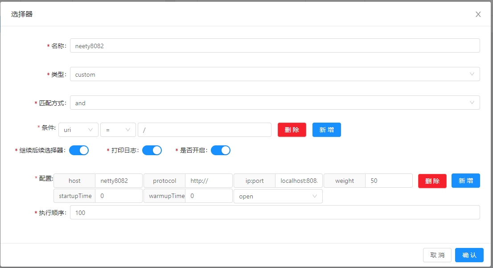
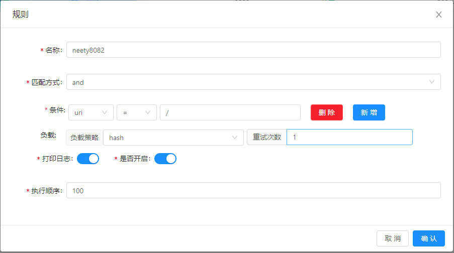

# Soul 源码解析（二）代码初步运行
***
## 简介
&ensp;&ensp;&ensp;&ensp;基于上篇：[Soul 源码阅读（一） 概览](),这部分跑一下Soul网关的示例

### 过程记录
&ensp;&ensp;&ensp;&ensp;现在我们可以根据地图，稍微探索一下周边，摸一摸

&ensp;&ensp;&ensp;&ensp;首先把工程拉下来，大致命令如下：

```shell script
# fork 代码到自己的参考
# 拉取代码到本地
git clone xxxxxx
# 如果你经常要给soul提交PR，进行学习研究时候建立一个新的专属分支，避免改动后还要改回来，新分支也可尽情改动
git checkout -b read 避免污染原来的代码，影响后面的提交

# 编译测试相关
F:\Software\apache-maven-3.6.3\bin\mvn.cmd clean install `-Dmaven.javadoc.skip`=true `-Dmaven.test.skip`=true
```

&ensp;&ensp;&ensp;&ensp;Soul Admin 需要数据，我们简单使用docker 启动一个

```shell script
# docker 启动一个mysql数据库,密码123456
# 如果之前运行过soul，重新删除数据库，让其重建，因为后面有改动数据库
docker run --name mysql -p 3306:3306 -e MYSQL_ROOT_PASSWORD=123456 -d mysql:latest
```

&ensp;&ensp;&ensp;&ensp;soul admin 修改配置文件中数据库相关信息

&ensp;&ensp;&ensp;&ensp;运行Soul Admin模块下的主函数，启动 soul-admin

&ensp;&ensp;&ensp;&ensp;运行Soul Bootstrap 模块下主函数，启动 soul-bootstrap，可以看到 websocket 建立同步的相关信息

&ensp;&ensp;&ensp;&ensp;浏览器访问： http://localhost:9095 ,登录 soul-admin，账号和密码是：admin 123456

&ensp;&ensp;&ensp;&ensp;找到插件列表的 divide 插件
&ensp;&ensp;&ensp;&ensp;添加选择器



&ensp;&ensp;&ensp;&ensp;添加规则



&ensp;&ensp;&ensp;&ensp;访问 http://localhost:9195/ ,得到 netty的返回结果(另开了一个netty的服务，返回hello world)

&ensp;&ensp;&ensp;&ensp;成功运行！