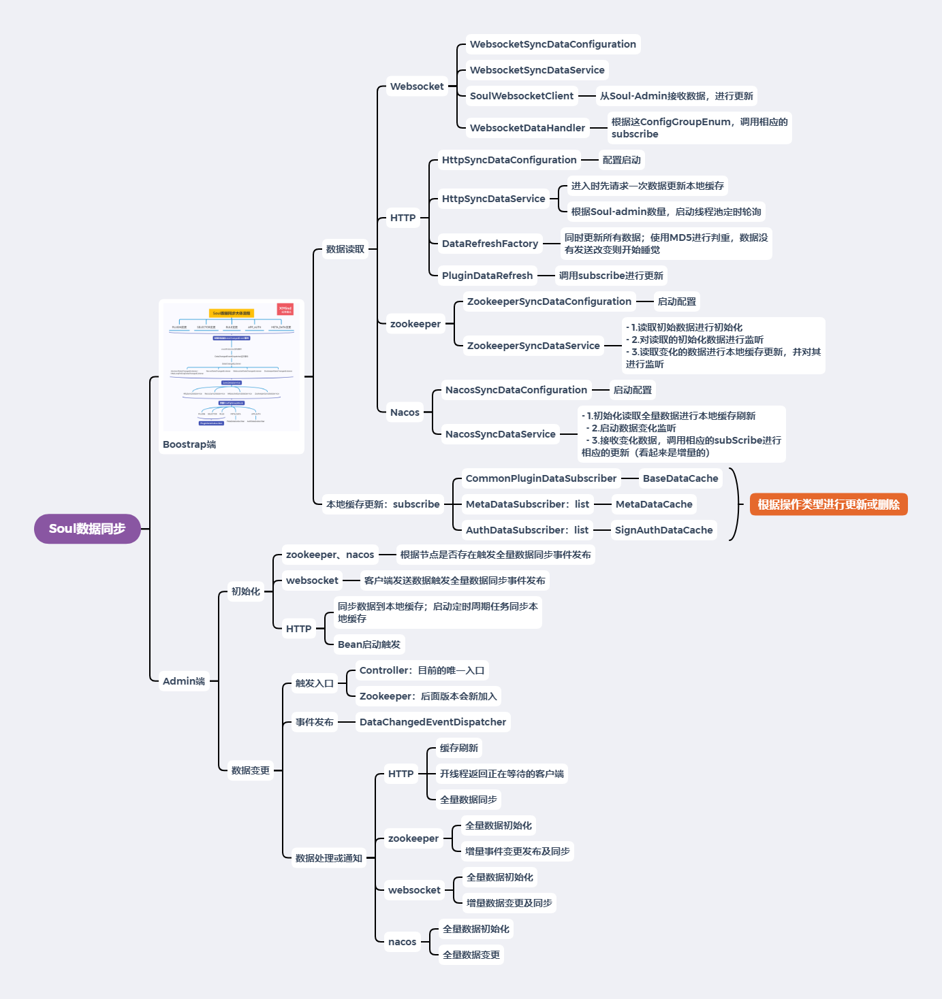

# Soul网关源码解析（二十二）数据同步小结
***
## 简介
&ensp;&ensp;&ensp;&ensp;经过前面几篇文章的探索，初步把数据同步相关的都走了一遍，本篇文章就做一个小结

## 总结
&ensp;&ensp;&ensp;&ensp;相关部分思维导图如下：

&ensp;&ensp;&ensp;&ensp;如上所示，数据同步分为两大模块：

- Bootstrap端
- Admin端

&ensp;&ensp;&ensp;&ensp;需要进行逐注意的是，两边的同步方式必须保持一致，这样才能正常进行数据同步

&ensp;&ensp;&ensp;&ensp;在解析的过程中，发现是可以开启多种数据同步方式的，但一般不建议这样做

&ensp;&ensp;&ensp;&ensp;推荐的同步方式是Zookeeper和Websocket，他们都是增量数据更新的

&ensp;&ensp;&ensp;&ensp;HTTP、Nacos是全量更新的

### Admin端数据同步
&ensp;&ensp;&ensp;&ensp;Admin端的数据同步套路基本一致，都是通过事件发布进行的

- 初始化事件：触发从数据库中读取所有数据进行同步
- 更新事件（更改和删除）：触发相应的处理

&ensp;&ensp;&ensp;&ensp;更新事件目前的唯一的触发入口都是Web Controllers，后面新加的可能还有Zookeeper

&ensp;&ensp;&ensp;&ensp;这边需要注意的是HTTP的同步方式，初始化事件是自己启动配置时触发的；更新事件先刷新本地缓存，再发送更新

### Bootstrap端
&ensp;&ensp;&ensp;&ensp;Bootstrap端基本套路都是一样，首先初始化、更新时，下发到各个数据的subscribe即可

&ensp;&ensp;&ensp;&ensp;初始化启动时都是拉取的全量数据进行本地缓存刷新

&ensp;&ensp;&ensp;&ensp;Zookeeper、Websocket都是增量数据更新，HTTP、Nacos是全量数据更新