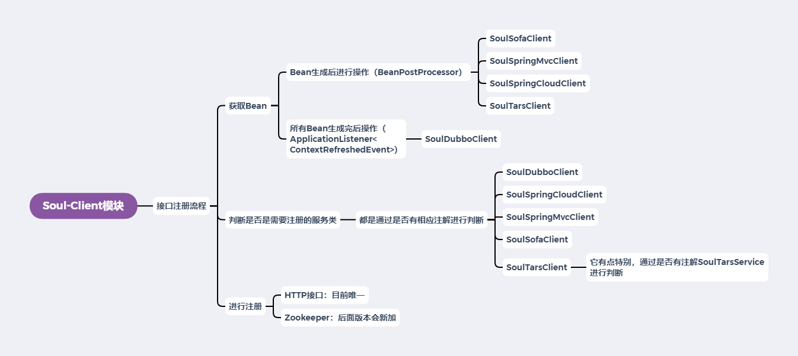

# Soul网关源码解析（二十五）Soul-Client模块小结
***
## 简介
&ensp;&ensp;&ensp;&ensp;本篇对Soul-Client做一个小结

## 总结
### 概览
&ensp;&ensp;&ensp;&ensp;在上两篇文章中，我们对HTTP和Apache Dubbo的注册进行分析，其大致流程如下：

- 1.获取Bean（class）
- 2.通过类上的注解判断是否需要进行注册
- 3.通过HTTP注册到Admin中

&ensp;&ensp;&ensp;&ensp;后面大致浏览了下其他的Alibaba Dubbo、Sofa、Tars、SpringCloud，发现基本都是大同小异的，也没啥特别，所有后面就不多余的进行分析，这里就对这个模块进行一个小结

&ensp;&ensp;&ensp;&ensp;整个Soul-Client模块注册流程如下：

&ensp;&ensp;&ensp;&ensp;下面进行下讲解

### 获取Bean
&ensp;&ensp;&ensp;&ensp;所有的基本思路都是利用Spring IOC提供的相关机制进行Bean的获取（类的获取），获取的方式在代码中有两种：

- 1.Bean生成后进行操作（BeanPostProcessor）：这种方式会在每个Bean生成完成后触发执行
- 2.所有Bean生成完后操作（ApplicationListener<ContextRefreshedEvent>）：这种方式在所有的Bean生成完成后触发执行

&ensp;&ensp;&ensp;&ensp;初步感觉第二种方式可以要好些，但仔细想想其实都差不多，基本都要遍历一次Bean（这方面细节不了解，这里初步的猜测一下），而且感觉两种方式应该是可以相互替换的，无非是那个写起来方便一点而已，这个感觉不是啥问题

### 注册判断
&ensp;&ensp;&ensp;&ensp;总览所有的注册判断，基本都是通过判断是否有相应的SoulXXX注解，有的话就进行注册的思路

&ensp;&ensp;&ensp;&ensp;这里SoulTarsClient，它有点特别，通过是否有注解SoulTarsService，有的话就进行注册，但也没有区别，只是更直观

### 注册到Admin
&ensp;&ensp;&ensp;&ensp;目前注册都是通过调用的HTTP接口，然后注册到Admin中，每个Client都有自己的注册链接

&ensp;&ensp;&ensp;&ensp;后期的版本可能会添加Zookeeper的注册方式，但和HTTP感觉大同小异，基本的原来应该是不会变的

## Soul网关源码解析文章列表
### 掘金
#### 了解与初步运行
- [Soul网关源码解析（一） 概览](https://juejin.cn/post/6917864624423436296)
- [Soul网关源码解析（二）代码初步运行](https://juejin.cn/post/6917865804121767944)

#### 请求处理流程解析
- [Soul网关源码解析（三）请求处理概览](https://juejin.cn/post/6917866538712334343)
- [Soul网关源码解析（四）Dubbo请求概览](https://juejin.cn/post/6917867369909977102)
- [Soul网关源码解析（五）请求类型探索](https://juejin.cn/post/6918575905962983438)
- [Soul网关源码解析（六）Sofa请求处理概览](https://juejin.cn/post/6918736260467015693)
- [Soul网关源码解析（七）限流插件初探](https://juejin.cn/post/6919348164944232455/)
- [Soul网关源码解析（八）路由匹配初探](https://juejin.cn/post/6919774553241550855/)
- [Soul网关源码解析（九）插件配置加载初探](https://juejin.cn/post/6920074307590684685/)
- [Soul网关源码解析（十）自定义简单插件编写](https://juejin.cn/post/6920142348617777166)
- [Soul网关源码解析（十一）请求处理小结](https://juejin.cn/post/6920596034171174925)

#### 数据同步解析
- [Soul网关源码解析（十二）数据同步初探](https://juejin.cn/post/6920596173925384206)
- [Soul网关源码解析（十三）Websocket同步数据-Bootstrap端](https://juejin.cn/post/6920596028505178125)
- [Soul网关源码解析（十四）HTTP数据同步-Bootstrap端](https://juejin.cn/post/6920597298674302983)
- [Soul网关源码解析（十五）Zookeeper数据同步-Bootstrap端](https://juejin.cn/post/6920764643967238151)
- [Soul网关源码解析（十六）Nacos数据同步示例运行](https://juejin.cn/post/6921170233868845064)
- [Soul网关源码解析（十七）Nacos数据同步解析-Bootstrap端](https://juejin.cn/post/6921325882753695757/)
- [Soul网关源码解析（十八）Zookeeper数据同步初探-Admin端](https://juejin.cn/post/6921495273122463751/)
- [Soul网关源码解析（十九）Nacos数据同步初始化修复-Admin端](https://juejin.cn/post/6921621915995996168/)
- [Soul网关源码解析（二十）Websocket数据同步-Admin端](https://juejin.cn/post/6921988280187617287/)
- [Soul网关源码解析（二十一）HTTP长轮询数据同步-Admin端](https://juejin.cn/post/6922301585288593416/)
- [Soul网关源码解析（二十二）数据同步小结](https://juejin.cn/post/6922584596810825735/)

#### Soul-Client模块
- [Soul网关源码解析（二十三）SoulSpringMvcClient注解](https://juejin.cn/post/6922643958455599111)
- [Soul网关源码解析（二十四）SoulDubboClient注解](https://juejin.cn/post/6922722161702469640/)

#### 番外
- [Soul网关源码阅读番外篇（一） HTTP参数请求错误](https://juejin.cn/post/6918947689564471309)