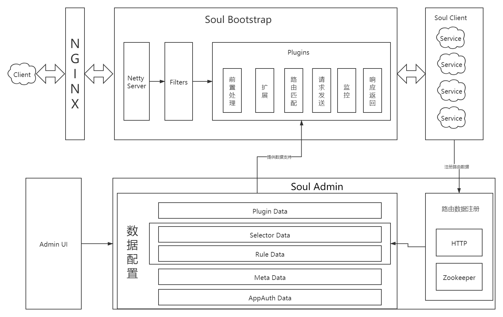
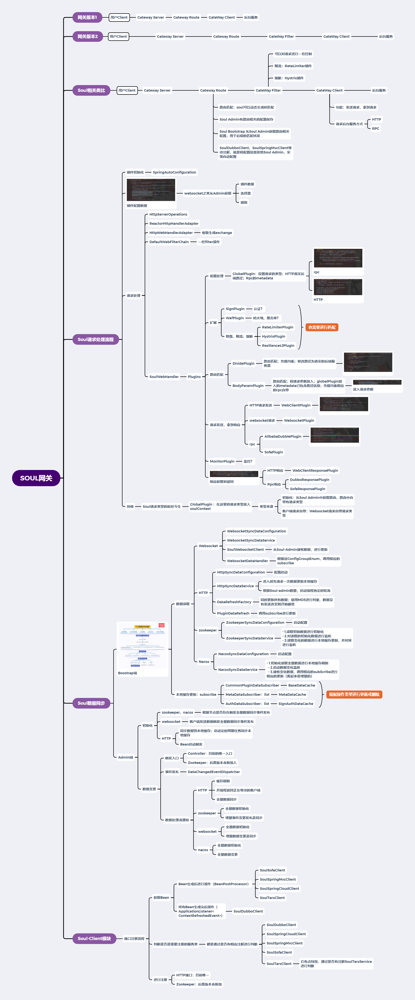

# Soul网关源码解析（二十六）初步总览
***
## 简介
&ensp;&ensp;&ensp;&ensp;讲过前面文章的分析，基本把Soul重要的三大模块都初步走了一遍，本篇文章就目前了解情况做一个总结

## 总结
&ensp;&ensp;&ensp;&ensp;整个Soul网关模块大致如下：

&ensp;&ensp;&ensp;&ensp;可以分为三大模块：

- Soul-Bootstrap:网关核心，进行请求处理
- Soul-Admin：网关配置中心，进行路由等主要的配置保存，给Soul-Bootstrap的Plugins提供数据支持（动态路由等等）
- Soul-Admin：实现自动路由配置，向Soul-Admin自动注册路由信息

&ensp;&ensp;&ensp;&ensp;Soul-Bootstrap和Soul-Admin都是可以集群配置的 

&ensp;&ensp;&ensp;&ensp;Soul-Bootstrap可以通过NGINX配置负载均衡来达到集群使用

&ensp;&ensp;&ensp;&ensp;Soul-Admin通过集群配置，可以避免单点错误，导致数据同步错误。但数据库不用集群，这些数据量应该不能达到要分库分表的那种规模吧

&ensp;&ensp;&ensp;&ensp;整个Soul网关的学习过程中的思维导图如下：

