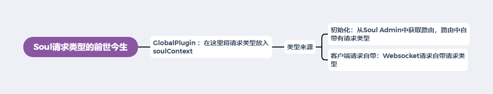

# Soul网关源码解析（五）请求类型探索
***
## 简介
&ensp;&ensp;&ensp;&ensp;在上几篇文章中分析了请求的处理流程，HTTP和RPC请求处理是互斥的，通过请求类型来判断，这篇文章来探索下请求类型的前世今生

## 源码分析
&ensp;&ensp;&ensp;&ensp;通过前面的分析，通过请求类型判断是否进入这个plugin进行执行，大致如下：

```java
    public Boolean skip(final ServerWebExchange exchange) {
        final SoulContext soulContext = exchange.getAttribute(Constants.CONTEXT);
        return !Objects.equals(Objects.requireNonNull(soulContext).getRpcType(), RpcTypeEnum.HTTP.getName());
    }
```

### Plugin Skip 函数
&ensp;&ensp;&ensp;&ensp;我们探索下那些plugin有实现skip函数

&ensp;&ensp;&ensp;&ensp;DividePlugin,判断是不是HTTP

```java
    public Boolean skip(final ServerWebExchange exchange) {
        final SoulContext soulContext = exchange.getAttribute(Constants.CONTEXT);
        return !Objects.equals(Objects.requireNonNull(soulContext).getRpcType(), RpcTypeEnum.HTTP.getName());
    }`
```

&ensp;&ensp;&ensp;&ensp;WebClientPlugin,是HTTP或者SPRING_CLOUD

```java
    public Boolean skip(final ServerWebExchange exchange) {
        final SoulContext soulContext = exchange.getAttribute(Constants.CONTEXT);
        assert soulContext != null;
        return !Objects.equals(RpcTypeEnum.HTTP.getName(), soulContext.getRpcType())
                && !Objects.equals(RpcTypeEnum.SPRING_CLOUD.getName(), soulContext.getRpcType());
    }
```


&ensp;&ensp;&ensp;&ensp;WebsocketPlugin,是WEB_SOCKET

```java
    public Boolean skip(final ServerWebExchange exchange) {
        final SoulContext body = exchange.getAttribute(Constants.CONTEXT);
        return !Objects.equals(Objects.requireNonNull(body).getRpcType(), RpcTypeEnum.WEB_SOCKET.getName());
    }
```

&ensp;&ensp;&ensp;&ensp;AlibabaDubboPlugin,类型是DUBBO

```java
    public Boolean skip(final ServerWebExchange exchange) {
        final SoulContext soulContext = exchange.getAttribute(Constants.CONTEXT);
        assert soulContext != null;
        return !Objects.equals(soulContext.getRpcType(), RpcTypeEnum.DUBBO.getName());
    }
```

&ensp;&ensp;&ensp;&ensp;WebClientResponsePlugin，类型是HTTP或者SPRING_CLOUD

```java
    public Boolean skip(final ServerWebExchange exchange) {
        final SoulContext soulContext = exchange.getAttribute(Constants.CONTEXT);
        assert soulContext != null;
        return !Objects.equals(RpcTypeEnum.HTTP.getName(), soulContext.getRpcType())
                && !Objects.equals(RpcTypeEnum.SPRING_CLOUD.getName(), soulContext.getRpcType());
    }
```

&ensp;&ensp;&ensp;&ensp;DubboResponsePlugin，类型是DUBBO

```java
    public Boolean skip(final ServerWebExchange exchange) {
        final SoulContext soulContext = exchange.getAttribute(Constants.CONTEXT);
        assert soulContext != null;
        return !Objects.equals(soulContext.getRpcType(), RpcTypeEnum.DUBBO.getName());
    }
```

&ensp;&ensp;&ensp;&ensp;两个类型看着有点怪，有时候转不过弯了，需要注意

### 源码追踪
&ensp;&ensp;&ensp;&ensp;我们看下取类似相关的代码，大致如下：

```java
final SoulContext soulContext = exchange.getAttribute(Constants.CONTEXT);
soulContext.getRpcType()
```

&ensp;&ensp;&ensp;&ensp;看看将响应放到exchange中的代码，可以猜测到把Constants.CONTEXT放到exchange的大致代码：

```java
exchange.getAttributes().put(Constants.CLIENT_RESPONSE_RESULT_TYPE, ResultEnum.SUCCESS.getName());

// 可以得到放Constants.CONTEXT的大致代码如下：
exchange.getAttributes().put(Constants.CONTEXT,
```

&ensp;&ensp;&ensp;&ensp;在IDEA中使用ctrl+shift+R，全局搜索，发现在 GlobalPlugin 中有嫌疑代码：

```java
    # GlobalPlugin

    public Mono<Void> execute(final ServerWebExchange exchange, final SoulPluginChain chain) {
        final ServerHttpRequest request = exchange.getRequest();
        final HttpHeaders headers = request.getHeaders();
        final String upgrade = headers.getFirst("Upgrade");
        SoulContext soulContext;
        if (StringUtils.isBlank(upgrade) || !"websocket".equals(upgrade)) {
            // 对SoulContext进行操作
            soulContext = builder.build(exchange);
        } else {
            final MultiValueMap<String, String> queryParams = request.getQueryParams();
            // 对SoulContext进行操作
            soulContext = transformMap(queryParams);
        }
        // 更新SoulContext
        exchange.getAttributes().put(Constants.CONTEXT, soulContext);
        return chain.execute(exchange);
    }
```

&ensp;&ensp;&ensp;&ensp;有两处嫌疑：build和transformMap，我们在看看build函数具体细节

```java
    # DefaultSoulContextBuilder build(exchange)
    
    public SoulContext build(final ServerWebExchange exchange) {
        final ServerHttpRequest request = exchange.getRequest();
        String path = request.getURI().getPath();
        // 根据path得到一些元数据
        MetaData metaData = MetaDataCache.getInstance().obtain(path);
        if (Objects.nonNull(metaData) && metaData.getEnabled()) {
            exchange.getAttributes().put(Constants.META_DATA, metaData);
        }
        // 再看下去
        return transform(request, metaData);
    }

    private SoulContext transform(final ServerHttpRequest request, final MetaData metaData) {
        final String appKey = request.getHeaders().getFirst(Constants.APP_KEY);
        final String sign = request.getHeaders().getFirst(Constants.SIGN);
        final String timestamp = request.getHeaders().getFirst(Constants.TIMESTAMP);
        SoulContext soulContext = new SoulContext();
        String path = request.getURI().getPath();
        soulContext.setPath(path);
        // 下面都是判断，而且是基于metaData的判断，猜测是在路由注册的时候就携带了相关的类型信息，而且默认是HTTP
        if (Objects.nonNull(metaData) && metaData.getEnabled()) {
            if (RpcTypeEnum.SPRING_CLOUD.getName().equals(metaData.getRpcType())) {
                setSoulContextByHttp(soulContext, path);
                soulContext.setRpcType(metaData.getRpcType());
            } else if (RpcTypeEnum.DUBBO.getName().equals(metaData.getRpcType())) {
                setSoulContextByDubbo(soulContext, metaData);
            } else if (RpcTypeEnum.SOFA.getName().equals(metaData.getRpcType())) {
                setSoulContextBySofa(soulContext, metaData);
            } else if (RpcTypeEnum.TARS.getName().equals(metaData.getRpcType())) {
                setSoulContextByTars(soulContext, metaData);
            } else {
                setSoulContextByHttp(soulContext, path);
                soulContext.setRpcType(RpcTypeEnum.HTTP.getName());
            }
        } else {
            setSoulContextByHttp(soulContext, path);
            soulContext.setRpcType(RpcTypeEnum.HTTP.getName());
        }
        soulContext.setAppKey(appKey);
        soulContext.setSign(sign);
        soulContext.setTimestamp(timestamp);
        soulContext.setStartDateTime(LocalDateTime.now());
        Optional.ofNullable(request.getMethod()).ifPresent(httpMethod -> soulContext.setHttpMethod(httpMethod.name()));
        return soulContext;
    }
```

&ensp;&ensp;&ensp;&ensp;类型是从MetaData中取出来的，我们详细去看看类： MetaDataCache

```java
    # MetaDataCache

    // 从Map中取出数据
    public MetaData obtain(final String path) {
        MetaData metaData = META_DATA_MAP.get(path);
        if (Objects.isNull(metaData)) {
            String key = META_DATA_MAP.keySet().stream().filter(k -> PathMatchUtils.match(k, path)).findFirst().orElse("");
            return META_DATA_MAP.get(key);
        }
        return metaData;
    }

    // 这个函数是存放数据的，我们在这个函数打上断点，看看调用栈
    public void cache(final MetaData data) {
        META_DATA_MAP.put(data.getPath(), data);
    }
```

&ensp;&ensp;&ensp;&ensp;在上面的 cache 函数打上端口，它应该是启动的时候初始化的，我们打上断点以后重启Bootstrap程序，调用栈的相关类和函数如下：

```java
    # MetaDataAllSubscriber ，再往上看
    public void onSubscribe(final MetaData metaData) {
        MetaDataCache.getInstance().cache(metaData);
    }

    # MetaDataHandler ，再往上看
    protected void doRefresh(final List<MetaData> dataList) {
        metaDataSubscribers.forEach(MetaDataSubscriber::refresh);
        dataList.forEach(metaData -> metaDataSubscribers.forEach(metaDataSubscriber -> metaDataSubscriber.onSubscribe(metaData)));
    }

    # AbstractDataHandler ，这里看到datalist是从json转过来的，继续往上差
    public void handle(final String json, final String eventType) {
        List<T> dataList = convert(json);
        if (CollectionUtils.isNotEmpty(dataList)) {
            DataEventTypeEnum eventTypeEnum = DataEventTypeEnum.acquireByName(eventType);
            switch (eventTypeEnum) {
                case REFRESH:
                case MYSELF:
                    doRefresh(dataList);
                    break;
                case UPDATE:
                case CREATE:
                    doUpdate(dataList);
                    break;
                case DELETE:
                    doDelete(dataList);
                    break;
                default:
                    break;
            }
        }
    }

    # WebsocketDataHandler ，到了websocket相关的，继续往上
    public void executor(final ConfigGroupEnum type, final String json, final String eventType) {
        ENUM_MAP.get(type).handle(json, eventType);
    }

    # SoulWebsocketClient ，到这就查到来源了，从websocket获取过来的
    private void handleResult(final String result) {
        WebsocketData websocketData = GsonUtils.getInstance().fromJson(result, WebsocketData.class);
        ConfigGroupEnum groupEnum = ConfigGroupEnum.acquireByName(websocketData.getGroupType());
        String eventType = websocketData.getEventType();
        String json = GsonUtils.getInstance().toJson(websocketData.getData());
        websocketDataHandler.executor(groupEnum, json, eventType);
    }

    public void onMessage(final String result) {
        // 最终源头，从websocket获取得到的
        handleResult(result);
    }
```

&ensp;&ensp;&ensp;&ensp;我们查看下 result 是个什么都行，内容大致如下（太长了，删了一些）：可以看到每个路径都有配置，并且都是RPCType这个属性，那我们基本就找到了，类型是客户端注册的时候自己传入的！

```json
{
	"groupType": "META_DATA",
	"eventType": "REFRESH",
	"data": [{
		"id": "1349889526699433984",
		"appName": "sofa",
		"path": "/sofa/insert",
		"rpcType": "sofa",
		"serviceName": "org.dromara.soul.examples.dubbo.api.service.DubboTestService",
		"methodName": "insert",
		"parameterTypes": "org.dromara.soul.examples.dubbo.api.entity.DubboTest",
		"rpcExt": "{\"loadbalance\":\"hash\",\"retries\":3,\"timeout\":-1}",
		"enabled": true
	}, {
		"id": "1350625956049108992",
		"appName": "dubbo",
		"path": "/dubbo/findAll",
		"rpcType": "dubbo",
		"serviceName": "org.dromara.soul.examples.dubbo.api.service.DubboTestService",
		"methodName": "findAll",
		"rpcExt": "{\"group\":\"\",\"version\":\"\",\"loadbalance\":\"random\",\"retries\":2,\"timeout\":10000,\"url\":\"\"}",
		"enabled": true
	}]
}
```

&ensp;&ensp;&ensp;&ensp;看下另外一个transformMap，看看它的请求类型是怎么来的

```java
    # GlobalPlugin

    private SoulContext transformMap(final MultiValueMap<String, String> queryParams) {
        SoulContext soulContext = new SoulContext();
        soulContext.setModule(queryParams.getFirst(Constants.MODULE));
        soulContext.setMethod(queryParams.getFirst(Constants.METHOD));
        soulContext.setRpcType(queryParams.getFirst(Constants.RPC_TYPE));
        return soulContext;
    }
```

&ensp;&ensp;&ensp;&ensp;queryParams是从 request 取得的，那应该不是初始化配置来的了，看看 GlobalPlugin 前面的类有没有对其进行处理了

&ensp;&ensp;&ensp;&ensp;通过前几篇，我们可以总结得到下面的处理链路经过的类

- HttpServerOperations : 明显的netty的请求接收的地方，请求入口
- TcpServerBind
- HttpServerHandle
- ReactorHttpHandlerAdapter ：生成response和request
- ReactiveWebServerApplicationContext
- HttpWebHandlerAdapter ：exchange 的生成
- ExceptionHandlingWebHandler
- WebHandlerDecorator
- FilteringWebHandler
- DefaultWebFilterChain
  - MetricsWebFilter
  - HealthFilter
  - FileSizeFilter
  - WebSocketParamFilter
  - HiddenHttpMethodFilter
- SoulWebHandler ：plugins调用链，后面带type的表明是需要去类型处理判断的
  - GlobalPlugin
  - SignPlugin
  - WafPlugin
  - RateLimiterPlugin
  - HystrixPlugin
  - Resilience4JPlugin
  - DividePlugin : type
  - WebClientPlugin : type
  - WebsocketPlugin : type
  - BodyParamPlugin
  - AlibabaDubblePlugin : type
  - MonitorPlugin
  - WebClientResponsePlugin : type
  - DubboResponsePlugin : type

&ensp;&ensp;&ensp;&ensp;快捷没有思路，就一个一个看看（SoulWebHandler，也没多少），大概瞄了一眼，没有看到设置相关的代码，就头疼

&ensp;&ensp;&ensp;&ensp;在回去看看 GlobalPlugin，我们仔细看看判断，发现一个有趣的逻辑：判断为空或者不为websocket，那是不是下面那个就是websocket？

```java
    # GlobalPlugin
    public Mono<Void> execute(final ServerWebExchange exchange, final SoulPluginChain chain) {
        final ServerHttpRequest request = exchange.getRequest();
        final HttpHeaders headers = request.getHeaders();
        final String upgrade = headers.getFirst("Upgrade");
        SoulContext soulContext;
        // 它这判断为空获取不为websocket，那是不是下面那个就是websocket？
        if (StringUtils.isBlank(upgrade) || !"websocket".equals(upgrade)) {
            // 对SoulContext进行操作
            soulContext = builder.build(exchange);
        } else {
            final MultiValueMap<String, String> queryParams = request.getQueryParams();
            // 对SoulContext进行操作
            soulContext = transformMap(queryParams);
        }
        // 更新SoulContext
        exchange.getAttributes().put(Constants.CONTEXT, soulContext);
        return chain.execute(exchange);
    }
```

&ensp;&ensp;&ensp;&ensp;于是我们找个websocket测试一下，下面websocket的测试攻击和websocket的官方说明文档：

- [http://www.easyswoole.com/wstool.html](http://www.easyswoole.com/wstool.html)
- [Soul网关Websocket支持](https://dromara.org/zh-cn/docs/soul/plugin-websocket.html)

&ensp;&ensp;&ensp;&ensp;我们在ReactorHttpHandlerAdapter/HttpWebHandlerAdapter/DefaultWebFilterChain 这三个上面打上断点，进行逐步调试

&ensp;&ensp;&ensp;&ensp;断点来到 filter 的 WebSocketParamFilter ,看到了非常可疑的代码

```java
    # WebSocketParamFilter
    protected Mono<Boolean> doFilter(final ServerWebExchange exchange, final WebFilterChain chain) {
        final ServerHttpRequest request = exchange.getRequest();
        final HttpHeaders headers = request.getHeaders();
        // 进入debug，查看其值为 websocket
        final String upgrade = headers.getFirst("Upgrade");
        if (StringUtils.isNoneBlank(upgrade) && RpcTypeEnum.WEB_SOCKET.getName().equals(upgrade)) {
            return Mono.just(verify(request.getQueryParams()));
        }
        return Mono.just(true);
    }

    // 下面这个判断是直接从请求里面取出来的
    private Boolean verify(final MultiValueMap<String, String> queryParams) {
        return !StringUtils.isBlank(queryParams.getFirst(Constants.MODULE))
                && !StringUtils.isBlank(queryParams.getFirst(Constants.METHOD))
                && !StringUtils.isBlank(queryParams.getFirst(Constants.RPC_TYPE));
    }
```

&ensp;&ensp;&ensp;&ensp;通过上面的代码，我们基本可以判断，GlobalPlugin 的 transformMap(queryParams) 基本是 websocket 的，而 websocket 类似是随着客户端的请求传入的

## 总结
&ensp;&ensp;&ensp;&ensp;梳理一下本篇文章的研究目标，大致如下图：



&ensp;&ensp;&ensp;&ensp;我们知道了 GlobalPlugin 的具体作用就是将请求类型放入soulContext，那后面的 plugin 就能拿到数据的请求类型

&ensp;&ensp;&ensp;&ensp;还知道了网关初始化的时候获取路由时，路由的信息自带请求类型；而Websocket请求比较特殊，它从客户端传入就自带请求类型

## Soul网关源码分析文章列表
### Github
- [Soul 源码阅读（一） 概览](https://github.com/lw1243925457/SE-Notes/blob/master/profession/program/%E5%BC%80%E6%BA%90/soul/soul%E6%BA%90%E7%A0%81%E9%98%85%E8%AF%BB1-%E6%A6%82%E8%A7%88.md)
- [Soul 源码阅读（二）代码初步运行](https://github.com/lw1243925457/SE-Notes/blob/master/profession/program/%E5%BC%80%E6%BA%90/soul/soul%E6%BA%90%E7%A0%81%E9%98%85%E8%AF%BB2-%E5%88%9D%E6%AD%A5%E8%BF%90%E8%A1%8C.md)
- [Soul 源码阅读（三）HTTP请求处理概览](https://github.com/lw1243925457/SE-Notes/blob/master/profession/program/%E5%BC%80%E6%BA%90/soul/soul%E6%BA%90%E7%A0%81%E9%98%85%E8%AF%BB3-%E8%AF%B7%E6%B1%82%E5%A4%84%E7%90%86%E6%A6%82%E8%A7%88.md)
- [Soul 网关源码阅读（四）Dubbo请求概览](https://github.com/lw1243925457/SE-Notes/blob/master/profession/program/%E5%BC%80%E6%BA%90/soul/soul%E6%BA%90%E7%A0%81%E9%98%85%E8%AF%BB4-dubbo%E8%AF%B7%E6%B1%82%E6%A6%82%E8%A7%88.md)
- [Soul网关源码阅读（五）请求类型探索](https://github.com/lw1243925457/SE-Notes/blob/master/profession/program/%E5%BC%80%E6%BA%90/soul/soul%E6%BA%90%E7%A0%81%E9%98%85%E8%AF%BB5-%E8%AF%B7%E6%B1%82%E7%B1%BB%E5%9E%8B%E6%8E%A2%E7%B4%A2.md)
- [Soul 网关源码阅读（六）Sofa请求处理概览](https://github.com/lw1243925457/SE-Notes/blob/master/profession/program/%E5%BC%80%E6%BA%90/soul/soul%E6%BA%90%E7%A0%81%E9%98%85%E8%AF%BB6-sofa%E8%AF%B7%E6%B1%82%E5%A4%84%E7%90%86%E6%A6%82%E8%A7%88.md)

### 掘金
- Soul 网关源码阅读（一） 概览 #掘金文章# https://juejin.cn/post/6917864624423436296
- Soul 网关源码阅读（二）代码初步运行 #掘金文章# https://juejin.cn/post/6917865804121767944
- Soul 网关源码阅读（三）请求处理概览 #掘金文章# https://juejin.cn/post/6917866538712334343
- Soul 网关源码阅读（四）Dubbo请求概览 #掘金文章# https://juejin.cn/post/6917867369909977102
- Soul网关源码阅读（五）请求类型探索 #掘金文章# https://juejin.cn/post/6918575905962983438