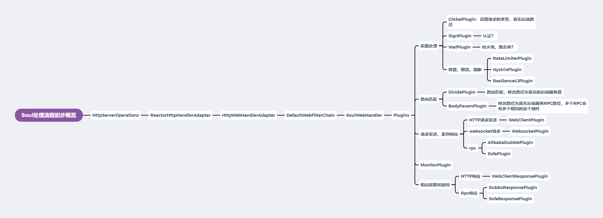

# Soul 网关源码解析（五）Sofa请求处理概览
***
## 简介
&ensp;&ensp;&ensp;&ensp;今天来探索一下Sofa请求处理流程，看看和前面的HTTP、Dubbo有什么异同

## Sofa示例运行
*PS：如果请求加上参数运行不成功，请更新最新版本，此问题在新版本中已经修复：https://blog.csdn.net/baidu_27627251/article/details/112726694*
*[Add sofa param resolve service](https://github.com/dromara/soul/pull/992)*

&ensp;&ensp;&ensp;&ensp;首先运行下官方的Sofa示例，首先启动下mysql和zookeeper，这里使用docker启动：

```shell script
docker run -dit --name zk -p 2181:2181 zookeepe
docker run --name mysql -p 3306:3306 -e MYSQL_ROOT_PASSWORD=123456 -d mysql:latest
```

&ensp;&ensp;&ensp;&ensp;然后运行Soul-admin，Soul-Bootst，在管理图界面起用sofa插件

&ensp;&ensp;&ensp;&ensp;运行官方示例：soul-examples --> soul-examples-sofa

&ensp;&ensp;&ensp;&ensp;这里有个坑，需要注意，启动后，bootstrap打印日志中没有sofa插件，请求一直失败

```xml
o.d.s.w.configuration.SoulConfiguration  : load plugin:[global] [org.dromara.soul.plugin.global.GlobalPlugin]
o.d.s.w.configuration.SoulConfiguration  : load plugin:[sign] [org.dromara.soul.plugin.sign.SignPlugin]
o.d.s.w.configuration.SoulConfiguration  : load plugin:[waf] [org.dromara.soul.plugin.waf.WafPlugin]
o.d.s.w.configuration.SoulConfiguration  : load plugin:[rate_limiter] [org.dromara.soul.plugin.ratelimiter.RateLimiterPlugin]
o.d.s.w.configuration.SoulConfiguration  : load plugin:[hystrix] [org.dromara.soul.plugin.hystrix.HystrixPlugin]
o.d.s.w.configuration.SoulConfiguration  : load plugin:[resilience4j] [org.dromara.soul.plugin.resilience4j.Resilience4JPlugin]
o.d.s.w.configuration.SoulConfiguration  : load plugin:[divide] [org.dromara.soul.plugin.divide.DividePlugin]
o.d.s.w.configuration.SoulConfiguration  : load plugin:[webClient] [org.dromara.soul.plugin.httpclient.WebClientPlugin]
o.d.s.w.configuration.SoulConfiguration  : load plugin:[divide] [org.dromara.soul.plugin.divide.websocket.WebSocketPlugin]
o.d.s.w.configuration.SoulConfiguration  : load plugin:[alibaba-dubbo-body-param] [org.dromara.soul.plugin.alibaba.dubbo.param.BodyParamPlugin]
o.d.s.w.configuration.SoulConfiguration  : load plugin:[dubbo] [org.dromara.soul.plugin.alibaba.dubbo.AlibabaDubboPlugin]
o.d.s.w.configuration.SoulConfiguration  : load plugin:[monitor] [org.dromara.soul.plugin.monitor.MonitorPlugin]
o.d.s.w.configuration.SoulConfiguration  : load plugin:[response] [org.dromara.soul.plugin.httpclient.response.WebClientResponsePlugin]
o.d.s.w.configuration.SoulConfiguration  : load plugin:[response] [org.dromara.soul.plugin.alibaba.dubbo.response.DubboResponsePlugin]
```xml

&ensp;&ensp;&ensp;&ensp;查看初始的plugins也是没有sofa

```java
    public SoulWebHandler soulWebHandler(final ObjectProvider<List<SoulPlugin>> plugins) {
        List<SoulPlugin> pluginList = plugins.getIfAvailable(Collections::emptyList);
        final List<SoulPlugin> soulPlugins = pluginList.stream()
                .sorted(Comparator.comparingInt(SoulPlugin::getOrder)).collect(Collectors.toList());
        soulPlugins.forEach(soulPlugin -> log.info("load plugin:[{}] [{}]", soulPlugin.named(), soulPlugin.getClass().getName()));
        return new SoulWebHandler(soulPlugins);
    }
```

&ensp;&ensp;&ensp;&ensp;经过探索和老哥的讨论，发现是没有起用sofa的相关依赖

&ensp;&ensp;&ensp;&ensp;我们在Bootstrap的pom.xml文件中添加下面的依赖，然后重启

```xml
        <!--        sofa plugin start-->
        <dependency>
            <groupId>com.alipay.sofa</groupId>
            <artifactId>sofa-rpc-all</artifactId>
            <version>5.7.6</version>
        </dependency>
        <dependency>
            <groupId>org.apache.curator</groupId>
            <artifactId>curator-client</artifactId>
            <version>4.0.1</version>
        </dependency>
        <dependency>
            <groupId>org.apache.curator</groupId>
            <artifactId>curator-framework</artifactId>
            <version>4.0.1</version>
        </dependency>
        <dependency>
            <groupId>org.apache.curator</groupId>
            <artifactId>curator-recipes</artifactId>
            <version>4.0.1</version>
        </dependency>
        <dependency>
            <groupId>org.dromara</groupId>
            <artifactId>soul-spring-boot-starter-plugin-sofa</artifactId>
            <version>${project.version}</version>
        </dependency>
        <!--        sofa plugin end-->
```

&ensp;&ensp;&ensp;&ensp;然后查看日志打印，出现了sofa相关的插件

```xml
o.d.s.w.configuration.SoulConfiguration  : load plugin:[global] [org.dromara.soul.plugin.global.GlobalPlugin]
o.d.s.w.configuration.SoulConfiguration  : load plugin:[sign] [org.dromara.soul.plugin.sign.SignPlugin]
o.d.s.w.configuration.SoulConfiguration  : load plugin:[waf] [org.dromara.soul.plugin.waf.WafPlugin]
o.d.s.w.configuration.SoulConfiguration  : load plugin:[rate_limiter] [org.dromara.soul.plugin.ratelimiter.RateLimiterPlugin]
o.d.s.w.configuration.SoulConfiguration  : load plugin:[hystrix] [org.dromara.soul.plugin.hystrix.HystrixPlugin]
o.d.s.w.configuration.SoulConfiguration  : load plugin:[resilience4j] [org.dromara.soul.plugin.resilience4j.Resilience4JPlugin]
o.d.s.w.configuration.SoulConfiguration  : load plugin:[divide] [org.dromara.soul.plugin.divide.DividePlugin]
o.d.s.w.configuration.SoulConfiguration  : load plugin:[webClient] [org.dromara.soul.plugin.httpclient.WebClientPlugin]
o.d.s.w.configuration.SoulConfiguration  : load plugin:[divide] [org.dromara.soul.plugin.divide.websocket.WebSocketPlugin]
o.d.s.w.configuration.SoulConfiguration  : load plugin:[sofa-body-param] [org.dromara.soul.plugin.sofa.param.BodyParamPlugin]
o.d.s.w.configuration.SoulConfiguration  : load plugin:[dubbo] [org.dromara.soul.plugin.alibaba.dubbo.AlibabaDubboPlugin]
// 新出现的sofa相关的
o.d.s.w.configuration.SoulConfiguration  : load plugin:[sofa] [org.dromara.soul.plugin.sofa.SofaPlugin]
o.d.s.w.configuration.SoulConfiguration  : load plugin:[monitor] [org.dromara.soul.plugin.monitor.MonitorPlugin]
o.d.s.w.configuration.SoulConfiguration  : load plugin:[response] [org.dromara.soul.plugin.alibaba.dubbo.response.DubboResponsePlugin]
o.d.s.w.configuration.SoulConfiguration  : load plugin:[response] [org.dromara.soul.plugin.httpclient.response.WebClientResponsePlugin]
// 新出现的sofa相关的
o.d.s.w.configuration.SoulConfiguration  : load plugin:[response] [org.dromara.soul.plugin.sofa.response.SofaResponsePlugin]
```

&ensp;&ensp;&ensp;&ensp;日志中还打印了成功加载sofa相关的metadata

```xml
o.d.s.p.s.cache.ApplicationConfigCache   : init sofa reference success there meteData is :MetaData
o.d.s.p.s.cache.ApplicationConfigCache   : init sofa reference success there meteData is :MetaData
o.d.s.p.s.cache.ApplicationConfigCache   : init sofa reference success there meteData is :MetaData
```

&ensp;&ensp;&ensp;&ensp;访问链接： http://localhost:9195/sofa/findAll ，成功返回如下请求

```json
{
    "code": 200,
    "message": "Access to success!",
    "data": {
        "name": "hello world Soul Sofa , findAll",
        "id": "998932133"
    }
}
```

## 源码解析
*PS:Debug时间过程，会导致超时，这是正常的*

&ensp;&ensp;&ensp;&ensp;首先找到我们非常熟悉的切入点函数： SoulWebHandler ，在下面的方法中打上断点，然后逐步进入每个plugin观察其行为

```java
        public Mono<Void> execute(final ServerWebExchange exchange) {
            return Mono.defer(() -> {
                if (this.index < plugins.size()) {
                    SoulPlugin plugin = plugins.get(this.index++);
                    Boolean skip = plugin.skip(exchange);
                    if (skip) {
                        return this.execute(exchange);
                    }
                    return plugin.execute(exchange, this);
                }
                return Mono.empty();
            });
        }
```

### GlobalPlugin
&ensp;&ensp;&ensp;&ensp;进入其中，执行处理逻辑，通过上篇的分析，我们知道大致作用是将请求类型放入exchange中

### SignPlugin/WafPlugin/RateLimiterPlugin/HystrixPlugin/Resilience4JPlugin
&ensp;&ensp;&ensp;&ensp;进入其中，但plugin没有起用，不执行逻辑

### DividePlugin/WebClientPlugin/WebSocketPlugin
&ensp;&ensp;&ensp;&ensp;通过类型判断，跳过，不执行

### BodyParamPlugin
&ensp;&ensp;&ensp;&ensp;这个plugin在dubbo的时候也是要执行，我们来看看它干了写啥事。从下面逻辑中大概能看出先判断是否符合执行条件，然后将请求地址替换成真实的后端地址

```java
    public Mono<Void> execute(final ServerWebExchange exchange, final SoulPluginChain chain) {
        final ServerHttpRequest request = exchange.getRequest();
        final SoulContext soulContext = exchange.getAttribute(Constants.CONTEXT);
        // 判断类型是不是sofa
        if (Objects.nonNull(soulContext) && RpcTypeEnum.SOFA.getName().equals(soulContext.getRpcType())) {
            MediaType mediaType = request.getHeaders().getContentType();
            ServerRequest serverRequest = ServerRequest.create(exchange, messageReaders);
            if (MediaType.APPLICATION_JSON.isCompatibleWith(mediaType)) {
                return body(exchange, serverRequest, chain);
            }
            if (MediaType.APPLICATION_FORM_URLENCODED.isCompatibleWith(mediaType)) {
                return formData(exchange, serverRequest, chain);
            }
            // 进行路径替换，换成后端服务器的
            return query(exchange, serverRequest, chain);
        }
        return chain.execute(exchange);
    }

    private Mono<Void> query(final ServerWebExchange exchange, final ServerRequest serverRequest, final SoulPluginChain chain) {
        exchange.getAttributes().put(Constants.SOFA_PARAMS,
                HttpParamConverter.ofString(() -> serverRequest.uri().getQuery()));
        return chain.execute(exchange);
    }
```

&ensp;&ensp;&ensp;&ensp;这里有个非常有趣的现象，我们第四篇分析中，dubbo也走了一模一样的类，在上面函数逻辑中，我们看出它并不能兼容dubbo，那dubbo是如何走这个类的呢？

&ensp;&ensp;&ensp;&ensp;通过调试我们发现，当同时启动dubbo和sofa的时候，会生成两个BodyParamPlugin,名称是一模一样的，但里面的判断类型换了，很神奇，猜测这个类是动态生成之类的手段，这里先不探索了，可以后面研究研究

### AlibabaDubboPlugin
&ensp;&ensp;&ensp;&ensp;通过类型判断，跳过

### SofaPlugin
&ensp;&ensp;&ensp;&ensp;这个从名字就看出来是核心类，我们看看它具体干了啥。通过下面注释的地方，可以看出和dubbo请求的非常的相像。进行路由匹配，成功后rpc调用，获得结果后放入exchange中

```java
    # AbstractSoulPlugin
    public Mono<Void> execute(final ServerWebExchange exchange, final SoulPluginChain chain) {
        String pluginName = named();
        final PluginData pluginData = BaseDataCache.getInstance().obtainPluginData(pluginName);
        if (pluginData != null && pluginData.getEnabled()) {
            final Collection<SelectorData> selectors = BaseDataCache.getInstance().obtainSelectorData(pluginName);
            if (CollectionUtils.isEmpty(selectors)) {
                return handleSelectorIsNull(pluginName, exchange, chain);
            }
            final SelectorData selectorData = matchSelector(exchange, selectors);
            if (Objects.isNull(selectorData)) {
                return handleSelectorIsNull(pluginName, exchange, chain);
            }
            selectorLog(selectorData, pluginName);
            final List<RuleData> rules = BaseDataCache.getInstance().obtainRuleData(selectorData.getId());
            if (CollectionUtils.isEmpty(rules)) {
                return handleRuleIsNull(pluginName, exchange, chain);
            }
            // 判断是否有路由规则能匹配上
            RuleData rule;
            if (selectorData.getType() == SelectorTypeEnum.FULL_FLOW.getCode()) {
                //get last
                rule = rules.get(rules.size() - 1);
            } else {
                rule = matchRule(exchange, rules);
            }
            if (Objects.isNull(rule)) {
                return handleRuleIsNull(pluginName, exchange, chain);
            }
            ruleLog(rule, pluginName);
            // 匹配上后执行处理逻辑
            return doExecute(exchange, chain, selectorData, rule);
        }
        return chain.execute(exchange);
    }

    # SofaPlugin
    protected Mono<Void> doExecute(final ServerWebExchange exchange, final SoulPluginChain chain, final SelectorData selector, final RuleData rule) {
        String body = exchange.getAttribute(Constants.SOFA_PARAMS);
        SoulContext soulContext = exchange.getAttribute(Constants.CONTEXT);
        assert soulContext != null;
        MetaData metaData = exchange.getAttribute(Constants.META_DATA);
        if (!checkMetaData(metaData)) {
            assert metaData != null;
            log.error(" path is :{}, meta data have error.... {}", soulContext.getPath(), metaData.toString());
            exchange.getResponse().setStatusCode(HttpStatus.INTERNAL_SERVER_ERROR);
            Object error = SoulResultWrap.error(SoulResultEnum.META_DATA_ERROR.getCode(), SoulResultEnum.META_DATA_ERROR.getMsg(), null);
            return WebFluxResultUtils.result(exchange, error);
        }
        if (StringUtils.isNoneBlank(metaData.getParameterTypes()) && StringUtils.isBlank(body)) {
            exchange.getResponse().setStatusCode(HttpStatus.INTERNAL_SERVER_ERROR);
            Object error = SoulResultWrap.error(SoulResultEnum.SOFA_HAVE_BODY_PARAM.getCode(), SoulResultEnum.SOFA_HAVE_BODY_PARAM.getMsg(), null);
            return WebFluxResultUtils.result(exchange, error);
        }
        // 这里得到结果，跟下去
        final Mono<Object> result = sofaProxyService.genericInvoker(body, metaData, exchange);
        return result.then(chain.execute(exchange));
    }

    # SofaProxyService
    public Mono<Object> genericInvoker(final String body, final MetaData metaData, final ServerWebExchange exchange) throws SoulException {
        // 根据请求路径，获得rpc中的consumer 
        ConsumerConfig<GenericService> reference = ApplicationConfigCache.getInstance().get(metaData.getPath());
        if (Objects.isNull(reference) || StringUtils.isEmpty(reference.getInterfaceId())) {
            ApplicationConfigCache.getInstance().invalidate(metaData.getServiceName());
            reference = ApplicationConfigCache.getInstance().initRef(metaData);
        }
        GenericService genericService = reference.refer();
        Pair<String[], Object[]> pair;
        if (null == body || "".equals(body) || "{}".equals(body) || "null".equals(body)) {
            pair = new ImmutablePair<>(new String[]{}, new Object[]{});
        } else {
            pair = sofaParamResolveService.buildParameter(body, metaData.getParameterTypes());
        }
        CompletableFuture<Object> future = new CompletableFuture<>();
        RpcInvokeContext.getContext().setResponseCallback(new SofaResponseCallback<Object>() {
            @Override
            public void onAppResponse(final Object o, final String s, final RequestBase requestBase) {
                future.complete(o);
            }

            @Override
            public void onAppException(final Throwable throwable, final String s, final RequestBase requestBase) {
                future.completeExceptionally(throwable);
            }

            @Override
            public void onSofaException(final SofaRpcException e, final String s, final RequestBase requestBase) {
                future.completeExceptionally(e);
            }
        });
        // 通过函数名，能猜到是rpc调用，然后得到结果，并将结果放入exchange中
        genericService.$invoke(metaData.getMethodName(), pair.getLeft(), pair.getRight());
        return Mono.fromFuture(future.thenApply(ret -> {
            if (Objects.isNull(ret)) {
                ret = Constants.SOFA_RPC_RESULT_EMPTY;
            }
            exchange.getAttributes().put(Constants.SOFA_RPC_RESULT, ret);
            exchange.getAttributes().put(Constants.CLIENT_RESPONSE_RESULT_TYPE, ResultEnum.SUCCESS.getName());
            return ret;
        })).onErrorMap(SoulException::new);
    }
```
### MonitorPlugin
&ensp;&ensp;&ensp;&ensp;不跳过，但插件没有开启

### DubboResponsePlugin/WebClientResponsePlugin
&ensp;&ensp;&ensp;&ensp;通过类型判断，跳过执行

### SofaResponsePlugin
&ensp;&ensp;&ensp;&ensp;通过上几篇分析和名字能猜出来是将响应返回给客户端的，通过下面代码的逻辑也可以看出 

```java
    public Mono<Void> execute(final ServerWebExchange exchange, final SoulPluginChain chain) {
        return chain.execute(exchange).then(Mono.defer(() -> {
            // 从exchange中获取结果
            final Object result = exchange.getAttribute(Constants.SOFA_RPC_RESULT);
            if (Objects.isNull(result)) {
                Object error = SoulResultWrap.error(SoulResultEnum.SERVICE_RESULT_ERROR.getCode(), SoulResultEnum.SERVICE_RESULT_ERROR.getMsg(), null);
                return WebFluxResultUtils.result(exchange, error);
            }
            Object success = SoulResultWrap.success(SoulResultEnum.SUCCESS.getCode(), SoulResultEnum.SUCCESS.getMsg(), JsonUtils.removeClass(result));
            // 熟悉的返回响应的函数
            return WebFluxResultUtils.result(exchange, success);
        }));
    }
```

## 总结
&ensp;&ensp;&ensp;&ensp;上面的plugin流程大致如下：

- GlobalPlugin : 将请求类型置入
- SignPlugin : 跳过不执行逻辑
- WafPlugin : 跳过不执行逻辑
- RateLimiterPlugin : 跳过不执行逻辑
- HystrixPlugin : 跳过不执行逻辑
- Resilience4JPlugin : 跳过不执行逻辑
- DividePlugin : 跳过不执行逻辑
- WebClientPlugin : 跳过不执行逻辑
- WebSocketPlugin : 跳过不执行逻辑
- BodyParamPlugin : 执行RPC的请求路径替换，替换成真实的服务器后端路径，作用类似于dividePlugin；不同rpc有相关的这个插件名，也就是会有多个BodyParamPlugin
- AlibabaDubboPlugin : 跳过不执行逻辑
- SofaPlugin : 发送请求到后台服务器，拿到结果，写入exchange
- MonitorPlugin : 跳过不执行逻辑
- DubboResponsePlugin : 跳过不执行逻辑
- WebClientResponsePlugin : 跳过不执行逻辑
- SofaResponsePlugin : 从exchange中拿到响应，发送给客户端

&ensp;&ensp;&ensp;&ensp;经过这几篇的分析，我们进一步优化我们对Soul网关的请求流程，大致如下：



&ensp;&ensp;&ensp;&ensp;更新了我们对处理流程中一些类的认知：

- 通过上篇分析，得到GlobalPlugin的具体作用，是置入请求类型
- BodyParamPlugin 作用类似于 dividePlugin，能进行路由匹配，匹配后将路径修改真实的后端服务器路径；并且能动态的生成同名的但针对不同rpc实现的plugin

## Soul网关源码分析文章列表
### Github
- [Soul 源码阅读（一） 概览](https://github.com/lw1243925457/SE-Notes/blob/master/profession/program/%E5%BC%80%E6%BA%90/soul/soul%E6%BA%90%E7%A0%81%E9%98%85%E8%AF%BB1-%E6%A6%82%E8%A7%88.md)
- [Soul 源码阅读（二）代码初步运行](https://github.com/lw1243925457/SE-Notes/blob/master/profession/program/%E5%BC%80%E6%BA%90/soul/soul%E6%BA%90%E7%A0%81%E9%98%85%E8%AF%BB2-%E5%88%9D%E6%AD%A5%E8%BF%90%E8%A1%8C.md)
- [Soul 源码阅读（三）HTTP请求处理概览](https://github.com/lw1243925457/SE-Notes/blob/master/profession/program/%E5%BC%80%E6%BA%90/soul/soul%E6%BA%90%E7%A0%81%E9%98%85%E8%AF%BB3-%E8%AF%B7%E6%B1%82%E5%A4%84%E7%90%86%E6%A6%82%E8%A7%88.md)
- [Soul 网关源码阅读（四）Dubbo请求概览](https://github.com/lw1243925457/SE-Notes/blob/master/profession/program/%E5%BC%80%E6%BA%90/soul/soul%E6%BA%90%E7%A0%81%E9%98%85%E8%AF%BB4-dubbo%E8%AF%B7%E6%B1%82%E6%A6%82%E8%A7%88.md)
- [Soul网关源码阅读（五）请求类型探索](https://github.com/lw1243925457/SE-Notes/blob/master/profession/program/%E5%BC%80%E6%BA%90/soul/soul%E6%BA%90%E7%A0%81%E9%98%85%E8%AF%BB5-%E8%AF%B7%E6%B1%82%E7%B1%BB%E5%9E%8B%E6%8E%A2%E7%B4%A2.md)
- [Soul 网关源码阅读（六）Sofa请求处理概览](https://github.com/lw1243925457/SE-Notes/blob/master/profession/program/%E5%BC%80%E6%BA%90/soul/soul%E6%BA%90%E7%A0%81%E9%98%85%E8%AF%BB6-sofa%E8%AF%B7%E6%B1%82%E5%A4%84%E7%90%86%E6%A6%82%E8%A7%88.md)

### 掘金
- Soul 网关源码阅读（一） 概览 #掘金文章# https://juejin.cn/post/6917864624423436296
- Soul 网关源码阅读（二）代码初步运行 #掘金文章# https://juejin.cn/post/6917865804121767944
- Soul 网关源码阅读（三）请求处理概览 #掘金文章# https://juejin.cn/post/6917866538712334343
- Soul 网关源码阅读（四）Dubbo请求概览 #掘金文章# https://juejin.cn/post/6917867369909977102
- Soul网关源码阅读（五）请求类型探索 #掘金文章# https://juejin.cn/post/6918575905962983438