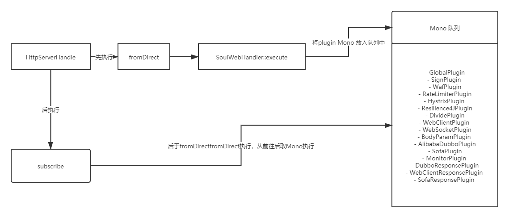

# Soul网关源码解析（七）限流插件初探
***
## 简介
&ensp;&ensp;&ensp;&ensp;前面的文章中对处理流程探索的差不多了，今天来探索下限流插件:resilience4j

## 示例运行
### 环境配置
&ensp;&ensp;&ensp;&ensp;启动下MySQL和redis

```shell script
docker run -dit --name redis -p 6379:6379 redis
docker run --name mysql -p 3306:3306 -e MYSQL_ROOT_PASSWORD=123456 -d mysql:latest
```

### Soul-Admin启动及相关配置
&ensp;&ensp;&ensp;&ensp;运行Soul-admin，进入管理界面：系统管理 --> 插件管理 --> resilience4j ，点击编辑，把它开启

&ensp;&ensp;&ensp;&ensp;进入管理界面的插件列表：resilience4j 添加选择器和规则，这里安装divide插件的匹配方式配的，让divide的/http前缀的接口都走限流（因为使用测试时官方本身自带的HTTP测试）

&ensp;&ensp;&ensp;&ensp;规则配置中：token filling number 要设置大于0，不然会报错

&ensp;&ensp;&ensp;&ensp;circuit enable 要设置为0，判断的时候走限流的逻辑

&ensp;&ensp;&ensp;&ensp;其他的：fallback uri 随便填个路径，其他的参数都可填1

### Soul-Bootstrap配置启动
&ensp;&ensp;&ensp;&ensp;在Soul-Bootstrap中进入相关的依赖，大致如下：

```xml
<!-- soul resilience4j plugin start-->
  <dependency>
      <groupId>org.dromara</groupId>
      <artifactId>soul-spring-boot-starter-plugin-resilience4j</artifactId>
       <version>${last.version}</version>
  </dependency>
  <!-- soul resilience4j plugin end-->
```

&ensp;&ensp;&ensp;&ensp;启动Soul-Bootstrap

### HTTP示例启动
&ensp;&ensp;&ensp;&ensp;启动：soul-examples --> soul-examples-http --> SoulTestHttpApplication

&ensp;&ensp;&ensp;&ensp;进入管理界面的：插件列表 --> divide 能看到相关的注册接口信息

&ensp;&ensp;&ensp;&ensp;访问： http://127.0.0.1:9195/http/order/findById?id=1111

&ensp;&ensp;&ensp;&ensp;成功运行，下面开始源码debug

```json
{
    "id": "1111",
    "name": "hello world findById"
}
```

## 源码Debug
### 限流流程顺序跟踪确认
&ensp;&ensp;&ensp;&ensp;根据前面的文章，对处理流程基本上有个清晰的认识了，我们通过前面的调试，知道 RateLimiterPlugin 是继承 AbstractSoulPlugin ,那它就会走和路由匹配相关的逻辑，如下面对代码所示。匹配成功后才走 doExcute 限流逻辑

```java
    # AbstractSoulPlugin
    // 首先进行路由匹配
    public Mono<Void> execute(final ServerWebExchange exchange, final SoulPluginChain chain) {
        String pluginName = named();
        final PluginData pluginData = BaseDataCache.getInstance().obtainPluginData(pluginName);
        if (pluginData != null && pluginData.getEnabled()) {
            final Collection<SelectorData> selectors = BaseDataCache.getInstance().obtainSelectorData(pluginName);
            if (CollectionUtils.isEmpty(selectors)) {
                return CheckUtils.checkSelector(pluginName, exchange, chain);
            }
            final SelectorData selectorData = matchSelector(exchange, selectors);
            if (Objects.isNull(selectorData)) {
                if (PluginEnum.WAF.getName().equals(pluginName)) {
                    return doExecute(exchange, chain, null, null);
                }
                return CheckUtils.checkSelector(pluginName, exchange, chain);
            }
            if (selectorData.getLoged()) {
                log.info("{} selector success match , selector name :{}", pluginName, selectorData.getName());
            }
            final List<RuleData> rules = BaseDataCache.getInstance().obtainRuleData(selectorData.getId());
            if (CollectionUtils.isEmpty(rules)) {
                if (PluginEnum.WAF.getName().equals(pluginName)) {
                    return doExecute(exchange, chain, null, null);
                }
                return CheckUtils.checkRule(pluginName, exchange, chain);
            }
            RuleData rule;
            if (selectorData.getType() == SelectorTypeEnum.FULL_FLOW.getCode()) {
                //get last
                rule = rules.get(rules.size() - 1);
            } else {
                rule = matchRule(exchange, rules);
            }
            if (Objects.isNull(rule)) {
                return CheckUtils.checkRule(pluginName, exchange, chain);
            }
            if (rule.getLoged()) {
                log.info("{} rule success match ,rule name :{}", pluginName, rule.getName());
            }
            return doExecute(exchange, chain, selectorData, rule);
        }
        return chain.execute(exchange);
    }

    # RateLimiterPlugin
    // 匹配完成后走限流的逻辑
    protected Mono<Void> doExecute(final ServerWebExchange exchange, final SoulPluginChain chain, final SelectorData selector, final RuleData rule) {
        final SoulContext soulContext = exchange.getAttribute(Constants.CONTEXT);
        assert soulContext != null;
        // 这里更加字符串转成对象，所有规则哪里不能乱填
        Resilience4JHandle resilience4JHandle = GsonUtils.getGson().fromJson(rule.getHandle(), Resilience4JHandle.class);
        // 这里判断 Circle enable 是否为1 走 combined的逻辑，但我们这次想走 limit 的逻辑，所以要填0
        if (resilience4JHandle.getCircuitEnable() == 1) {
            return combined(exchange, chain, rule);
        }
        return rateLimiter(exchange, chain, rule);
    }

    // 到这有些复杂，看的不是太懂，只能继续跟下去
    private Mono<Void> rateLimiter(final ServerWebExchange exchange, final SoulPluginChain chain, final RuleData rule) {
        return ratelimiterExecutor.run(
                chain.execute(exchange), fallback(ratelimiterExecutor, exchange, null), Resilience4JBuilder.build(rule))
                .onErrorResume(throwable -> ratelimiterExecutor.withoutFallback(exchange, throwable));
    }
```    

&ensp;&ensp;&ensp;&ensp;plugin前面代码还是看的懂，但rateLimiter开始就有些迷糊，流式编程的知识用上都看不懂了，但大致知道是进行限流逻辑

```java
public class RateLimiterExecutor implements Executor {

    @Override
    public <T> Mono<T> run(final Mono<T> toRun, final Function<Throwable, Mono<T>> fallback, final Resilience4JConf conf) {
        // 生成限流器
        RateLimiter rateLimiter = Resilience4JRegistryFactory.rateLimiter(conf.getId(), conf.getRateLimiterConfig());
        // 应该是在这触发的限流逻辑
        Mono<T> to = toRun.transformDeferred(RateLimiterOperator.of(rateLimiter));
        if (fallback != null) {
            return to.onErrorResume(fallback);
        }
        return to;
    }
}
```

&ensp;&ensp;&ensp;&ensp;继续跟到上面那个类，我们看到了明显的生成限流器的逻辑，但有个让疑惑的是，因为返回的Mono，但没有看到明显的限流触发逻辑。在没有响应式编程的基础的时候感觉很懵，目前也没去定位真正的触发代码是在哪？但猜测是在上面注释中标注的那段触发的

&ensp;&ensp;&ensp;&ensp;因为响应式，没有办法跟下去了，我们只能另找路径，看看具体的限流逻辑是什么样的

&ensp;&ensp;&ensp;&ensp;通过上面知道：RateLimiter 是限流器，我们查看它的具体实现

&ensp;&ensp;&ensp;&ensp;发现是一个接口，我们看看它有哪些实现，发现有两个： SemaphoreBasedRateLimiter 和 AtomicRateLimiter

&ensp;&ensp;&ensp;&ensp;因为不知道用的哪个，我们在这两个类中可能会执行的函数都给打上断点

&ensp;&ensp;&ensp;&ensp;重启发送请求，不断的跳断点，终于进入了一个限流器的类： AtomicRateLimiter ，大致如下

```java
    # AtomicRateLimiter
    public long reservePermission(final int permits) {
        long timeoutInNanos = ((AtomicRateLimiter.State)this.state.get()).config.getTimeoutDuration().toNanos();
        AtomicRateLimiter.State modifiedState = this.updateStateWithBackOff(permits, timeoutInNanos);
        boolean canAcquireImmediately = modifiedState.nanosToWait <= 0L;
        if (canAcquireImmediately) {
            this.publishRateLimiterEvent(true, permits);
            return 0L;
        } else {
            boolean canAcquireInTime = timeoutInNanos >= modifiedState.nanosToWait;
            if (canAcquireInTime) {
                this.publishRateLimiterEvent(true, permits);
                return modifiedState.nanosToWait;
            } else {
                this.publishRateLimiterEvent(false, permits);
                return -1L;
            }
        }
    }
```

&ensp;&ensp;&ensp;&ensp;具体实现逻辑，不是我们此次关注的目的，此次是想看它在plugin中处理的流程顺序如何

&ensp;&ensp;&ensp;&ensp;和前面几篇一样，我们在： SoulWebHandler 打上断点，看看限流器的执行顺序是什么样的

&ensp;&ensp;&ensp;&ensp;通过debug，我们发现顺序和我们预期的基本一致：在进入 RateLimiterPlugin 插件执行的时候，执行的断点也到了限流器（AtomicRateLimiter),等限流器逻辑执行完毕，divide等插件才开始执行

### 关于执行处罚和Mono的一些思考
&ensp;&ensp;&ensp;&ensp;我们看一下下面限流执行的代码：

```java
public class RateLimiterExecutor implements Executor {

    @Override
    public <T> Mono<T> run(final Mono<T> toRun, final Function<Throwable, Mono<T>> fallback, final Resilience4JConf conf) {
        // 生成限流器
        RateLimiter rateLimiter = Resilience4JRegistryFactory.rateLimiter(conf.getId(), conf.getRateLimiterConfig());
        // 应该是在这触发的限流逻辑
        Mono<T> to = toRun.transformDeferred(RateLimiterOperator.of(rateLimiter));
        if (fallback != null) {
            return to.onErrorResume(fallback);
        }
        return to;
    }
}
```

&ensp;&ensp;&ensp;&ensp;返回的一个Mono

&ensp;&ensp;&ensp;&ensp;我们再看看divide之类的,也是返回的Mono

```java
public class DividePlugin extends AbstractSoulPlugin {

    @Override
    protected Mono<Void> doExecute(final ServerWebExchange exchange, final SoulPluginChain chain, final SelectorData selector, final RuleData rule) {
        final SoulContext soulContext = exchange.getAttribute(Constants.CONTEXT);
        assert soulContext != null;
        final DivideRuleHandle ruleHandle = GsonUtils.getInstance().fromJson(rule.getHandle(), DivideRuleHandle.class);
        final List<DivideUpstream> upstreamList = UpstreamCacheManager.getInstance().findUpstreamListBySelectorId(selector.getId());
        if (CollectionUtils.isEmpty(upstreamList)) {
            log.error("divide upstream configuration error： {}", rule.toString());
            Object error = SoulResultWrap.error(SoulResultEnum.CANNOT_FIND_URL.getCode(), SoulResultEnum.CANNOT_FIND_URL.getMsg(), null);
            return WebFluxResultUtils.result(exchange, error);
        }
        final String ip = Objects.requireNonNull(exchange.getRequest().getRemoteAddress()).getAddress().getHostAddress();
        DivideUpstream divideUpstream = LoadBalanceUtils.selector(upstreamList, ruleHandle.getLoadBalance(), ip);
        if (Objects.isNull(divideUpstream)) {
            log.error("divide has no upstream");
            Object error = SoulResultWrap.error(SoulResultEnum.CANNOT_FIND_URL.getCode(), SoulResultEnum.CANNOT_FIND_URL.getMsg(), null);
            return WebFluxResultUtils.result(exchange, error);
        }
        // set the http url
        String domain = buildDomain(divideUpstream);
        String realURL = buildRealURL(domain, soulContext, exchange);
        exchange.getAttributes().put(Constants.HTTP_URL, realURL);
        // set the http timeout
        exchange.getAttributes().put(Constants.HTTP_TIME_OUT, ruleHandle.getTimeout());
        exchange.getAttributes().put(Constants.HTTP_RETRY, ruleHandle.getRetry());
        return chain.execute(exchange);
    }
}
```

&ensp;&ensp;&ensp;&ensp;再看看我们非常熟悉： SoulWebHandler

```java
        public Mono<Void> execute(final ServerWebExchange exchange) {
            return Mono.defer(() -> {
                if (this.index < plugins.size()) {
                    SoulPlugin plugin = plugins.get(this.index++);
                    Boolean skip = plugin.skip(exchange);
                    if (skip) {
                        return this.execute(exchange);
                    }
                    return plugin.execute(exchange, this);
                }
                return Mono.empty();
            });
        }
```

&ensp;&ensp;&ensp;&ensp;在上面函数中，通过英文，可以看到所有的Plugin都是返回一个Mono

&ensp;&ensp;&ensp;&ensp;我们结合响应式编程的相关概念：发布订阅。也就是说，这些plugin Mono 会发布到一个队列中，当订阅的时候，就会取出来顺序执行

&ensp;&ensp;&ensp;&ensp;订阅的逻辑大致在那呢，我们翻一翻我们第三篇分析:[Soul 网关源码阅读（三）请求处理概览](https://juejin.cn/post/6917866538712334343)

&ensp;&ensp;&ensp;&ensp;在类：HttpServerHandle ，找到很可疑的一段，猜测应该是这：

```java
    public void onStateChange(Connection connection, State newState) {
        if (newState == HttpServerState.REQUEST_RECEIVED) {
            try {
                if (log.isDebugEnabled()) {
                    log.debug(ReactorNetty.format(connection.channel(), "Handler is being applied: {}"), new Object[]{this.handler});
                }

                HttpServerOperations ops = (HttpServerOperations)connection;
                // 在这进行了发布和订阅，而handler.apply(ops, ops)会不断调用后面哪些plugin的逻辑
                Mono.fromDirect((Publisher)this.handler.apply(ops, ops)).subscribe(ops.disposeSubscriber());
            } catch (Throwable var4) {
                log.error(ReactorNetty.format(connection.channel(), ""), var4);
                connection.channel().close();
            }
        }

    }
```

&ensp;&ensp;&ensp;&ensp;而限流的Mono是在divide之前，所以限流就先执行了，大致示意图如下：



&ensp;&ensp;&ensp;&ensp;大意是：fromDirect 函数触发将 Plugin Mono 放到队列中；subscribe函数，触发执行，执行顺序先进先出，则GlobalPlugin先进去的，则先开始执行（图中Global先进的，把上方看做队列底部，理解意思就行）。那顺序就对应上了我们的调试猜想

&ensp;&ensp;&ensp;&ensp;还没深入研究响应式编程，所以也有可能是错的

### 疑问点
&ensp;&ensp;&ensp;&ensp;在下面这段生成限流器的逻辑中，好像每次请求过来都是进行一个新的生成，有没有可能进行复用，配置里面加一个字段，表示是否更新过，没有更新，我们就复用我们之前的限流器；有更新我们就新生成一个

&ensp;&ensp;&ensp;&ensp;当然上面优化，需要在具体了解动态配置更新后，再看看是否可行

&ensp;&ensp;&ensp;&ensp;也有可能是不熟悉Resilience4J,可能下面的代码中Resilience4JRegistryFactory本身实现了缓存复用

```java
public class RateLimiterExecutor implements Executor {

    @Override
    public <T> Mono<T> run(final Mono<T> toRun, final Function<Throwable, Mono<T>> fallback, final Resilience4JConf conf) {
        // 生成限流器
        RateLimiter rateLimiter = Resilience4JRegistryFactory.rateLimiter(conf.getId(), conf.getRateLimiterConfig());
        // 应该是在这触发的限流逻辑
        Mono<T> to = toRun.transformDeferred(RateLimiterOperator.of(rateLimiter));
        if (fallback != null) {
            return to.onErrorResume(fallback);
        }
        return to;
    }
}
```

## 总结
&ensp;&ensp;&ensp;&ensp;本次文章大致探索了限流插件：resilience4j的使用配置。调试验证它的限流逻辑执行在plugin链中执行顺序，发现基本符合我们的猜想，限流逻辑的执行和plugin顺序一致

&ensp;&ensp;&ensp;&ensp;还初步讨论提出了plugin链在Mono队列中的执行猜想，后面研究响应式编程的时候验证一下猜想是否正常

&ensp;&ensp;&ensp;&ensp;最后提出了一些对限流器生成的一些优化疑问，看后面配置更新相关的分析的时候，是否能验证自己的猜想

## 参考链接
- [resilience4j插件](https://dromara.org/zh-cn/docs/soul/plugin-resilience4j.html)
- [Resilience4j 源码解析（3）：限流模块 RateLimiter 与 常见限流算法](https://blog.csdn.net/mickjoust/article/details/102411585)

## Soul网关源码分析文章列表
### Github
- [Soul 源码阅读（一） 概览](https://github.com/lw1243925457/SE-Notes/blob/master/profession/program/%E5%BC%80%E6%BA%90/soul/soul%E6%BA%90%E7%A0%81%E9%98%85%E8%AF%BB1-%E6%A6%82%E8%A7%88.md)
- [Soul 源码阅读（二）代码初步运行](https://github.com/lw1243925457/SE-Notes/blob/master/profession/program/%E5%BC%80%E6%BA%90/soul/soul%E6%BA%90%E7%A0%81%E9%98%85%E8%AF%BB2-%E5%88%9D%E6%AD%A5%E8%BF%90%E8%A1%8C.md)
- [Soul 源码阅读（三）HTTP请求处理概览](https://github.com/lw1243925457/SE-Notes/blob/master/profession/program/%E5%BC%80%E6%BA%90/soul/soul%E6%BA%90%E7%A0%81%E9%98%85%E8%AF%BB3-%E8%AF%B7%E6%B1%82%E5%A4%84%E7%90%86%E6%A6%82%E8%A7%88.md)
- [Soul 网关源码阅读（四）Dubbo请求概览](https://github.com/lw1243925457/SE-Notes/blob/master/profession/program/%E5%BC%80%E6%BA%90/soul/soul%E6%BA%90%E7%A0%81%E9%98%85%E8%AF%BB4-dubbo%E8%AF%B7%E6%B1%82%E6%A6%82%E8%A7%88.md)
- [Soul网关源码阅读（五）请求类型探索](https://github.com/lw1243925457/SE-Notes/blob/master/profession/program/%E5%BC%80%E6%BA%90/soul/soul%E6%BA%90%E7%A0%81%E9%98%85%E8%AF%BB5-%E8%AF%B7%E6%B1%82%E7%B1%BB%E5%9E%8B%E6%8E%A2%E7%B4%A2.md)
- [Soul 网关源码阅读（六）Sofa请求处理概览](https://github.com/lw1243925457/SE-Notes/blob/master/profession/program/%E5%BC%80%E6%BA%90/soul/soul%E6%BA%90%E7%A0%81%E9%98%85%E8%AF%BB6-sofa%E8%AF%B7%E6%B1%82%E5%A4%84%E7%90%86%E6%A6%82%E8%A7%88.md)

- [Soul网关源码阅读番外篇（一） HTTP参数请求错误](https://github.com/lw1243925457/SE-Notes/blob/master/profession/program/%E5%BC%80%E6%BA%90/soul/soul%E6%BA%90%E7%A0%81%E9%98%85%E8%AF%BB%E7%95%AA%E5%A4%96%E7%AF%871-HTTP%E7%A4%BA%E4%BE%8B%E5%8F%82%E6%95%B0%E8%AF%B7%E6%B1%82%E9%94%99%E8%AF%AF.md)

### 掘金
- [Soul 网关源码阅读（一） 概览](https://juejin.cn/post/6917864624423436296)
- [Soul 网关源码阅读（二）代码初步运行](https://juejin.cn/post/6917865804121767944)
- [Soul 网关源码阅读（三）请求处理概览](https://juejin.cn/post/6917866538712334343)
- [Soul 网关源码阅读（四）Dubbo请求概览](https://juejin.cn/post/6917867369909977102)
- [Soul网关源码阅读（五）请求类型探索](https://juejin.cn/post/6918575905962983438)
- [Soul 网关源码阅读（六）Sofa请求处理概览](https://juejin.cn/post/6918736260467015693)

- [Soul网关源码阅读番外篇（一） HTTP参数请求错误](https://juejin.cn/post/6918947689564471309)


