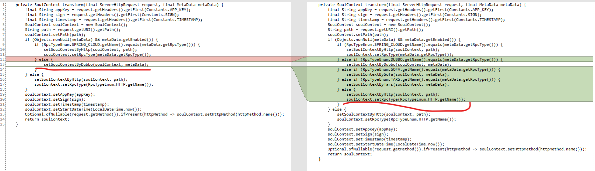

# Soul网关源码解析番外篇（一） HTTP参数请求错误
***
* 共同作者：石立 萧 *

## 简介
&ensp;&ensp;&ensp;&ensp;在Soul网关2.2.1版本源码阅读中，遇到了HTTP请求加上参数返回404的错误，此篇文章基于此进行探索

## Bug复现
### 相关环境配置
&ensp;&ensp;&ensp;&ensp;首先把代码拉下来，然后切换到2.2.1版本，命令大致如下：

```shell script
# 加速拉取
git clone https://github.com.cnpmjs.org/lw1243925457/soul.git

# 切换到2.2.1版本
git fetch origin 2.2.1:2.2.1
git checkout 2.2.1
```

&ensp;&ensp;&ensp;&ensp;如果之前运行过Soul网关的，需要清理下数据库，这里删除原来的soul数据库，让2.2.1版本自己重新建立一个

```shell script
# 使用docker启动mysql
docker run --name mysql -p 3306:3306 -e MYSQL_ROOT_PASSWORD=root -d mysql:latest

# 重启，需要删除soul数据库，然后让程序自己重建
docker restart mysql
# 使用命令登录，删除原来的数据库
docker exec -ti mysql mysql -u root -p
> drop database soul;
```

### Soul——Admin启动
&ensp;&ensp;&ensp;&ensp;修改Soul-admin模块下的配置文件：soul-admin --> application-local.yml 

&ensp;&ensp;&ensp;&ensp;修改mysql用户和密码： root root

&ensp;&ensp;&ensp;&ensp;修改链接配置：jdbc:mysql://localhost:3306/soul?useUnicode=true&characterEncoding=utf-8&allowPublicKeyRetrieval=true&&useSSL=false

&ensp;&ensp;&ensp;&ensp;启动soul-admin --> SoulAdminBootstrap

&ensp;&ensp;&ensp;&ensp;如果出现SelectorTypeEnum相关的错误，请切换到jdk8


### 启动Soul-Bootstrap
&ensp;&ensp;&ensp;&ensp;启动soul-bootstrap --> SoulBootstrapApplication

### 启动HTTP test
&ensp;&ensp;&ensp;&ensp;首先右键soul-test根目录下的pom.xml，选择 add as maven project,导入工程
&ensp;&ensp;&ensp;&ensp;可能会出现依赖错误，将其版本替换为2.2.1，大致如下：

```xml
        <dependency>
            <groupId>org.dromara</groupId>
            <artifactId>soul-spring-boot-starter-client-springmvc</artifactId>
            <version>2.2.1</version>
        </dependency>
```

&ensp;&ensp;&ensp;&ensp;启动soul-test --> soul-test-http --> SoulTestHttpApplication

### 请求复现
&ensp;&ensp;&ensp;&ensp;访问管理界面： http://localhost:9095/ ，查看插件列表 --> divide ,表现正常

&ensp;&ensp;&ensp;&ensp;访问问题链接： http://localhost:9195/http/order/findById?id=1 ，可以看到出现了404

```json
{
    "timestamp": "2021-01-18T02:18:19.557+0000",
    "path": "/",
    "status": 404,
    "error": "Not Found",
    "message": null,
    "requestId": "84752141"
}
```

&ensp;&ensp;&ensp;&ensp;直接访问： http://localhost:8187/order/findById?id=11 ，正常的

```json
{
    "id": "11",
    "name": "hello world findById"
}
```

&ensp;&ensp;&ensp;&ensp;OK，到这问题基本复现，下面开始debug

## 源码Debug
### 查看日志进行切入
&ensp;&ensp;&ensp;&ensp;根据老哥的提示，我们也看到了这个问题请求的相关日志，大致如下

```xml
o.d.soul.plugin.base.AbstractSoulPlugin  : divide selector success match , selector name :/http
o.d.soul.plugin.base.AbstractSoulPlugin  : divide rule success match ,rule name :/http/order/findById
o.d.s.plugin.httpclient.WebClientPlugin  : you request,The resulting urlPath is :http://192.168.101.104:8187?id=1111
```

&ensp;&ensp;&ensp;&ensp;最后一句urlpath非常的诡异，完整路径不对。我们就直接看下这个类： WebClientPlugin

```java
    # WebClientPlugin
    public Mono<Void> execute(final ServerWebExchange exchange, final SoulPluginChain chain) {
        final SoulContext soulContext = exchange.getAttribute(Constants.CONTEXT);
        assert soulContext != null;
        # 在这里debug看到取出来的路径是： http://192.168.101.104:8187?id=1111
        String urlPath = exchange.getAttribute(Constants.HTTP_URL);
        if (StringUtils.isEmpty(urlPath)) {
            Object error = SoulResultWarp.error(SoulResultEnum.CANNOT_FIND_URL.getCode(), SoulResultEnum.CANNOT_FIND_URL.getMsg(), null);
            return WebFluxResultUtils.result(exchange, error);
        }
        long timeout = (long) Optional.ofNullable(exchange.getAttribute(Constants.HTTP_TIME_OUT)).orElse(3000L);
        log.info("you request,The resulting urlPath is :{}", urlPath);
        HttpMethod method = HttpMethod.valueOf(exchange.getRequest().getMethodValue());
        WebClient.RequestBodySpec requestBodySpec = webClient.method(method).uri(urlPath);
        return handleRequestBody(requestBodySpec, exchange, timeout, chain);
    }
```

&ensp;&ensp;&ensp;&ensp;在上面这个类中，可以看到就是单纯取路径，我们需要跟踪这个路径的来源

### Divide查看
&ensp;&ensp;&ensp;&ensp;在前面几篇分析中，我们知道divide plugin 是进行路由配置，并写入真实路径到exchange中的，我们去 DividePlugin 看看

```java
    # DividePlugin
    protected Mono<Void> doExecute(final ServerWebExchange exchange, final SoulPluginChain chain, final SelectorData selector, final RuleData rule) {
        final SoulContext soulContext = exchange.getAttribute(Constants.CONTEXT);
        assert soulContext != null;
        final DivideRuleHandle ruleHandle = GsonUtils.getInstance().fromJson(rule.getHandle(), DivideRuleHandle.class);
        final List<DivideUpstream> upstreamList = UpstreamCacheManager.getInstance().findUpstreamListBySelectorId(selector.getId());
        if (CollectionUtils.isEmpty(upstreamList)) {
            LOGGER.error("divide upstream configuration error：{}", rule.toString());
            Object error = SoulResultWarp.error(SoulResultEnum.CANNOT_FIND_URL.getCode(), SoulResultEnum.CANNOT_FIND_URL.getMsg(), null);
            return WebFluxResultUtils.result(exchange, error);
        }
        final String ip = Objects.requireNonNull(exchange.getRequest().getRemoteAddress()).getAddress().getHostAddress();
        DivideUpstream divideUpstream = LoadBalanceUtils.selector(upstreamList, ruleHandle.getLoadBalance(), ip);
        if (Objects.isNull(divideUpstream)) {
            LOGGER.error("divide has no upstream");
            Object error = SoulResultWarp.error(SoulResultEnum.CANNOT_FIND_URL.getCode(), SoulResultEnum.CANNOT_FIND_URL.getMsg(), null);
            return WebFluxResultUtils.result(exchange, error);
        }
        //设置一下 http url : http://192.168.101.104:8187
        String domain = buildDomain(divideUpstream);
        // 在这设置realURL，进去看看这个函数
        String realURL = buildRealURL(domain, soulContext, exchange);
        // 放入exchange中
        exchange.getAttributes().put(Constants.HTTP_URL, realURL);
        exchange.getAttributes().put(Constants.HTTP_TIME_OUT, ruleHandle.getTimeout());
        return chain.execute(exchange);
    }

    private String buildRealURL(final String domain, final SoulContext soulContext, final ServerWebExchange exchange) {
        String path = domain;
        // 在这取url，但通过debug发现，它确实是null
        final String rewriteURI = (String) exchange.getAttributes().get(Constants.REWRITE_URI);
        if (StringUtils.isNoneBlank(rewriteURI)) {
            path = path + rewriteURI;
        } else {
            // 然后又进到这进行取，发现也是null
            final String realUrl = soulContext.getRealUrl();
            if (StringUtils.isNoneBlank(realUrl)) {
                path = path + realUrl;
            }
        }
        String query = exchange.getRequest().getURI().getQuery();
        if (StringUtils.isNoneBlank(query)) {
            return path + "?" + query;
        }
        return path;
    }
```

&ensp;&ensp;&ensp;&ensp;在上面的分析中，发现取出来的都是null，而且没有看到url的设置之类的操作，divide竟然也是单纯的取值

### URL设置探索
&ensp;&ensp;&ensp;&ensp;那我们需要继续探索url的是怎么设置进去的，通过上面的分析，目前有两者设置url的方式，如下面两段代码：

```java
final String rewriteURI = (String) exchange.getAttributes().get(Constants.REWRITE_URI);
final String realUrl = soulContext.getRealUrl();
```

#### exchange.getAttributes().get(Constants.REWRITE_URI) 方式探索
&ensp;&ensp;&ensp;&ensp;我们类比响应的设置方式，可以得到第一种URL设置的方式大致如下：

```java
exchange.getAttributes().put(Constants.CLIENT_RESPONSE_RESULT_TYPE, ResultEnum.SUCCESS.getName());

// 可以得到放Constants.REWRITE_URI的大致代码如下：
exchange.getAttributes().put(Constants.REWRITE_URI
```

&ensp;&ensp;&ensp;&ensp;然后使用全局搜索：ctrl+shift+r ，exchange.getAttributes().put(Constants.REWRITE_URI

```java
    # RewritePlugin
    protected Mono<Void> doExecute(final ServerWebExchange exchange, final SoulPluginChain chain, final SelectorData selector, final RuleData rule) {
        String handle = rule.getHandle();
        final RewriteHandle rewriteHandle = GsonUtils.getInstance().fromJson(handle, RewriteHandle.class);
        if (Objects.isNull(rewriteHandle) || StringUtils.isBlank(rewriteHandle.getRewriteURI())) {
            log.error("uri rewrite rule can not configuration：{}", handle);
            return chain.execute(exchange);
        }
        exchange.getAttributes().put(Constants.REWRITE_URI, rewriteHandle.getRewriteURI());
        return chain.execute(exchange);
    }
```

&ensp;&ensp;&ensp;&ensp;搜索到唯一一处有这个代码的类： RewritePlugin ,然后我们打断点，然后并不能进入这个逻辑，查看控制台，它是关闭的。那就先放着，看第二种设置方式

### soulContext.getRealUrl() 的设置探索
&ensp;&ensp;&ensp;&ensp;运用类比，我们可以猜测设置的代码应该是： soulContext.setRealUrl

&ensp;&ensp;&ensp;&ensp;我们进行搜索，也成功的找到了唯一的一处代码，在类 DefaultSoulContextBuilder 中，大致如下：

```java
    # DefaultSoulContextBuilder
    private void setSoulContextByHttp(final SoulContext soulContext, final String path) {
        String contextPath = "/";
        String[] splitList = StringUtils.split(path, "/");
        if (splitList.length != 0) {
            contextPath = contextPath.concat(splitList[0]);
        }
        String realUrl = path.substring(contextPath.length());
        soulContext.setContextPath(contextPath);
        soulContext.setModule(contextPath);
        soulContext.setMethod(realUrl);
        // 设置url
        soulContext.setRealUrl(realUrl);
    }
```

&ensp;&ensp;&ensp;&ensp;我们在这个函数上打上断点，然而非常不幸的是，也没有进入。瞬间头上？？？？？？？，这是怎么肥事啊，都没设置

&ensp;&ensp;&ensp;&ensp;不抛弃不放弃，咱继续。看到realURL是从path来的，我们继续往上追求其来源，发现调用的是同一个类的下面这个函数 transform ,再上一层是 build

```java
    # DefaultSoulContextBuilder
    private SoulContext transform(final ServerHttpRequest request, final MetaData metaData) {
        final String appKey = request.getHeaders().getFirst(Constants.APP_KEY);
        final String sign = request.getHeaders().getFirst(Constants.SIGN);
        final String timestamp = request.getHeaders().getFirst(Constants.TIMESTAMP);
        SoulContext soulContext = new SoulContext();
        String path = request.getURI().getPath();
        soulContext.setPath(path);
        if (Objects.nonNull(metaData) && metaData.getEnabled()) {
            if (RpcTypeEnum.SPRING_CLOUD.getName().equals(metaData.getRpcType())) {
                setSoulContextByHttp(soulContext, path);
                soulContext.setRpcType(metaData.getRpcType());
            } else {
                setSoulContextByDubbo(soulContext, metaData);
            }
        } else {
            setSoulContextByHttp(soulContext, path);
            soulContext.setRpcType(RpcTypeEnum.HTTP.getName());
        }
        soulContext.setAppKey(appKey);
        soulContext.setSign(sign);
        soulContext.setTimestamp(timestamp);
        soulContext.setStartDateTime(LocalDateTime.now());
        Optional.ofNullable(request.getMethod()).ifPresent(httpMethod -> soulContext.setHttpMethod(httpMethod.name()));
        return soulContext;
    }

    public SoulContext build(final ServerWebExchange exchange) {
        final ServerHttpRequest request = exchange.getRequest();
        String path = request.getURI().getPath();
        MetaData metaData = MetaDataCache.getInstance().obtain(path);
        if (Objects.nonNull(metaData) && metaData.getEnabled()) {
            exchange.getAttributes().put(Constants.META_DATA, metaData);
        }
        return transform(request, metaData);
    }
```

&ensp;&ensp;&ensp;&ensp;在build函数上打上断点，感谢老天，成功进入，通过调用栈发现，竟然是熟悉的 GlobalPlugin 进行调用的

```java
    # GlobalPlugin
    public Mono<Void> execute(final ServerWebExchange exchange, final SoulPluginChain chain) {
        final ServerHttpRequest request = exchange.getRequest();
        final HttpHeaders headers = request.getHeaders();
        final String upgrade = headers.getFirst("Upgrade");
        SoulContext soulContext;
        if (StringUtils.isBlank(upgrade) || !"websocket".equals(upgrade)) {
            soulContext = builder.build(exchange);
        } else {
            final MultiValueMap<String, String> queryParams = request.getQueryParams();
            soulContext = transformMap(queryParams);
        }
        exchange.getAttributes().put(Constants.CONTEXT, soulContext);
        return chain.execute(exchange);
    }
```

&ensp;&ensp;&ensp;&ensp;在下面的函数打上端口，逐步debug。在下面注释的地方可以看到：我们的是HTTP请求，但竟然走到Dubbo的逻辑里面去，这非常的不对劲

```java
    private SoulContext transform(final ServerHttpRequest request, final MetaData metaData) {
        // http://127.0.0.1:9195/http/order/findById?id=1111
        final String appKey = request.getHeaders().getFirst(Constants.APP_KEY);
        final String sign = request.getHeaders().getFirst(Constants.SIGN);
        final String timestamp = request.getHeaders().getFirst(Constants.TIMESTAMP);
        SoulContext soulContext = new SoulContext();
        String path = request.getURI().getPath();
        soulContext.setPath(path);
        // 下面这个就神了，判断直接进到了setSoulContextByDubbo
        if (Objects.nonNull(metaData) && metaData.getEnabled()) {
            if (RpcTypeEnum.SPRING_CLOUD.getName().equals(metaData.getRpcType())) {
                setSoulContextByHttp(soulContext, path);
                soulContext.setRpcType(metaData.getRpcType());
            } else {
                // 应该是进到HTTP的，估计就这出错了
                setSoulContextByDubbo(soulContext, metaData);
            }
        } else {
            setSoulContextByHttp(soulContext, path);
            soulContext.setRpcType(RpcTypeEnum.HTTP.getName());
        }
        soulContext.setAppKey(appKey);
        soulContext.setSign(sign);
        soulContext.setTimestamp(timestamp);
        soulContext.setStartDateTime(LocalDateTime.now());
        Optional.ofNullable(request.getMethod()).ifPresent(httpMethod -> soulContext.setHttpMethod(httpMethod.name()));
        return soulContext;
    }
```

&ensp;&ensp;&ensp;&ensp;我们使用下面的diff工具，看看最新版本的代码和目前版本有什么区别：

- [Diffinity – 轻量级文件对比比较工具Windows](https://www.appinn.com/diffinity-for-win/)



&ensp;&ensp;&ensp;&ensp;通过上图我们可以发现，最新版本中进行了更严谨的判断，并将默认的请求类型设置为了HTTP，这样再新版本代码中，就能走HTTP的处理逻辑

&ensp;&ensp;&ensp;&ensp;我们将代码修改一下，将HTTP设置为默认处理，代码大致如下：

```java
    private SoulContext transform(final ServerHttpRequest request, final MetaData metaData) {
        final String appKey = request.getHeaders().getFirst(Constants.APP_KEY);
        final String sign = request.getHeaders().getFirst(Constants.SIGN);
        final String timestamp = request.getHeaders().getFirst(Constants.TIMESTAMP);
        SoulContext soulContext = new SoulContext();
        String path = request.getURI().getPath();
        soulContext.setPath(path);
        // 还可以从metadata入手，这里就从类型判断入手
        if (Objects.nonNull(metaData) && metaData.getEnabled()) {
            if (RpcTypeEnum.SPRING_CLOUD.getName().equals(metaData.getRpcType())) {
                setSoulContextByHttp(soulContext, path);
                soulContext.setRpcType(metaData.getRpcType());
            } else if (RpcTypeEnum.DUBBO.getName().equals(metaData.getRpcType())) {
                setSoulContextByDubbo(soulContext, metaData);
            } else {
                setSoulContextByHttp(soulContext, path);
                soulContext.setRpcType(RpcTypeEnum.HTTP.getName());
            }
        } else {
            setSoulContextByHttp(soulContext, path);
            soulContext.setRpcType(RpcTypeEnum.HTTP.getName());
        }
        soulContext.setAppKey(appKey);
        soulContext.setSign(sign);
        soulContext.setTimestamp(timestamp);
        soulContext.setStartDateTime(LocalDateTime.now());
        Optional.ofNullable(request.getMethod()).ifPresent(httpMethod -> soulContext.setHttpMethod(httpMethod.name()));
        return soulContext;
    }
```

&ensp;&ensp;&ensp;&ensp;重启，发送请求： http://127.0.0.1:9195/http/order/findById?id=1111 ，OK，非常感人的成功了

```json
{
    "id": "1111",
    "name": "hello world findById"
}
```

&ensp;&ensp;&ensp;&ensp;到这，我们成功的定位并修复了这个错误（虽然没有啥用，但开心啊）

&ensp;&ensp;&ensp;&ensp;这个bug的修复还可以从if (Objects.nonNull(metaData) && metaData.getEnabled()) 这端逻辑入手，需要跟踪一下metadata，这里就不展开讲，搞的话又是一篇番外


## 总结
&ensp;&ensp;&ensp;&ensp;本篇文章中对Soul网关2.2.1版本中HTTP请求出现404的错误进行了详细的分析

&ensp;&ensp;&ensp;&ensp;通过上面的分析可以看出，在2.2.1中，不是Spring cloud的HTTP请求，都会发生错误，这个bug还是有点厉害的

&ensp;&ensp;&ensp;&ensp;还认识到了GlobalPlugin这个插件的重要作用，不仅设置了类型，还设置了真实的后端服务器路径，可以说这个插件很核心。rewrite插件也有设置路径这个功能

&ensp;&ensp;&ensp;&ensp;又有了新的认识，更新下我们请求处理图：


## Soul网关源码分析文章列表
### Github
- [Soul 源码阅读（一） 概览](https://github.com/lw1243925457/SE-Notes/blob/master/profession/program/%E5%BC%80%E6%BA%90/soul/soul%E6%BA%90%E7%A0%81%E9%98%85%E8%AF%BB1-%E6%A6%82%E8%A7%88.md)
- [Soul 源码阅读（二）代码初步运行](https://github.com/lw1243925457/SE-Notes/blob/master/profession/program/%E5%BC%80%E6%BA%90/soul/soul%E6%BA%90%E7%A0%81%E9%98%85%E8%AF%BB2-%E5%88%9D%E6%AD%A5%E8%BF%90%E8%A1%8C.md)
- [Soul 源码阅读（三）HTTP请求处理概览](https://github.com/lw1243925457/SE-Notes/blob/master/profession/program/%E5%BC%80%E6%BA%90/soul/soul%E6%BA%90%E7%A0%81%E9%98%85%E8%AF%BB3-%E8%AF%B7%E6%B1%82%E5%A4%84%E7%90%86%E6%A6%82%E8%A7%88.md)
- [Soul 网关源码阅读（四）Dubbo请求概览](https://github.com/lw1243925457/SE-Notes/blob/master/profession/program/%E5%BC%80%E6%BA%90/soul/soul%E6%BA%90%E7%A0%81%E9%98%85%E8%AF%BB4-dubbo%E8%AF%B7%E6%B1%82%E6%A6%82%E8%A7%88.md)
- [Soul网关源码阅读（五）请求类型探索](https://github.com/lw1243925457/SE-Notes/blob/master/profession/program/%E5%BC%80%E6%BA%90/soul/soul%E6%BA%90%E7%A0%81%E9%98%85%E8%AF%BB5-%E8%AF%B7%E6%B1%82%E7%B1%BB%E5%9E%8B%E6%8E%A2%E7%B4%A2.md)
- [Soul 网关源码阅读（六）Sofa请求处理概览](https://github.com/lw1243925457/SE-Notes/blob/master/profession/program/%E5%BC%80%E6%BA%90/soul/soul%E6%BA%90%E7%A0%81%E9%98%85%E8%AF%BB6-sofa%E8%AF%B7%E6%B1%82%E5%A4%84%E7%90%86%E6%A6%82%E8%A7%88.md)

### 掘金
- Soul 网关源码阅读（一） 概览 #掘金文章# https://juejin.cn/post/6917864624423436296
- Soul 网关源码阅读（二）代码初步运行 #掘金文章# https://juejin.cn/post/6917865804121767944
- Soul 网关源码阅读（三）请求处理概览 #掘金文章# https://juejin.cn/post/6917866538712334343
- Soul 网关源码阅读（四）Dubbo请求概览 #掘金文章# https://juejin.cn/post/6917867369909977102
- Soul网关源码阅读（五）请求类型探索 #掘金文章# https://juejin.cn/post/6918575905962983438
- Soul 网关源码阅读（六）Sofa请求处理概览 #掘金文章# https://juejin.cn/post/6918736260467015693