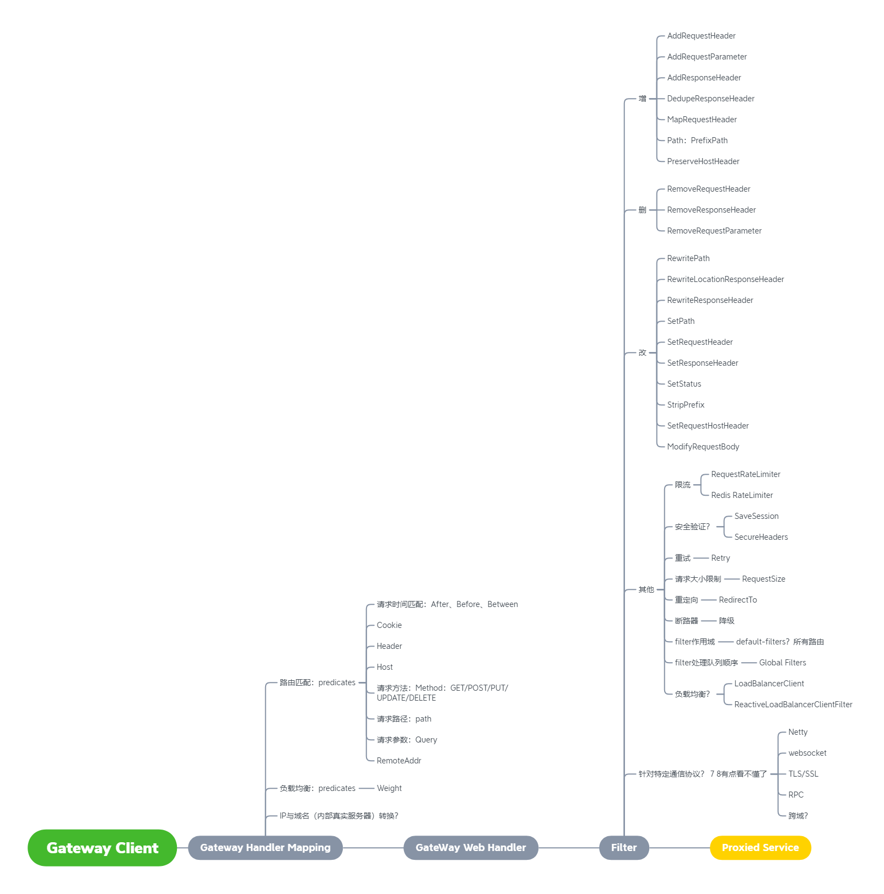

# SpringCloudGateway(一) 概览
***
### Spring Cloud Gateway 的数据流图
&ensp;&ensp;&ensp;&ensp;通读了两遍官方文档：[Spring Cloud Gateway](https://docs.spring.io/spring-cloud-gateway/docs/2.2.6.RELEASE/reference/html/#the-loadbalancerclient-filter),对其数据的流向，各部分的处理组件，还有在各个阶段能做哪些事情又了大致的了解，做了下面的大致思维导图（有些部分还不太了解，后面可能需要写代码看看）



&ensp;&ensp;&ensp;&ensp;给人感觉就是两点模块：

- 路由匹配：对初始的请求进行路由匹配，如果匹配，放入后面进行处理。这块看着还有下面两个作用
  - 负载均衡：后面的好像也有LoadBalance，这里还没有摸清楚
  - DNS：好像可以定义ip与域名之类的转换

- Filter模块：这块功能最为丰富，针对请求（request）和响应（response）的各种增删改操作，还有一些高级的操作：降级限流之类的；还有其他协议的配置，WS、RPC，这块暂时也没摸清楚

### 一个简单的转发百度的示例
&ensp;&ensp;&ensp;&ensp;一个路由定义最关键的是三个地方：匹配（path）、filter（可以多个filter处理）、目标（uri），这样访问此应用就转到了百度

```java
@SpringBootApplication
public class Application {

	public static void main(String[] args) {
		SpringApplication.run(Application.class, args);
	}

	@Bean
	public RouteLocator myRoutes(RouteLocatorBuilder builder) {
		return builder.routes()
				.route(p -> p
						.path("/")
						.filters(f -> f.addRequestParameter("wd", "fs").addRequestHeader("test", "test"))
						.uri("http://www.baidu.com/"))
				.build();
	}
}
```