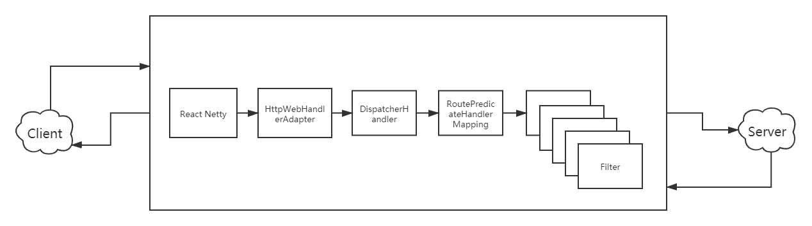

# Spring Cloud Gateway （七）处理流程解析
***
## 简介
&ensp;&ensp;&ensp;&ensp;初步梳理 Spring Cloud Gateway 的处理流程

### 过程记录
#### 主要请求流程
&ensp;&ensp;&ensp;&ensp;在前面的分析中，我们知道在 RoutePredicateHandlerMapping 中是实现了路由查找，于是在这个类中 getHandlerInternal 函数打上断点，通过调用栈向前追溯调用

&ensp;&ensp;&ensp;&ensp;向前我们追溯到了 DispatcherHandler ,在这个断点处通过断点调试发现有类似循环的操作，这个感觉是查找相应 handler 进行处理，细节部分暂时不够，后面再来详细看

```java
    public Mono<Void> handle(ServerWebExchange exchange) {
        return this.handlerMappings == null ? this.createNotFoundError() : Flux.fromIterable(this.handlerMappings).concatMap((mapping) -> {
            return mapping.getHandler(exchange);
        }).next().switchIfEmpty(this.createNotFoundError()).flatMap((handler) -> {
            return this.invokeHandler(exchange, handler);
        }).flatMap((result) -> {
            return this.handleResult(exchange, result);
        });
    }
```

&ensp;&ensp;&ensp;&ensp;在上面函数打断点，再通过调用栈向前查找，找到 netty 相关的一个类： HttpServerHandle 。下面的函数中有类似 Mono 这里的代码，发布后触发调用

```java
    public void onStateChange(Connection connection, State newState) {
        if (newState == HttpServerState.REQUEST_RECEIVED) {
            try {
                if (log.isDebugEnabled()) {
                    log.debug(ReactorNetty.format(connection.channel(), "Handler is being applied: {}"), new Object[]{this.handler});
                }

                HttpServerOperations ops = (HttpServerOperations)connection;
                // Mono 发布,这一步需要注意，跟踪handler下去
                Mono.fromDirect((Publisher)this.handler.apply(ops, ops)).subscribe(ops.disposeSubscriber());
            } catch (Throwable var4) {
                log.error(ReactorNetty.format(connection.channel(), ""), var4);
                connection.channel().close();
            }
        }
    }
```

&ensp;&ensp;&ensp;&ensp;在上面注释的地方打上断点，进入相应类及其方法，跳入下面的 ReactorHttpHandlerAdapter , 其中再次调用了其他的 handler，进行参数的传递，我们再接着跟下去

```java
    public Mono<Void> apply(HttpServerRequest reactorRequest, HttpServerResponse reactorResponse) {
        NettyDataBufferFactory bufferFactory = new NettyDataBufferFactory(reactorResponse.alloc());

        try {
            ReactorServerHttpRequest request = new ReactorServerHttpRequest(reactorRequest, bufferFactory);
            ServerHttpResponse response = new ReactorServerHttpResponse(reactorResponse, bufferFactory);
            if (request.getMethod() == HttpMethod.HEAD) {
                response = new HttpHeadResponseDecorator((ServerHttpResponse)response);
            }

            // 这一步再次调用其他的 handler 进行传递，再次跟踪下去
            return this.httpHandler.handle(request, (ServerHttpResponse)response).doOnError((ex) -> {
                logger.trace(request.getLogPrefix() + "Failed to complete: " + ex.getMessage());
            }).doOnSuccess((aVoid) -> {
                logger.trace(request.getLogPrefix() + "Handling completed");
            });
        } catch (URISyntaxException var6) {
            if (logger.isDebugEnabled()) {
                logger.debug("Failed to get request URI: " + var6.getMessage());
            }

            reactorResponse.status(HttpResponseStatus.BAD_REQUEST);
            return Mono.empty();
        }
    }
```

&ensp;&ensp;&ensp;&ensp;接着跳到了：WebServerManager ，里面进行了一次调用，来到了 HttpWebHandlerAdapter ,

```java
    public Mono<Void> handle(ServerHttpRequest request, ServerHttpResponse response) {
        if (this.forwardedHeaderTransformer != null) {
            request = this.forwardedHeaderTransformer.apply(request);
        }

        // 看到了熟悉，非常关键的exchange的生成，终于定位到了 exchange 的来源了
        ServerWebExchange exchange = this.createExchange(request, response);
        LogFormatUtils.traceDebug(logger, (traceOn) -> {
            return exchange.getLogPrefix() + this.formatRequest(exchange.getRequest()) + (traceOn ? ", headers=" + this.formatHeaders(exchange.getRequest().getHeaders()) : "");
        });

        // delegate 和 filter 息息相关，继续跟下去
        Mono var10000 = this.getDelegate().handle(exchange).doOnSuccess((aVoid) -> {
            this.logResponse(exchange);
        }).onErrorResume((ex) -> {
            return this.handleUnresolvedError(exchange, ex);
        });
        response.getClass();
        return var10000.then(Mono.defer(response::setComplete));
    }
```

&ensp;&ensp;&ensp;&ensp;接着到了： DispatcherHandler ，回到了最开始的切入点，看到其中大致是调用各个 mapping 进行处理

```java
    public Mono<Void> handle(ServerWebExchange exchange) {
        return this.handlerMappings == null ? this.createNotFoundError() : Flux.fromIterable(this.handlerMappings).concatMap((mapping) -> {
            return mapping.getHandler(exchange);
        }).next().switchIfEmpty(this.createNotFoundError()).flatMap((handler) -> {
            // handler 调用
            return this.invokeHandler(exchange, handler);
        }).flatMap((result) -> {
            return this.handleResult(exchange, result);
        });
    }
```

&ensp;&ensp;&ensp;&ensp;查看 handlerMappings ，它有6个，routePredicateHandlerMapping 是熟悉的重要的，它会逐个调用各个 Mapping 的 getHandler 方法，不同的 Mapping 实现了不同的 getHandlerInternal 方法，成功的话返回 FilteringWebHandler

```java
    public Mono<Object> getHandler(ServerWebExchange exchange) {
        // 调用 getHandlerInternal ，不同的 Mapping 有各自的实现
        return this.getHandlerInternal(exchange).map((handler) -> {
            if (this.logger.isDebugEnabled()) {
                this.logger.debug(exchange.getLogPrefix() + "Mapped to " + handler);
            }

            ServerHttpRequest request = exchange.getRequest();
            if (this.hasCorsConfigurationSource(handler) || CorsUtils.isPreFlightRequest(request)) {
                CorsConfiguration config = this.corsConfigurationSource != null ? this.corsConfigurationSource.getCorsConfiguration(exchange) : null;
                CorsConfiguration handlerConfig = this.getCorsConfiguration(handler, exchange);
                config = config != null ? config.combine(handlerConfig) : handlerConfig;
                if (!this.corsProcessor.process(config, exchange) || CorsUtils.isPreFlightRequest(request)) {
                    return REQUEST_HANDLED_HANDLER;
                }
            }

            // 这里 debug 返回 FilteringWebHandler
            return handler;
        });
    }

    protected abstract Mono<?> getHandlerInternal(ServerWebExchange var1);
```

&ensp;&ensp;&ensp;&ensp;getHandlerInternal(exchange) 调用跳到 RoutePredicateHandlerMapping ，其中关键的是绑定上定制化的 filter

```java
    @Override
	protected Mono<?> getHandlerInternal(ServerWebExchange exchange) {
		// don't handle requests on management port if set and different than server port
		if (this.managementPortType == DIFFERENT && this.managementPort != null
				&& exchange.getRequest().getURI().getPort() == this.managementPort) {
			return Mono.empty();
		}
		exchange.getAttributes().put(GATEWAY_HANDLER_MAPPER_ATTR, getSimpleName());

		return lookupRoute(exchange)
				// .log("route-predicate-handler-mapping", Level.FINER) //name this
				.flatMap((Function<Route, Mono<?>>) r -> {
					exchange.getAttributes().remove(GATEWAY_PREDICATE_ROUTE_ATTR);
					if (logger.isDebugEnabled()) {
						logger.debug(
								"Mapping [" + getExchangeDesc(exchange) + "] to " + r);
					}

					// r 是它独有的filter 处理器
					exchange.getAttributes().put(GATEWAY_ROUTE_ATTR, r);

					// webHandler 是全局链
					return Mono.just(webHandler);
				}).switchIfEmpty(Mono.empty().then(Mono.fromRunnable(() -> {
					exchange.getAttributes().remove(GATEWAY_PREDICATE_ROUTE_ATTR);
					if (logger.isTraceEnabled()) {
						logger.trace("No RouteDefinition found for ["
								+ getExchangeDesc(exchange) + "]");
					}
				})));
	}
```


&ensp;&ensp;&ensp;&ensp;在上面的 Mapping 中处理完成后，返回 handler ，然后this.invokeHandler(exchange, handler), 跳转到 FilteringWebHandler ,在其中从 exchange 中取出定制化的 filter，和 global filter 排序融合在一起，最后结合前面的：[Spring cloud Gateway（二） 一个Http请求的流程解析](https://github.com/lw1243925457/SE-Notes/blob/master/profession/program/java/spring/springcloudGateway/%E6%B5%81%E7%A8%8B%E7%B1%BB.md) ，整个流程就串起来了

```java
    public Mono<Void> handle(ServerWebExchange exchange) {
		// 这里是获取特定转发的filter列表
		Route route = exchange.getRequiredAttribute(GATEWAY_ROUTE_ATTR);
		List<GatewayFilter> gatewayFilters = route.getFilters();

		// 获取全局filter列表，和上面的排序组合成新的filter
		List<GatewayFilter> combined = new ArrayList<>(this.globalFilters);
		combined.addAll(gatewayFilters);
		// TODO: needed or cached?
		AnnotationAwareOrderComparator.sort(combined);

		if (logger.isDebugEnabled()) {
			logger.debug("Sorted gatewayFilterFactories: " + combined);
		}

		// 触发调用
		return new DefaultGatewayFilterChain(combined).filter(exchange);
	}
```

### 总结
&ensp;&ensp;&ensp;&ensp;结合前面的分析，那处理流程大致如下如下：

- HttpServerHandle : netty 的服务端，接收客户端请求
- ReactorHttpHandlerAdapter : 一个承接的作用
- HttpWebHandlerAdapter : 对 exchange 这个重要变量的组装,触发跳转 DispatcherHandler
- DispatcherHandler : 请求调度器，负责请求分发，首先调用到 route 匹配模块，对 exchange 传入定制化的 filter，成功后进行 filter 相关调用
- RoutePredicateHandlerMapping : 路由匹配操作，绑定定制化的 filter 到 exchange 上
- FilteringWebHandler : 使用 filter 链表处理请求
- Filter : 一系列的操作， WebsocketRoutingFilter/NettyRoutingFilter 负责请求到后台服务器并接受请求， NettyWriteResponseFilter 返回响应到客户端

&ensp;&ensp;&ensp;&ensp;完整的处理流程图大致如下：



&ensp;&ensp;&ensp;&ensp;想到之前秦老师说的：Spring Cloud Gateway基于spring体系，所以偷了个懒，可以直接用spring mvc作为请求接入。到这里有些名称，在图中前面都是使用的react-netty服务相关的(HttpServerHandle和ReactorHttpHandlerAdapter)，Spring web(HttpWebHandlerAdapter)类似做一个承接,后面开始路由匹配和filter。其中最有特色的是，请求和响应和发送都是在filter里面做的，可以说filter做了很多核心的功能了

&ensp;&ensp;&ensp;&ensp;后面的filter流程下面的文章链接中：

- [Spring cloud Gateway（二） 一个Http请求的流程解析](https://github.com/lw1243925457/SE-Notes/blob/master/profession/program/java/spring/springcloudGateway/%E6%B5%81%E7%A8%8B%E7%B1%BB.md)