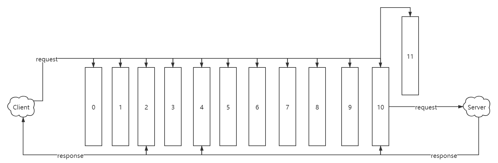

# Spring cloud Gateway（二） 一个Http请求的流程解析
***
## 简介
&ensp;&ensp;&ensp;&ensp;通过一个简单示例，debug出Spring Cloud Gateway的一个HTTP请求的处理流程

## 思路整理
&ensp;&ensp;&ensp;&ensp;在上篇文章中大致了解了SpringCloudGateway的大致作用和关键模块（路由匹配和Filter），在这篇文章中将梳理出一个HTTP请求的处理链路

&ensp;&ensp;&ensp;&ensp;目前先不关心其具体细节，主要梳理出其路由匹配的核心处理类，请求和响应的处理流向核心类

&ensp;&ensp;&ensp;&ensp;需要的一些前置知识：netty相关使用经验，因为分析大量用到了netty相关概念的类比和猜测

### 示例代码
&ensp;&ensp;&ensp;&ensp;配置启动一个简单的程序，请求转发到后台服务器，在请求和响应上添加一些东西，程序代码大致如下：

```java
@SpringBootApplication
public class Application {

	public static void main(String[] args) {
		SpringApplication.run(Application.class, args);
	}

	@Bean
	public RouteLocator myRoutes(RouteLocatorBuilder builder) {
		return builder.routes()
				.route(p -> p.path("/")
						.filters(f -> f.addRequestParameter("test", "test")
								.addResponseHeader("return", "return"))
						.uri("http://localhost:8082/"))
				.build();
	}
}
```

### 相关处理类查找
#### 路由匹配
&ensp;&ensp;&ensp;&ensp;首先在没有打任何断点的情况下运行一次程序：把程序跑起来，访问 http://localhost:8080/，成功得到结果。通过查看日志，发现有下面关于路由匹配的语句：

```
o.s.c.g.h.p.RoutePredicateFactory        : Pattern "[/image/webp]" does not match against value "/"
o.s.c.g.h.p.RoutePredicateFactory        : Pattern "/" matches against value "/"
o.s.c.g.h.RoutePredicateHandlerMapping   : Route matched: 606b3b86-7ef4-4538-bbcb-b512c411c325
```

&ensp;&ensp;&ensp;&ensp;一眼便看到 Route matched，还有类名带有 RoutePredicate,这大概率是路由匹配的核心处理类了，于是我们直接搜索打开这个类，看到下面的关键内容：

```java
public class RoutePredicateHandlerMapping extends AbstractHandlerMapping {
    // 这 lookupRoute 方法名一看就是妥妥的路由查找
	protected Mono<Route> lookupRoute(ServerWebExchange exchange) {
		return this.routeLocator.getRoutes()
				// individually filter routes so that filterWhen error delaying is not a
				// problem
				.concatMap(route -> Mono.just(route).filterWhen(r -> {
					// add the current route we are testing
					exchange.getAttributes().put(GATEWAY_PREDICATE_ROUTE_ATTR, r.getId());
					return r.getPredicate().apply(exchange);
				})
						// instead of immediately stopping main flux due to error, log and
						// swallow it
						.doOnError(e -> logger.error(
								"Error applying predicate for route: " + route.getId(),
								e))
						.onErrorResume(e -> Mono.empty()))
				// .defaultIfEmpty() put a static Route not found
				// or .switchIfEmpty()
				// .switchIfEmpty(Mono.<Route>empty().log("noroute"))
				.next()
				// TODO: error handling
				.map(route -> {
					if (logger.isDebugEnabled()) {
						logger.debug("Route matched: " + route.getId());
					}
					validateRoute(route, exchange);
					return route;
				});
	}
}
```

&ensp;&ensp;&ensp;&ensp;路由匹配找到这个就差不多了，具体的比如路由如何加载、查找后如何调整到处理链，到后面在此处打断点，通过调用栈应该可以看到

### Filter处理
#### Request处理发送
&ensp;&ensp;&ensp;&ensp;一样通过查看debug日志，可以看到下面明显的日志：

```
o.s.c.g.handler.FilteringWebHandler      : Sorted gatewayFilterFactories: 
o.s.c.g.filter.RouteToRequestUrlFilter   : RouteToRequestUrlFilter start
```

&ensp;&ensp;&ensp;&ensp;首先查看 RouteToRequestUrlFilter,发现其中没有明显的处理链（根据写网关的Filter的经验或者Netty的pipeline，应该入口是一个列表的循环处理或者定义的地方）。

&ensp;&ensp;&ensp;&ensp;于是我们打开另外一个类： FilteringWebHandler ,很幸运，看到filters，还有其get方法，很像，大致如下：

```java
public class FilteringWebHandler implements WebHandler {
    ......

	private static class DefaultGatewayFilterChain implements GatewayFilterChain {

		@Override
		public Mono<Void> filter(ServerWebExchange exchange) {
			return Mono.defer(() -> {
				if (this.index < filters.size()) {
					GatewayFilter filter = filters.get(this.index);
					DefaultGatewayFilterChain chain = new DefaultGatewayFilterChain(this,
							this.index + 1);
					return filter.filter(exchange, chain);
				}
				else {
					return Mono.empty(); // complete
				}
			});
		}

	}

    ......
}
```

&ensp;&ensp;&ensp;&ensp;这里应该就是Filter处理的核心了，接下来在这个函数进行打断点进行调试

&ensp;&ensp;&ensp;&ensp;在程序debug停在此处的时候，我们可以查看 filters 的值是啥，大致的内容如下：

```
0 RemoveCachedBodyFilter
1 AdaptCachedBodyGlobalFilter
2 NettyWriteResponseFilter
3 ForwardPathFilter
4 GatewayMetricsFilter
5 [[AddRequestParameter test = 'test'], order = 0]
6 [[AddResponseHeader return = 'return'], order = 0]
7 RouteToRequestUrlFilter
8 LoadBalancerClientFilter
9 WebsocketRoutingFilter
10 NettyRoutingFilter
11 ForwardRoutingFilter
```

&ensp;&ensp;&ensp;&ensp;此时我们沿着这条链路一直debug下去，进入上面所有的 filter 走一遍

&ensp;&ensp;&ensp;&ensp;在这次的debug过程中，能清晰的看到每个类都走了一遍，但是在最后一个filter：ForwardRoutingFilter,它的关键代码如下：

```java
public class ForwardRoutingFilter implements GlobalFilter, Ordered {
    ......

	@Override
	public Mono<Void> filter(ServerWebExchange exchange, GatewayFilterChain chain) {
		URI requestUrl = exchange.getRequiredAttribute(GATEWAY_REQUEST_URL_ATTR);

		String scheme = requestUrl.getScheme();
		if (isAlreadyRouted(exchange) || !"forward".equals(scheme)) {
			return chain.filter(exchange);
		}

		// TODO: translate url?

		if (log.isTraceEnabled()) {
			log.trace("Forwarding to URI: " + requestUrl);
		}

		return this.getDispatcherHandler().handle(exchange);
	}

    ......
}
```

&ensp;&ensp;&ensp;&ensp;目前的猜测是最后一个filter，发送请求到后台服务器，但是这个filter完全没有看到这个类似的代码，于是又瞎debug了第二遍和第三遍，发现了一个及其可疑的类: NettyRoutingFilter,在这个类中发现了请求发送相关代码，大致如下：

```java
public class NettyRoutingFilter implements GlobalFilter, Ordered {
    ......

	@Override
	@SuppressWarnings("Duplicates")
	public Mono<Void> filter(ServerWebExchange exchange, GatewayFilterChain chain) {
		URI requestUrl = exchange.getRequiredAttribute(GATEWAY_REQUEST_URL_ATTR);

		String scheme = requestUrl.getScheme();
		if (isAlreadyRouted(exchange)
				|| (!"http".equals(scheme) && !"https".equals(scheme))) {
			return chain.filter(exchange);
		}

        ......

		Flux<HttpClientResponse> responseFlux = getHttpClient(route, exchange)
				.headers(headers -> {
					headers.add(httpHeaders);
					// Will either be set below, or later by Netty
					headers.remove(HttpHeaders.HOST);
					if (preserveHost) {
						String host = request.getHeaders().getFirst(HttpHeaders.HOST);
						headers.add(HttpHeaders.HOST, host);
					}
				}).request(method).uri(url).send((req, nettyOutbound) -> {
					if (log.isTraceEnabled()) {
                        ///////////////////////////////////////////////////////////////////
                        // 熟悉的netty outbound
						nettyOutbound
								.withConnection(connection -> log.trace("outbound route: "
										+ connection.channel().id().asShortText()
										+ ", inbound: " + exchange.getLogPrefix()));
					}
                    // 使用outbound send 确定发送请求无疑了
					return nettyOutbound.send(request.getBody().map(this::getByteBuf));
                    /////////////////////////////////////////////////////////////////////////
				}).responseConnection((res, connection) -> {
                    ......
				});

        ......
		return responseFlux.then(chain.filter(exchange));
	}
    ......
}
```

&ensp;&ensp;&ensp;&ensp;在这里看到netty熟悉的outbound和send函数，那就确定是在这个类里面进行数据的发送，request的流程就走完了

#### Response响应处理
&ensp;&ensp;&ensp;&ensp;通过上面的步骤，我们找到了request的流程，但是发现好像把所有的filter都走完一遍了，如果类比到netty，那就应该有inbound和outbound。outbound的部分我们在上面找到了，现在要找inbound的部分。

&ensp;&ensp;&ensp;&ensp;所有filter都走了一遍，代码中也没有类似inbound和outbound属性的判断，则假设这些filter是双工的，同时兼备inbound和outbound的类似功能。通过查看这些filter的代码，我们在下面那个地方找到了response相关的代码：

&ensp;&ensp;&ensp;&ensp;在第二个类 NettyWriteResponseFilter,清晰的看到了熟悉的 writeAndFlushWith,到这里就确定了response响应的最后是到了writeAndFlushWith。但是，整个流程是怎么样的目前还是不清楚，没有看到链表逆序或者反向传播的相关代码

&ensp;&ensp;&ensp;&ensp;判断当前有些关键的组件知识欠缺，在这些filter类代码中，仔细查看相关的代码，看着像是lamda表达式，但是核心思想是逐个调用处理，依照这个思路来梳理下面的代码：

```java
public class NettyRoutingFilter implements GlobalFilter, Ordered {
    ......

	@Override
	@SuppressWarnings("Duplicates")
	public Mono<Void> filter(ServerWebExchange exchange, GatewayFilterChain chain) {
        ......

		Flux<HttpClientResponse> responseFlux = getHttpClient(route, exchange)
                // 猜测设置header
				.headers(headers -> {
                    ......
                // 发送request
				}).request(method).uri(url).send((req, nettyOutbound) -> {
                    ......
                // 接收到返回的response
				}).responseConnection((res, connection) -> {
                    // 这里看到将结果放入了，exchange中，而这个exchange贯穿了这个请求流程，感觉这个就类似netty的ctx
					exchange.getAttributes().put(CLIENT_RESPONSE_ATTR, res);
					exchange.getAttributes().put(CLIENT_RESPONSE_CONN_ATTR, connection);

					ServerHttpResponse response = exchange.getResponse();
					// put headers and status so filters can modify the response
					HttpHeaders headers = new HttpHeaders();

					res.responseHeaders().forEach(
							entry -> headers.add(entry.getKey(), entry.getValue()));

					String contentTypeValue = headers.getFirst(HttpHeaders.CONTENT_TYPE);
					if (StringUtils.hasLength(contentTypeValue)) {
						exchange.getAttributes().put(ORIGINAL_RESPONSE_CONTENT_TYPE_ATTR,
								contentTypeValue);
					}

					setResponseStatus(res, response);

					// make sure headers filters run after setting status so it is
					// available in response
					HttpHeaders filteredResponseHeaders = HttpHeadersFilter.filter(
							getHeadersFilters(), headers, exchange, Type.RESPONSE);

					if (!filteredResponseHeaders
							.containsKey(HttpHeaders.TRANSFER_ENCODING)
							&& filteredResponseHeaders
									.containsKey(HttpHeaders.CONTENT_LENGTH)) {
						// It is not valid to have both the transfer-encoding header and
						// the content-length header.
						// Remove the transfer-encoding header in the response if the
						// content-length header is present.
						response.getHeaders().remove(HttpHeaders.TRANSFER_ENCODING);
					}

					exchange.getAttributes().put(CLIENT_RESPONSE_HEADER_NAMES,
							filteredResponseHeaders.keySet());

					response.getHeaders().putAll(filteredResponseHeaders);

					return Mono.just(res);
				});

		return responseFlux.then(chain.filter(exchange));
	}
}


// 在下面这个类的filter方法中，我们看到response的获取
// 看到了属性的writeAndFlushWith
public class NettyWriteResponseFilter implements GlobalFilter, Ordered {

	@Override
	public Mono<Void> filter(ServerWebExchange exchange, GatewayFilterChain chain) {
        // 通过debug可以看到 filter是触发下一个filter类的执行，filter执行完后执行then，里面有明显的发送响应到客户端的代码
		return chain.filter(exchange)
				.doOnError(throwable -> cleanup(exchange))
				.then(Mono.defer(() -> {
					Connection connection = exchange.getAttribute(CLIENT_RESPONSE_CONN_ATTR);

					if (connection == null) {
						return Mono.empty();
					}
					if (log.isTraceEnabled()) {
						log.trace("NettyWriteResponseFilter start inbound: "
								+ connection.channel().id().asShortText() + ", outbound: "
								+ exchange.getLogPrefix());
					}
					ServerHttpResponse response = exchange.getResponse();

					// TODO: needed?
					final Flux<DataBuffer> body = connection
							.inbound()
							.receive()
							.retain()
							.map(byteBuf -> wrap(byteBuf, response));

					MediaType contentType = null;
					try {
						contentType = response.getHeaders().getContentType();
					}
					catch (Exception e) {
						if (log.isTraceEnabled()) {
							log.trace("invalid media type", e);
						}
					}
					return (isStreamingMediaType(contentType)
							? response.writeAndFlushWith(body.map(Flux::just))
							: response.writeWith(body));
				})).doOnCancel(() -> cleanup(exchange));
	}
}
```

&ensp;&ensp;&ensp;&ensp;到这我们就大致摸清楚了response响应的数据流向

#### 请求数据流向
&ensp;&ensp;&ensp;&ensp;数据流图如下，图中使用序号代替filter处理器

```
0 RemoveCachedBodyFilter
1 AdaptCachedBodyGlobalFilter
2 NettyWriteResponseFilter
3 ForwardPathFilter
4 GatewayMetricsFilter
5 AddRequestParameterGatewayFilterFactory -- [[AddRequestParameter test = 'test'], order = 0]
6 AddResponseHeaderGatewayFilterFactory -- [[AddResponseHeader return = 'return'], order = 0]
7 RouteToRequestUrlFilter
8 LoadBalancerClientFilter
9 WebsocketRoutingFilter
10 NettyRoutingFilter
11 ForwardRoutingFilter
```




&ensp;&ensp;&ensp;&ensp;通过debug梳理下来，我们大致看到数据如何在整个filter链中流动的。从中也大致体会到响应式编程的一点点思想，感觉还挺好用

&ensp;&ensp;&ensp;&ensp;AddResponseHeaderGatewayFilterFactory 添加 response的 header，通过查看代码，发现思想还有点巧妙：在 exchange 中初始化了响应response，所有的响应的相应的修改都在这个上面进行修改，在拿到服务器的响应以后，直接将这些放到里面去。这个思想还挺巧妙的，很有借鉴意义

### 总结
&ensp;&ensp;&ensp;&ensp;request每个filter都会走一遍，但并不是每个filter都会对request进行处理，类似下面的代码，通过判断是不是websocket的前缀来判断是否需要进行处理。这里好像通过这个实现了不同请求类型的转发，也就是 HTTP（NettyRoutingFilter）和 Web（WebsocketRoutingFilter）结构上应该是同级的，这个思想挺有意思

```java
public class WebsocketRoutingFilter implements GlobalFilter, Ordered {

	@Override
	public Mono<Void> filter(ServerWebExchange exchange, GatewayFilterChain chain) {
		changeSchemeIfIsWebSocketUpgrade(exchange);

		URI requestUrl = exchange.getRequiredAttribute(GATEWAY_REQUEST_URL_ATTR);
		String scheme = requestUrl.getScheme();

        // 这里对请求的类型进行判断
		if (isAlreadyRouted(exchange)
				|| (!"ws".equals(scheme) && !"wss".equals(scheme))) {
			return chain.filter(exchange);
		}
		setAlreadyRouted(exchange);

		HttpHeaders headers = exchange.getRequest().getHeaders();
		HttpHeaders filtered = filterRequest(getHeadersFilters(), exchange);

		List<String> protocols = headers.get(SEC_WEBSOCKET_PROTOCOL);
		if (protocols != null) {
			protocols = headers.get(SEC_WEBSOCKET_PROTOCOL).stream().flatMap(
					header -> Arrays.stream(commaDelimitedListToStringArray(header)))
					.map(String::trim).collect(Collectors.toList());
		}

		return this.webSocketService.handleRequest(exchange, new ProxyWebSocketHandler(
				requestUrl, this.webSocketClient, filtered, protocols));
	}
}
```

&ensp;&ensp;&ensp;&ensp;还有一个就是 response 修改的实现也是很巧妙，感觉收获了很多
